# :green_square: Izvedljiv sistem (2. poročilo o stanju)

| [:arrow_backward:](02_Osnutek_sistema_1_porocilo_o_stanju.md) Prejšnji dokument |                       Trenutni dokument                       | Naslednji dokument [:arrow_forward:](04_Koncna_izdaja_celovito_koncno_porocilo.md) |
| :------------------------------------------------------------------------------ | :-----------------------------------------------------------: | ---------------------------------------------------------------------------------: |
| :orange_square: **Osnutek sistema**<br>(1. poročilo o stanju)                   | :green_square: **Izvedljiv sistem**<br>(2. poročilo o stanju) |                      :blue_square: **Končna izdaja**<br>(celovito končno poročilo) |


Do 11. tedna naj bi bila implementirana osnovna funkcionalnost sistema v obliki demo prototipa. 2. poročilo o stanju je osredotočeno na razdelka [**4 Opis sistema**](#4-opis-sistema) in [**5 Trenutno stanje**](#5-trenutno-stanje). Pri opisu sistema se je treba osredotočiti predvsem na opis arhitekture sistema.

Izogibajte se nepotrebnemu podvajanju pri opisovanju sistema. Vključite ostale informacije na najbolj ustrezna mesta, med [uvodom](#1-uvod) in [opisom sistema](#4-opis-sistema).

Za izdelavo diagramov uporabite orodje [**PlantUML**](https://plantuml.com/) in v poročilo vključite izvorno kodo diagrama v jeziku PlantUML (v mapi [`gradivo`](gradivo)), sliko diagrama pa vključite s povezavo (in ne preko neposredne vključitve binarne datoteke) preko storitve <https://teaching.lavbic.net/plantuml>, kot prikazujejo primeri vključenih diagram v tej predlogi poročila.

## :page_with_curl: Sistem za spontana družabna srečanja – združi ljudi s skupnimi interesi v tvoji bližini

## :information_desk_person: Ime ekipe: 06. skupina | Člani ekipe: Miha Fabčič, Aleks Gogić, Jakob Jesenko, Leja Petrič, Tim Pezdirc

## 1 Uvod

To poročilo predstavlja 2. poročilo o stanju projekta sistema za spontana družabna srečanja. Medtem ko je bila prejšnja iteracija namenjena zasnovi sistema in pripravi demo aplikacije z demo podatki, se je ekipa v tej iteraciji prvič lotila dejanske implementacije. Osrednji dosežki so vzpostavitev podatkovne baze MongoDB, razvoj celotnega backenda z REST API-jem ter implementacija ključnih delov Angular frontenda (registracija, prijava, nadzorna plošča). Poročilo je osredotočeno na opis arhitekture sistema (poglavje 4) in prikaz trenutnega stanja implementacije (poglavje 5).

### 1.2 Poudarki

**Načrt za to iteracijo** je bil prehod iz dokumentacijsko-demo faze v dejansko implementacijo. Konkretni cilji so bili: vzpostavitev MongoDB podatkovne baze z ustreznimi modeli, implementacija celotnega backend REST API-ja, uspešna povezava backenda s frontendom ter prototipna implementacija pametne komponente za oblikovanje skupin.

**Ekipa je v tej iteraciji dosegla:**

- Vzpostavitev MongoDB podatkovne baze z dokumentnimi modeli za uporabnike, profile, interese, skupine in sporočila.
- Implementacijo celotnega backend REST API-ja (Node.js/Express) z vsemi ključnimi endpointi: upravljanje uporabnikov in profilov, interesi, iskanje in predlogi skupin, skupinski chat ter administratorske funkcije.
- JWT-based avtentikacijo z zaščito zasebnih API poti in ločenimi vlogami (uporabnik, administrator).
- Integracijo zunanjega e-poštnega servisa (Nodemailer + SMTP) za verifikacijo računa ob registraciji in ponastavitev gesla.
- Prototipno implementacijo pametne komponente – osnovna logika scoring algoritma (Jaccard podobnost interesov, Haversine geografska razdalja, časovno prekrivanje) je vzpostavljena in funkcionalna, a kalibracija uteži in obravnava robnih primerov še nista dokončani.
- Na strani frontenda (Angular): implementacijo toka registracije v treh korakih, prijave z JWT ter uporabniške nadzorne plošče (dashboard).
- Uspešno integracijo frontenda z backendom prek REST API-ja za vse implementirane maske.

### 1.3 Spremembe

Nismo uvedli nobenih sprememb.

## 2 Potrebe naročnika

Primarni naročnik so končni uporabniki (mladi odrasli, 18–35 let, v urbanih okoljih), ki iščejo preprost in učinkovit način za organizacijo spontanih družabnih srečanj z novimi ljudmi. Želijo si sistem, ki jim z minimalnim vnosom podatkov (interesi, lokacija, razpoložljivost) ponudi kakovostne predloge manjših skupin (3–5 oseb) ter omogoči neposredno usklajevanje srečanja v skupinskem chatu.

Sekundarni deležniki (lokalna skupnost, ponudniki prostorov za srečanja) pričakujejo večjo socialno vključenost in strukturiran način organizacije srečanj v javnih prostorih. Operativni naročnik (administrator sistema) pričakuje pregledno nadzorno ploščo za upravljanje uporabnikov, reševanje prijav neprimernega vedenja ter vpogled v ključne metrike kakovosti algoritma za oblikovanje skupin.

Splošna želena izkušnja naročnika je, da se celoten tok od registracije do prvega predloga skupin odvije v manj kot 5 minutah, brez tehničnih ovir in z občutkom varnosti pri spoznavanju novih ljudi.

---

## 3 Cilji projekta

Projekt naslavlja problem avtomatskega oblikovanja manjših kompatibilnih skupin za spontana srečanja, ki ga obstoječe platforme ne rešujejo celovito. Tinder in Bumble sta osredotočena na individualno ujemanje, Meetup na organizacijo večjih javnih dogodkov, Timeleft na fiksne tematske večerje. Nobena od teh rešitev ne kombinira sočasnega ujemanja interesov, geografske bližine in časovne razpoložljivosti za samodejno oblikovanje manjših spontanih skupin.

**Ključne koristi projekta za naročnika:**

- Povprečen čas od registracije do prvega predloga skupin je največ 5 minut.
- Najmanj 60 % prikazanih predlogov skupin je potrjenih s strani uporabnikov.
- Najmanj 80 % testnih uporabnikov brez pomoči uspešno zaključi registracijo, prijavo in iskanje skupine.
- Delež neuspešno zaključenih ključnih tokov zaradi notranjih napak ne preseže 1 %.
- Po potrjeni skupini je skupinski chat takoj dostopen vsem potrjenim članom v istem vmesniku.
- Administrativna dejanja so v 100 % primerov zabeležena z identiteto izvajalca, časom in tipom akcije.
- Kakovost predlogov je merljiva z deležem sprejetih predlogov in povprečno oceno po srečanju.

## 4 Opis sistema

### 4.1 Pregled sistema

Sistem za spontana družabna srečanja je spletna aplikacija, ki na podlagi profilov registriranih uporabnikov (interesi, lokacija, časovna razpoložljivost) samodejno oblikuje manjše kompatibilne skupine (3–5 oseb) in jim omogoča usklajevanje srečanja prek vgrajenega skupinskega chata. Sistem je zasnovan po tristopenjski arhitekturi: Angular SPA frontend, Node.js/Express REST API backend ter MongoDB podatkovna baza. Za komunikacijo v realnem času (skupinski chat) je vzporedno z REST API-jem vzpostavljen WebSocket strežnik (Socket.io).

Jedro sistema je **pametna komponenta** – algoritem za oblikovanje skupin, ki kombinira tri kriterije ujemanja v skupno oceno kompatibilnosti:

```
score = w1 * similarity_interesov + w2 * blizina_geografska + w3 * prekrivanje_casa
```

Podobnost interesov se izračuna z Jaccard indeksom (razmerje skupnih do vseh interesov para), geografska bližina s Haversine formulo (razdalja v km med koordinatama dveh lokacij), časovno prekrivanje pa kot delež skupnih urnih blokov razpoložljivosti. Uteži `w1`, `w2`, `w3` so nastavljivi parametri; privzete vrednosti se bodo kalibrirale na podlagi podatkov iz testiranja v naslednji iteraciji.

**Glavne načrtovalske odločitve in njihove utemeljitve:**

- **MongoDB** kot podatkovna baza: Interesi in časovna razpoložljivost so po naravi polstrukturirani in variabilni med uporabniki. Dokumentni model MongoDB omogoča shranjevanje teh podatkov brez stroge relacijske sheme ter pospešuje razvoj v MVP fazi, hkrati pa podpira enostavno razširitev z novimi atributi brez migracij.
- **Node.js/Express** za backend: JavaScript full-stack pristop zmanjšuje kontekstualni preklop med frontendom in backendom ter omogoča souporabo validacijske logike. Express je uveljavljen mikro-framework, primeren za hitro postavitev RESTful API-ja z dobro podporo za JWT middleware in integracijo Socket.io.
- **Angular** za frontend: Ekipa ima predhodno izkušnjo z Angularom. Komponentna arhitektura ogrodja ustreza modularni naravi aplikacije (profil, predlogi skupin, chat, admin panel). Reaktivni pristop prek RxJS je primeren za obvladovanje asinhronih REST klicev in WebSocket dogodkov.
- **JWT avtentikacija**: Brezstanovno preverjanje pristnosti je naravno za SPA arhitekturo – strežnik ne vzdržuje sej, žeton pa nosi informacijo o vlogi (uporabnik/administrator), kar poenostavlja zaščito API poti z middleware.
- **Socket.io** za skupinski chat: Zahteva po dvosmerni komunikaciji v realnem času narekuje WebSocket pristop. Socket.io zagotavlja zanesljivo abstrakcijo s samodejnim fallback mehanizmom ter sobami (rooms), ki naravno ustrezajo konceptu skupin v sistemu.
- **Resend** za e-pošto: Preprosta integracija za MVP;

**Kontekstni diagram sistema** prikazuje meje sistema in ključne zunanje interakcije:

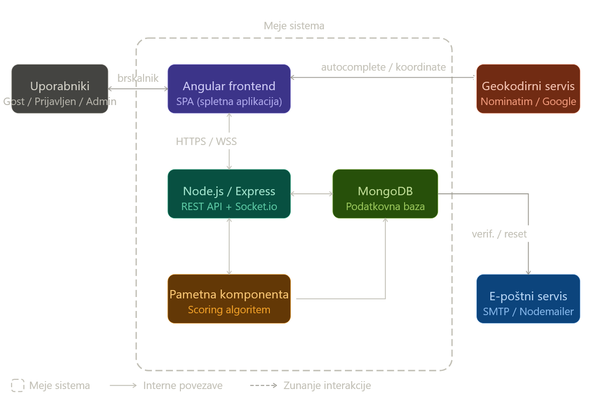

**Opis zunanjih interakcij sistema:**

Sistem komunicira s tremi zunanjimi entitetami:

1. **Geokodirni API** (npr. OpenStreetMap Nominatim): Ob vnosu lokacije v profilu sistem pošlje besedilni niz zunanjemu servisu, ki vrne standardizirane geografske koordinate. Koordinate se shranijo v MongoDB in pri vsakem klicu algoritma za oblikovanje skupin uporabijo za izračun geografske razdalje po Haversine formuli. Ob nedosegljivosti zunanjega servisa sistem prikaže napako in omogoča ponovni vnos.

2. **E-poštni servis** (SMTP prek Resenda): Sistem pošlje verifikacijsko e-pošto ob registraciji in e-pošto za ponastavitev gesla ob zahtevi. Prek tega kanala se prenašajo izključno sistemska obvestila; vsebina skupinskih chatov in osebni podatki se ne prenašajo. Ob nedosegljivosti servisa sistem zabeleži napako v dnevnik in obvesti uporabnika.

3. **Spletni brskalnik (odjemalec)**: Vsi uporabniki (gostje, registrirani uporabniki, administratorji) dostopajo do sistema prek spletnega brskalnika. Komunikacija med Angular SPA in backendom poteka prek HTTPS za REST API klice ter prek WSS (WebSocket Secure) za skupinski chat v realnem času.

Znotraj meja sistema so vse komponente: Angular frontend, Node.js/Express REST API, Socket.io strežnik, MongoDB podatkovna baza in pametna komponenta (algoritem za oblikovanje skupin).

### 4.2 Osrednji arhitekturni pogledi

**Razredni diagram**

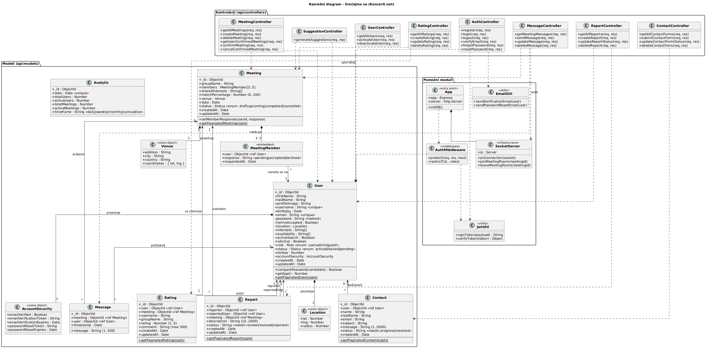

**Arhitektura sistema**

  - Seznam elementov in skrbnikov

| Element                         | Namen                                                                      | Skrbnik          |
|---------------------------------|----------------------------------------------------------------------------|------------------|
| Nadzorna plošča uporabnika      | Pregled predlogov skupin in profila                                        | Tim Pezdirc      |
| Nadzorna plošča administratorja | Prikaz statistike platforme (št. uporabnikov, aktivnih iskanj, ...)        | Tim Pezdirc      |
| Avtentikacija                   | Skrbi za prijavo uporabnikov, preverjanje gesel in generiranje JWT žetonov | Aleks Gogić      |
| Chat                            | Prikaz klepeta skupine                                                     | Miha Fabčič      |
| Kontakt                         | Pregled sporočil uporabnikov (feedback)                                    | Miha Fabčič      |
| Urejanje profila                | Skrbi za urejanje profila (spremembe interesov, lokacije, ...)             | Jakob Jesenko    |
| Ponastavitev gesla              | Prikaz strani za ponastavitev gesla                                        | Jakob Jesenko    |
| Pametna komponenta              | Skrbi za predloge skupin na podlagi formule                                | Leja Petrič      |
| Krmilniki                       | Upravljanje različnih delov aplikacije                                     | Leja Petrič      |
| E-mail servis                   | Pošilja e-maile za verifikacijo profila in ponastavitev gesla              | Aleks Gogić      |

**Logični pogled (paketni diagram)**

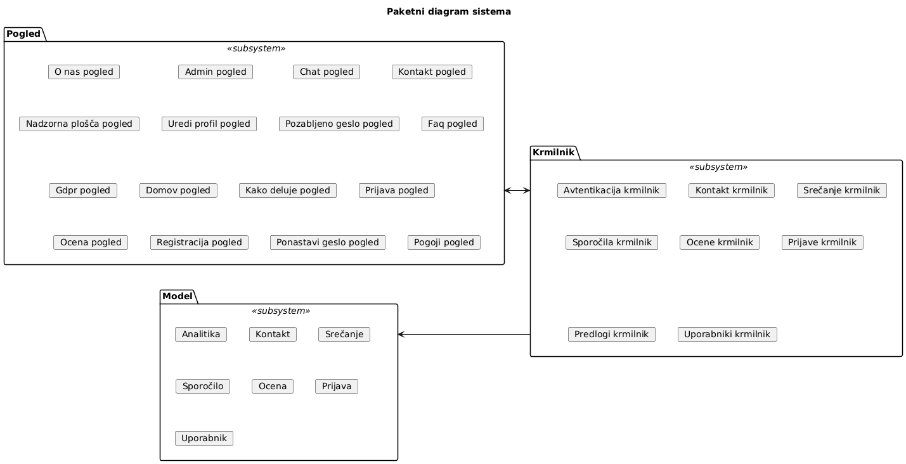

**Procesni pogled (diagram aktivnosti)**

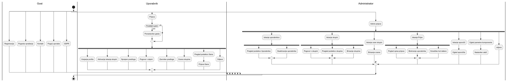

**Razvojni pogled (komponentni diagram)**

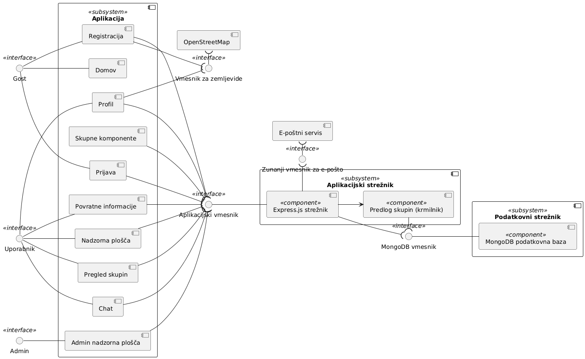

**Fizični pogled (postavitveni diagram)**

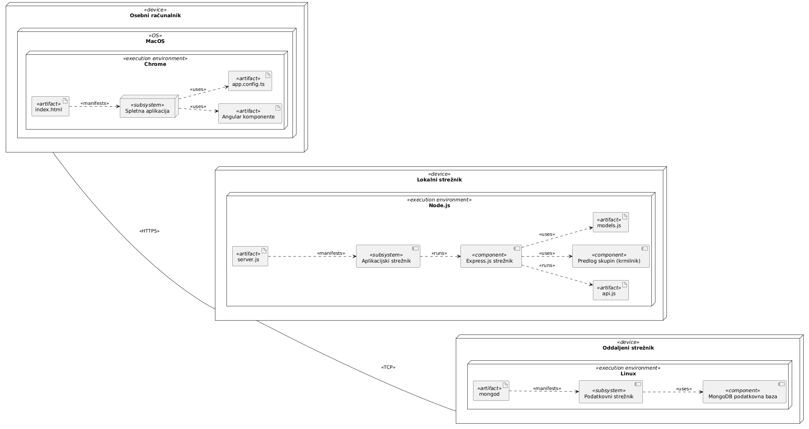

**Diagrami za osnovne in alternativne tokove**
**8. Odločitev o udeležbi**


  - Alternativni tok potrditev udeležbe

  .png "Odločitev o udeležbi A1")

  - Alternativni tok zavrnitev udeležbe

  .png "Odločitev o udeležbi A2")

  - Izjemni tok predlog ni več aktiven

  .png "Odločitev o udeležbi E1")

**9. Oddaja povratne informacije**


  - Alternativni tok oddaja samo ocene

  .png "Oddaja povratne informacijei A1")

  - Izjemni tok uporabnik je že oddal povratno informacijo

  .png "Oddaja povratne informacije E1")

  - Izjemni tok napaka pri shranjevanju

  .png "Oddaja povratne informacije E2")

**10. Prijava neprimernega vedenja**


  - Alternativni tok dopolnitev prijave

  .png "Prijava neprimernega vedenja A1")

  - Izjemni tok neprimerno izpolnjena prijava

  .png "Prijava neprimernega vedenja E1")

**11. Pregled informacij**  


  - Alternativni tok branje več informacijskih strani

  .png "Pregled informacij A1")

  - Izjemni tok informacijska stran ni dosegljiva

  .png "Pregled informacij E1")

**12. Kontaktni obrazec**


  - Alternativni tok dopolnitev obrazca pred oddajo

  .png "Kontaktni obrazec A1")

  - Izjemni tok neveljavno izpolnjen kontaktni obrazec

  .png "Kontaktni obrazec E1")

**13. Upravljanje uporabnikov (administrator)**

.png "Upravljanje uporabnikov (administrator) osnovni")

  - Alternativni tok opozorilo uporabniku

  .png "Upravljanje uporabnikov (administrator) A1")

  - Izjemni tok administrator nima ustreznih pravic

  .png "Upravljanje uporabnikov (administrator) E1")

  - Izjemni tok konflikt stanja računa

  .png "Upravljanje uporabnikov (administrator) E2")

**14. Pregled kontaktnih obrazcev in prijav neprimernega vedenja**


  - Alternativni tok eskalacija obvestila

  .png "Pregled kontaktnih obrazcev in prijav neprimernega vedenja A1")

  - Alternativni tok eskalacija na upravljanje uporabnika

  .png "Pregled kontaktnih obrazcev in prijav neprimernega vedenja A2")

  - Izjemni tok podrobnosti obvestila niso dosegljive

  .png "Pregled kontaktnih obrazcev in prijav neprimernega vedenja E1")

**15. Pregled skupin in chata**


  - Alternativni tok filtriranje pred vpogledom

  .png "Pregled skupin in chata A1")

  - Izjemni tok podatki chata niso dosegljivi

  .png "Pregled skupin in chata E1")

**16. Pregled povratnih informacij (administrator)**

 osnovni")

  - Alternativni tok filtriranje povratnih informacij po skupini

  .png "Pregled povratnih informacij (administrator) A1")

  - Izjemni tok povratne informacije za skupino niso dosegljive

  .png "Pregled povratnih informacij (administrator) E1")

**17. Upravljanje pametne komponente**


  - Alternativni tok spremljanje brez spremembe parametrov

  .png "Upravljanje pametne komponente A1")

  - Izjemni tok parametri so izven dovoljenih mej

  .png "Upravljanje pametne komponente E1")

  - Izjemni tok konflikt sočasnih sprememb

  .png "Upravljanje pametne komponente E1")

- Za vsak pogled zagotovite osrednji diagram (npr. postavitveni ([deployment](https://plantuml.com/deployment-diagram)), paketni ([class](https://plantuml.com/class-diagram)) diagram oz. komponentni ([component](https://plantuml.com/component-diagram)) diagram).
  - Pri predlogu upoštevajte arhitekturne in načrtovalske vzorce.
  - Priporoča se uporaba naslednjih diagramskih tehnik (ne nujno vseh):
    - **Razredni diagram** ([Class Diagram](https://plantuml.com/class-diagram), izvorna koda :bar_chart: [PlantUML](./gradivo/plantuml/RD.puml))

      

    - **Diagram zaporedja** ([Sequence Diagram](https://plantuml.com/sequence-diagram), izvorna koda :bar_chart: [PlantUML](./gradivo/plantuml/DZ.puml))

      

    - **Diagram aktivnosti** ([Activity Diagram](https://plantuml.com/activity-diagram-beta), izvorna koda :bar_chart: [PlantUML](./gradivo/plantuml/diagram_aktivnosti.puml))

      

    - **Diagram stanj**

Diagrami stanj prikazujejo življenjske cikle ključnih entitet v sistemu. Za vsako pomembno entiteto smo pripravili diagram, ki opisuje dovoljena stanja, prehode med njimi in dogodke, ki te prehode sprožijo.

*Diagram stanj za uporabnika*

Uporabniški račun je lahko v štirih stanjih: **Nepotrjen** (takoj po registraciji), **Aktiven** (po uspešni verifikaciji), **Blokiran** in **Deaktiviran** (slednji dve stanji nastavi administrator). Iz nepotrjenega stanja uporabnik preide v aktivnega z odprtjem verifikacijske povezave. Administrator lahko aktivnega uporabnika blokira ali deaktivira ter ga iz teh stanj tudi vrne nazaj v aktivnega.

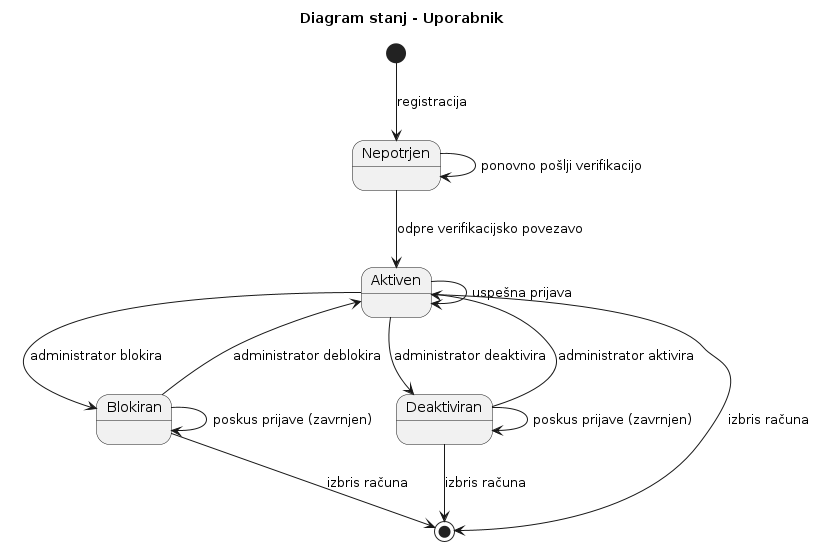

*Diagram stanj za skupino*

Skupina (predlog za srečanje) ima štiri stanja: **Predlog** (ustvarjen s strani pametne komponente), **Aktivna** (ko vsaj trije člani potrdijo udeležbo), **Zaključena** (po izvedenem srečanju) in **Razveljavljena** (če premalo članov potrdi udeležbo ali administrator odpove srečanje).

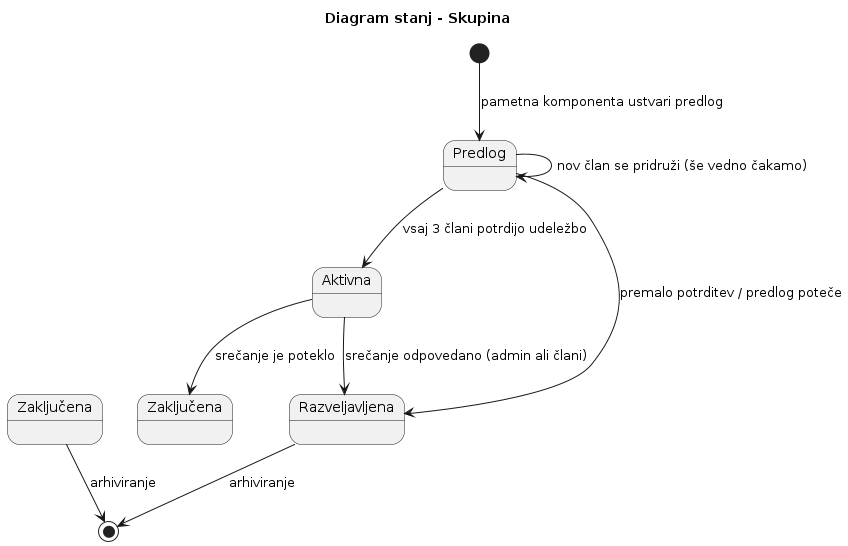

*Diagram stanj za člana skupine*

Vsak član skupine ima svoj status odziva: **Neodločen** (privzeto po vstopu v skupino), **Potrdil** (uporabnik je potrdil udeležbo) in **Zavrnil** (uporabnik je zavrnil udeležbo). Dokler skupina ni aktivna, lahko uporabnik svojo odločitev poljubno spreminja.

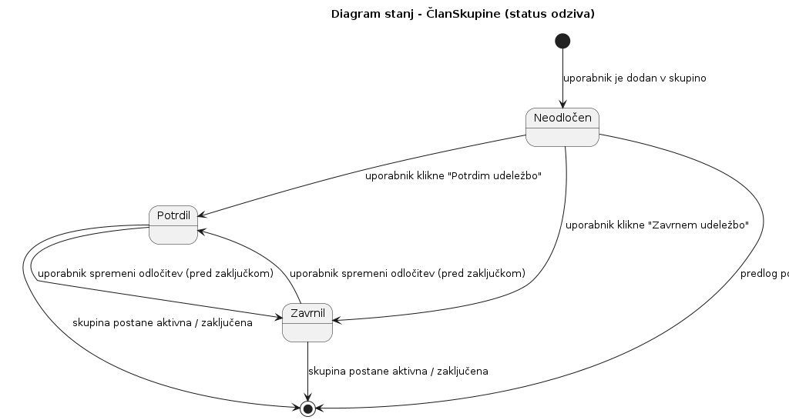

*Diagram stanj za prijavo neprimernega vedenja*

Prijava, ki jo odda uporabnik, ima tri stanja: **Nova** (pravkar oddana, čaka na obravnavo), **Obdelana** (administrator jo je pregledal in zaključil) in **Eskalirana** (administrator jo je posredoval v nadaljnjo obravnavo). Eskalirano prijavo nato zaključi višji administrator.

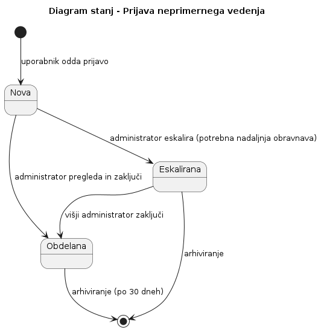

*Diagram stanj za verifikacijski žeton*

Verifikacijski žeton (za potrditev e-pošte ali ponastavitev gesla) je lahko **Veljaven** (ustvarjen in poslan uporabniku), **Uporabljen** (uporabnik je odprl povezavo) ali **Potekel** (uporabnik povezave ni odprl v časovni omejitvi, npr. 24 ur).

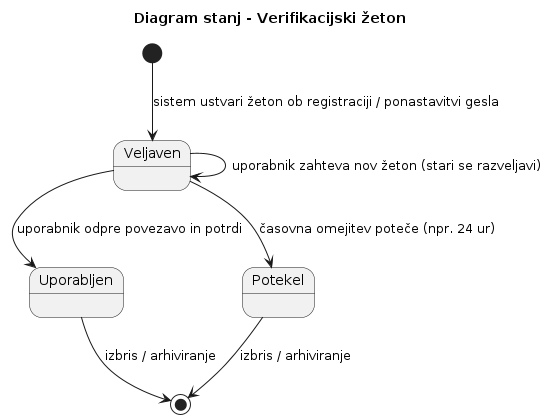

*Diagram stanj za parametre algoritma*

Parametri pametne komponente (uteži w1, w2, w3) imajo tri stanja: **Osnovni** (privzeti parametri ob zagonu sistema), **Spremenjeni** (administrator je spremenil parametre) in **Arhivirani** (stara verzija parametrov, shranjena v zgodovino). Arhivirani parametri se po enem letu izbrišejo.

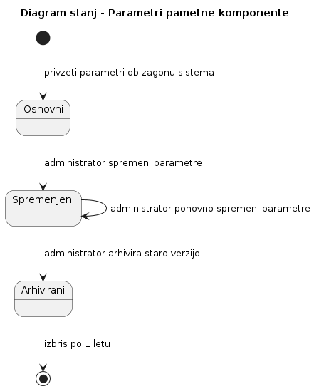

*Diagram stanj za uporabniško sejo (JWT)*

Uporabniška seja ima tri stanja: **Brez seje** (uporabnik ni prijavljen), **Aktivna seja** (uporabnik je uspešno prijavljen) in **Potekla seja** (JWT žeton je potekel zaradi neaktivnosti ali izteka časa). Iz potekle seje se uporabnik vrne v stanje brez seje, ko poskusi dostopati do zaščitene strani.

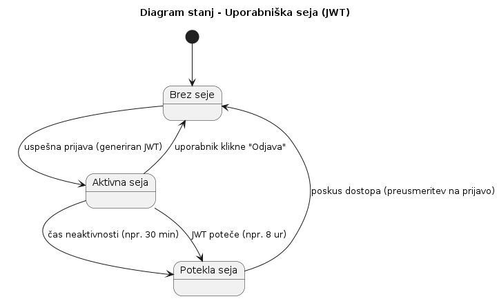

    - **Psevdokoda**

      > **assume** vrednost1 &subseteq; C, vrednost2 &subseteq; C  
      > **let** maxVrednost1 = max {r | (s,r) &in; vrednost1}  
      > **for** (s, r) **in** vrednost2:  
      > &nbsp;&nbsp;&nbsp;&nbsp;**if** r &le; maxVrednost1 **return false**  
      > **return true**

- Za arhitekturne elemente v diagramu dodajte katalog elementov z imenom in namenom vsakega elementa.
- Za vsak element določite enega člana ekipe (tudi, če je več članov ekipe prispevalo k elementu), ki bo njen skrbnik.

## 5 Trenutno stanje

- Kakšni dodatni cilji te iteracije, poleg tega, kar je že navedeno v [uvodu](#1-uvod)?
  - Kaj deluje? Vključite posnetke zaslona.
  - Kakšni izzivi?
  - Uporabite blokovni diagram za razlago trenutnega sistema.
- Katere teste ste izvedli?
- Koliko vrstic kode ste napisali (skupno do tega trenutka)?

## 6 Vodenje projekta

### Dnevnik sprememb (dopolnitev od zadnjega poročila)

| Datum | Motivacija | Opis spremembe | Posledica |
|-------|------------|----------------|------------|
| 6. 4. 2026 | Prvo testiranje z naročniki | Izdelali smo prve testne zaslonske maske (wireframe-i osnovnih tokov: registracija, vnos profila, prikaz predlogov) in jih posredovali naročnikom v pregled. | Uskladitev prioritet in zmanjšanje obsega na MVP. |
| 8. 4. 2026 | Tehnična odločitev | Potrjena je uporaba tehnologij: Node.js, MongoDB, Angular. | Ekipa lahko začne s pripravo razvojnega okolja in osnovnih ogrodij. |
| 10. 4. 2026 | Poenostavitev | Opustitev zahteve po avtomatičnem iskanju v ozadju za MVP. | Uporabnik mora eksplicitno klikniti "Išči skupino". Zmanjšana kompleksnost prve faze. |
| 22. 4. 2026 | Pomanjkljiva specifikacija scoring algoritma | Med implementacijo pametne komponente smo ugotovili, da prvotna formula (Jaccard + Haversine + čas) ne deluje dobro na sintetičnih podatkih – uteži so bile poljubno izbrane. | Razširili smo definicijo algoritma: dodana je normalizacija razdalje (sigmoindna funkcija) in utež za število že izvedenih srečanj (za spodbujanje novih uporabnikov). Sprememba je podaljšala razvoj pametne komponente za 3 dni. |
| 28. 4. 2026 | Zamik pri administratorskem vmesniku | Zaradi poznega začetka kodiranja (kot je opisano v refleksiji) nismo uspeli implementirati celotnega administratorskega vmesnika do načrtovanega roka. | Administratorska plošča je v trenutni iteraciji delno implementirana (le pregled uporabnikov). Metrike algoritma in upravljanje skupin smo prestavili v naslednjo iteracijo. |
| 2. 5. 2026 | Poenostavitev glede na čas | Zaradi skupnega zamika pri integraciji in algoritmu smo se odločili začasno opustiti WebSocket (Socket.io) za chat v trenutni iteraciji. | Chat je v 2. iteraciji implementiran le kot simulacija prek REST API-ja (pošiljanje sporočil s periodičnim osveževanjem). Pravi chat v realnem času bo v 3. iteraciji. |

### Cilji za naslednjo iteracijo (4. iteracija: 25. 5. 2026 – 5. 6. 2026)

Zadnja iteracija, namenjena zaključku projekta in predaji končnega sistema. Trajanje: **12 dni**.

**Cilji 4. iteracije:**

- **Obsežno testiranje:** Izvedba sprejemnih testov z vsaj 5 realnimi uporabniki. Testiranje ključnih tokov: registracija → profil → iskanje → predlogi → chat. Odprava vseh kritičnih napak.
- **Optimizacija zmogljivosti:** Testiranje odzivnih časov pod obremenitvijo. Dodajanje indeksov v MongoDB. Zagotovitev, da iskanje skupine ne preseže 2 sekund.
- **Priprava končne dokumentacije:** Dopolnitev arhitekturne dokumentacije in diagramov. Dokončanje API dokumentacije. Priprava kratkega uporabniškega priročnika (max 2 strani).
- **Končna predaja sistema:** 5. 6. 2026 – predaja sistema (GitHub ali zip) in končnega poročila.

### Načrt za preostanek semestra

| Obdobje | Aktivnosti | Ključni mejniki |
|---------|------------|-----------------|
| 25. 5. – 28. 5. 2026 | Testiranje z realnimi uporabniki, zbiranje napak, odprava kritičnih hroščev. | Sistem brez kritičnih napak. |
| 29. 5. – 1. 6. 2026 | Optimizacija poizvedb, testiranje zmogljivosti, dodajanje indeksov. | Odziv iskanja < 2 sekundi. |
| 2. 6. – 4. 6. 2026 | Dokončanje dokumentacije (arhitektura, API, uporabniški priročnik), priprava končnega poročila. | Končana vsa dokumentacija. |
| 5. 6. 2026 | Končna predaja sistema in poročila. | zaključek projekta |

### 6.2 Projektni načrt

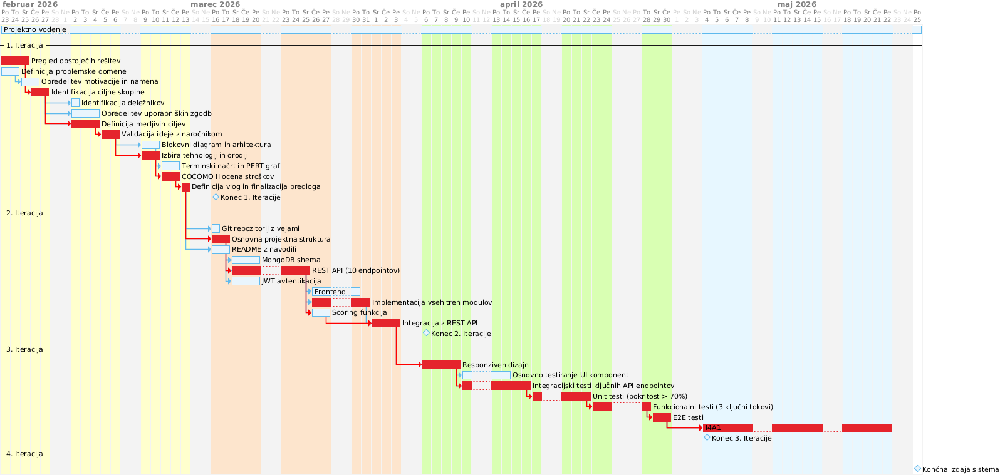

**Ganttov diagram** (izvorna koda [PlantUML](./gradivo/plantuml/Ganttov_diagram3.puml))

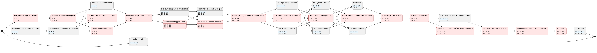

**Graf PERT** (izvorna koda [PlantUML](./gradivo/plantuml/PERT_diagram_odvisnosti3.puml))

## 7 Ekipa
### Opis aktivnosti in prispevkov članov ekipe v tej iteraciji (3. iteracija)

V tej iteraciji smo se osredotočili na dejansko implementacijo sistema. Naloge smo si razdelili glede na predznanja in interese posameznikov, pri čemer je Aleks Gogić prevzel organizacijo sestankov, spremljanje rokov in komunikacijo z naročnikom (profesorjem). Ostali člani so prav tako aktivno sodelovali pri usklajevanju, dogovarjanju o terminih in medsebojni pomoči. V tej iteraciji smo organizirali štiri krajše sestanke (ob začetku, po prvem tednu, sredi in pred zaključkom iteracije) ter redno komunicirali prek skupinskega klepeta.

#### A1: Vodenje ekipe in koordinacija

V ekipi smo si naloge razdelili glede na sposobnosti, vendar je Aleks Gogić prevzel organizacijo sestankov, spremljanje rokov in komunikacijo z naročnikom (profesorjem). Ostali člani so prav tako aktivno sodelovali pri usklajevanju, dogovarjanju o terminih in medsebojni pomoči. V tej iteraciji so bili organizirani štirje krajši sestanki in redna komunikacija prek skupinskega klepeta.

- **Aleks Gogić:** 60 % – organizacija sestankov, komunikacija z naročnikom, struktura poročila, poglavji 1 in 6, refleksija, končna integracija
- **Miha Fabčič:** 10 % – sodelovanje pri usklajevanju, organizacija terminskih zapisov
- **Jakob Jesenko:** 10 % – sodelovanje pri usklajevanju, vodenje seznama nalog
- **Tim Pezdirc:** 10 % – sodelovanje pri usklajevanju, vodenje dnevnika sprememb
- **Leja Petrič:** 10 % – sodelovanje pri usklajevanju, koordinacija pri razvoju pametne komponente

#### A2: Razvoj backenda (Node.js/Express, MongoDB, JWT, e-mail)

Aktivnost vključuje vzpostavitev MongoDB podatkovne baze z dokumentnimi modeli, implementacijo REST API endpointov, JWT avtentikacijo z zaščito poti ter integracijo e-poštnega servisa (Resend) za verifikacijo računa in ponastavitev gesla.

- **Aleks Gogić:** 20 % – implementacija JWT avtentikacije, zaščita API poti, e-mail servis, končna integracija backenda
- **Miha Fabčič:** 30 % – pomoč pri postavitvi osnovne strukture, testiranje endpointov
- **Jakob Jesenko:** 30 % – vzpostavitev MongoDB baze in modelov (Uporabnik, Profil, Interes, Skupina, Sporočilo)
- **Tim Pezdirc:** 15 % – implementacija REST API endpointov za uporabnike, profile in iskanje
- **Leja Petrič:** 5 % – priprava sintetičnih podatkov za testiranje baze

#### A3: Razvoj pametne komponente (scoring algoritem)

Aktivnost vključuje implementacijo scoring funkcije za ujemanje uporabnikov (interesi, lokacija, čas) z Jaccard indeksom, Haversine formulo in časovnim prekrivanjem ter optimizacijo algoritma za hitro delovanje.

- **Leja Petrič:** 70 % – glavna implementacija pametne komponente (scoring funkcija, uteži)
- **Tim Pezdirc:** 15 % – povezava scoring funkcije z REST API-jem
- **Aleks Gogić:** 5 % – pregled in testiranje algoritma
- **Miha Fabčič:** 5 % – testiranje na sintetičnih podatkih
- **Jakob Jesenko:** 5 % – pisanje agregacijskih poizvedb za MongoDB, optimizacija

#### A4: Razvoj frontenda (Angular – registracija, prijava, nadzorna plošča)

Aktivnost vključuje implementacijo Angular frontenda: tok registracije v treh korakih, prijavo z JWT ter uporabniško nadzorno ploščo (dashboard) za pregled predlogov skupin in profila.

- **Miha Fabčič:** 50 % – implementacija registracije v treh korakih, prijava, povezava z backend API-jem
- **Tim Pezdirc:** 20 % – implementacija nadzorne plošče uporabnika (pregled predlogov skupin in profila)
- **Aleks Gogić:** 10 % – pomoč pri integraciji JWT žetonov s frontendom
- **Jakob Jesenko:** 10 % – implementacija urejanja profila in ponastavitve gesla
- **Leja Petrič:** 10 % – testiranje uporabniškega toka

#### A5: Razvoj administratorskega vmesnika

Aktivnost vključuje implementacijo administratorske plošče za pregled uporabnikov, skupin in metrik algoritma.

- **Tim Pezdirc:** 20 % – implementacija nadzorne plošče administratorja (pregled uporabnikov, skupin, metrik)
- **Miha Fabčič:** 20 % – pomoč pri implementaciji administratorskih funkcionalnosti
- **Aleks Gogić:** 20 % – pomoč pri zaščiti administratorskih poti z JWT
- **Jakob Jesenko:** 20 % – povezava administratorskega vmesnika s podatkovnimi modeli
- **Leja Petrič:** 20 % – testiranje administratorskih funkcionalnosti

#### A6: Pisanje poročila (2. poročilo o stanju – "Izvedljiv sistem")

Aktivnost vključuje pisanje, urejanje, oblikovanje in končno integracijo celotnega poročila o stanju sistema. Pisanje je potekalo vzporedno z razvojem v zadnjem tednu iteracije.

- **Aleks Gogić:** 60 % – struktura, uvod, vodenje projekta, refleksija, končna integracija
- **Miha Fabčič:** 10 % – opis sistema (frontend, chat, kontakt), testi
- **Jakob Jesenko:** 10 % – opis sistema (baza, backend, urejanje profila), nefunkcionalne zahteve, diagrami
- **Tim Pezdirc:** 10 % – trenutno stanje, dnevnik sprememb, API specifikacija, nadzorni plošči
- **Leja Petrič:** 10 % – pametna komponenta, krmilniki, cilji, potrebe naročnika

### Preglednica vlog za 3. iteracijo (povprečni prispevki)

| Aktivnost | Aleks Gogić | Miha Fabčič | Jakob Jesenko | Tim Pezdirc | Leja Petrič |
|-----------|-------------|-------------|---------------|-------------|--------------|
| A1: Vodenje ekipe in koordinacija | 60 % | 10 % | 10 % | 10 % | 10 % |
| A2: Razvoj backenda (MongoDB, API, JWT, e-mail) | 20 % | 30 % | 30 % | 15 % | 5 % |
| A3: Razvoj pametne komponente (scoring) | 5 % | 5 % | 5 % | 15 % | 70 % |
| A4: Razvoj frontenda (Angular) | 10 % | 50 % | 10 % | 20 % | 10 % |
| A5: Razvoj administratorskega vmesnika | 20 % | 20 % | 20 % | 20 % | 20 % |
| A6: Pisanje poročila | 60 % | 10 % | 10 % | 10 % | 10 % |
| **Povprečni prispevek** | **20 %** | **20 %** | **20 %** | **20 %** | **20 %** |

### Povzetek vlog (usklajeno s seznamom elementov in skrbnikov)

| Član ekipe | Ključne odgovornosti (elementi iz poglavja 4) |
|------------|------------------------------------------------|
| **Aleks Gogić** | Vodenje ekipe, organizacija sestankov, komunikacija z naročnikom, struktura poročila, poglavji 1 in 6, refleksija, končna integracija, avtentikacija (JWT), e-mail servis (Resend) |
| **Miha Fabčič** | Sodelovanje pri usklajevanju, chat (REST simulacija), kontakt (feedback), implementacija registracije in prijave v Angularju, testiranje |
| **Jakob Jesenko** | Sodelovanje pri usklajevanju, urejanje profila, ponastavitev gesla, MongoDB baza in modeli, agregacijske poizvedbe, diagrami, nefunkcionalne zahteve |
| **Tim Pezdirc** | Sodelovanje pri usklajevanju, nadzorna plošča uporabnika, nadzorna plošča administratorja, REST API endpointi, dnevnik sprememb, API specifikacija |
| **Leja Petrič** | Sodelovanje pri usklajevanju, pametna komponenta (scoring), krmilniki, sintetični podatki, cilji, potrebe naročnika |

### Opombe k prispevkom

Kljub temu da so bili prispevki pri posameznih aktivnostih različni (nekdo je več delal na backendu, drugi na pametni komponenti, tretji na frontendu), je **povprečni prispevek vseh članov ekipe enak – 20 %**. Razlike so posledica različnih predznanj in interesov, vendar smo si med seboj pomagali, usklajevali in pokrivali manjkajoča področja. Aleks Gogić je prevzel nekoliko več organizacijskih in koordinacijskih nalog ter pisanja poročila, medtem ko so ostali člani več prispevali k specifičnim tehničnim področjem. Skupaj smo dosegli vse zastavljene cilje iteracije.


## 9 Refleksija

### Kaj je šlo po pričakovanjih?

Sodelovanje in komunikacija v ekipi sta delovali dobro. Redno smo komunicirali prek skupinskega klepeta in se uspešno organizirali za štiri krajše sestanke (ob začetku, po prvem tednu, sredi in pred zaključkom iteracije). Delitev na področja (backend, frontend, pametna komponenta) se je izkazala za učinkovito.

Hitro smo uskladili, da je treba dokumentacijo pisati vzporedno z razvojem, ne šele pred njim.

Vse ključne funkcionalnosti (avtentikacija, registracija, prijava, nadzorna plošča) smo uspešno implementirali do konca iteracije.

### Kaj ni šlo po pričakovanjih?

Glavna težava je bil zamik pri implementaciji administratorskega vmesnika in chata. Zaradi poznega začetka kodiranja nismo uspeli implementirati WebSocket chata, ampak le simulacijo prek REST API-ja. Prav tako administratorska plošča ni povsem dokončana (manjkajo metrike algoritma).

Druga težava je bila pomanjkljiva specifikacija scoring algoritma, kar je povzročilo 3 dni zamika pri razvoju pametne komponente.

### Kakšne težave so se pojavile pri ciljih, ki jih niste dosegli?

- **Nedokončan administratorski vmesnik:** Metrike algoritma in upravljanje skupin nista bila implementirana do načrtovanega roka.
- **Chat v realnem času:** WebSocket (Socket.io) ni bil implementiran, uporabili smo simulacijo prek REST API-ja.
- **Zamik pri integraciji:** CORS napake in napačne URL poti so povzročile 2 dni zamika pri povezavi backenda in frontenda.

### Kako nameravate premagati te težave?

- **Za nedokončan administratorski vmesnik in chat:** V naslednji (4.) iteraciji bomo prioritizirali dokončanje teh funkcionalnosti takoj na začetku.
- **Za zamik pri integraciji:** V naslednji iteraciji bomo najprej vzpostavili testno okolje in preverili povezavo med backendom in frontendom, preden začnemo z razvojem novih funkcij.

### Kaj boste naredili drugače v naslednji iteraciji?

- **Zgodnejše testiranje integracije:** Že na začetku iteracije bomo preverili CORS nastavitve in okoljske spremenljivke.
- **Prioritizacija nedokončanih funkcionalnosti:** Takoj na začetku 4. iteracije bomo dokončali administratorski vmesnik in WebSocket chat.
- **Rednejši kratki sestanki:** Ohranili bomo 10-minutne online sestanke 2-krat tedensko za spremljanje napredka.
- **Dnevno spremljanje napredka kodiranja:** Vsak dan bomo na kratkem sestanku preverili, kaj je bilo narejeno in kaj so ovire.
