# :blue_square: Končna izdaja (celovito končno poročilo)

| [:arrow_backward:](03_Izvedljiv_sistem_2_porocilo_o_stanju.md) Prejšnji dokument |                       Trenutni dokument                       | Naslednji dokument |
| :------------------------------------------------------------------------------- | :-----------------------------------------------------------: | -----------------: |
| :green_square: **Izvedljiv sistem**<br>(2. poročilo o stanju)                    | :blue_square: **Končna izdaja**<br>(celovito končno poročilo) |                    |


Končno poročilo naj bo edini vir za pregled poljubnega vidika projekta. Pričakuje se, da vsebuje posodobljene podatke o dodani vrednosti za naročnika iz [predloga projekta](01_Predlog_projekta.md), opredelitvi problema iz [1. poročila o stanju](02_Osnutek_sistema_1_porocilo_o_stanju.md) in opis sistema iz [2. poročila o stanju](03_Izvedljiv_sistem_2_porocilo_o_stanju.md). Razdelek [**9 Refleksija**](#9-refleksija) predstavlja retrospektiven pogled na celoten pogled. Vsebino iz prejšnjih poročil lahko ponovno uporabite, vključno z uporabniškimi zgodbami, primeri uporabe, kontekstnim diagramom in osrednjimi arhitekturnimi pogledi.

## :page_with_curl: Opisni naslov, osredotočen na prednosti za naročnika

## :information_desk_person: Ime ekipe: Člani ekipe

## 0 Projektna ideja

### 0.1 Ozadje

V urbanih okoljih Slovenije in med študenti ali mladimi zaposlenimi se pogosto pojavlja problem socialne izolacije. Selitev v novo mesto, delo na daljavo in razpršene socialne mreže zmanjšujejo spontane družabne stike in priložnosti za spoznavanje novih ljudi.

Med najbolj znanimi aplikacijami za spoznavanje novih ljudi je **Tinder**, ki uporabnikom omogoča povezovanje na podlagi lokacije in osebnih preferenc. Aplikacija je primarno namenjena individualnim zmenkom, kjer uporabniki ocenjujejo profile drugih uporabnikov in se povežejo ob obojestranskem interesu.

Podobno deluje tudi **Bumble**, ki poleg romantičnih povezav omogoča tudi spoznavanje prijateljev ali profesionalnih kontaktov. Sistem prav tako temelji predvsem na individualnem ujemanju uporabnikov, ne pa na oblikovanju večjih skupin.

Drugačen pristop uporablja platforma **Meetup**, ki je namenjena organizaciji dogodkov in srečanj za večje skupine ljudi na podlagi skupnih interesov. Uporabniki se lahko pridružijo različnim skupinam ali dogodkom, ki jih organizirajo drugi uporabniki.

V zadnjih letih so se pojavile tudi aplikacije, ki poskušajo uporabnike povezovati v manjše skupine za družabna srečanja. Ena izmed takšnih je **Timeleft**, ki organizira večerje za manjše skupine neznancev na podlagi kratkega vprašalnika o osebnosti. Sistem vsak teden uporabnikom določi restavracijo in skupino ljudi, s katerimi se srečajo, vendar je tak pristop precej omejen na specifično aktivnost in določen čas srečanja.

Podoben koncept uporablja aplikacija **We3**, ki uporabnike povezuje v manjše skupine treh oseb na podlagi osebnostnih vprašalnikov in interesov. Algoritem poskuša ustvariti skupine z visoko socialno kompatibilnostjo, vendar je cilj predvsem oblikovanje dolgoročnih prijateljstev, ne pa spontanih družabnih srečanj.

Novejši primer predstavlja aplikacija **222**, ki uporabnike povezuje v manjše skupine za različne aktivnosti, kot so kava ali sprehodi. Sistem pri tem upošteva lokacijo in interese uporabnikov, vendar je trenutno na voljo predvsem v večjih mestih v Združenih državah.

Kljub temu večina teh rešitev ne ponuja **avtomatskega** oblikovanja manjših skupin uporabnikov za spontana srečanja. Pogosto se osredotočajo bodisi na individualno povezovanje bodisi na organizacijo večjih dogodkov, kjer morajo uporabniki sami poiskati ustrezno skupino ali aktivnost.

**Predlagani sistem** se od obstoječih rešitev razlikuje po tem, da se osredotoča na avtomatsko oblikovanje manjših skupin uporabnikov (npr. 3–5 oseb) na podlagi več kriterijev hkrati, kot so interesi, lokacija in časovna razpoložljivost. Namesto organizacije velikih dogodkov ali individualnih zmenkov sistem poskuša optimizirati sestavo manjših skupin, kjer je verjetnost uspešne socialne interakcije večja.

### 0.2 Področje in motivacija

Problem, ki ga želimo obravnavati, je **oblikovanje manjših skupin ljudi za spontana družabna srečanja** na podlagi njihovih interesov, lokacije in časovne razpoložljivosti.

Organizacija takšnih srečanj pogosto zahteva več korakov usklajevanja med posamezniki, kar zmanjšuje spontanost druženja. Posamezniki morajo:
- Najti ljudi s podobnimi interesi
- Uskladiti lokacijo srečanja
- Najti skupen časovni termin
- Organizirati konkretno aktivnost

**Motivacija projekta** je raziskati, ali lahko informacijski sistem z uporabo algoritma za oblikovanje skupin avtomatizira proces povezovanja uporabnikov v manjše kompatibilne skupine ter tako poveča možnosti za uspešna spontana druženja.

### 0.3 Namen projekta

Namen projekta je razviti **prototip sistema**, ki demonstrira algoritem za oblikovanje manjših skupin uporabnikov za družabna srečanja.

Sistem bi na podlagi:
- **interesov uporabnikov** (aktivnosti, hobiji, preference)
- **njihove lokacije** (geografska bližina)
- **časovne razpoložljivosti** (prosti termini)

predlagal skupine 3–5 ljudi, ki imajo največjo verjetnost za uspešno družabno srečanje.

Sistem, ki ga gradimo bi imel naslednje koristi:
- Zmanjšanje časa, potrebnega za organizacijo srečanja
- Povečanje možnosti za spontana druženja
- Boljša izkušnja uporabnikov pri iskanju družbe za neformalne aktivnosti
- Zmanjšanje socialne izolacije v urbanih okoljih
- Omogočanje spoznavanja novih ljudi v varnem in strukturiranem okolju

### 0.4 Cilji

Glavni cilji, ki jih želimo s projektom doseči so naslednji:

1. **Razvoj prototipa sistema** za zbiranje podatkov o interesih, lokaciji in razpoložljivosti uporabnikov
2. **Implementacija(prilagoditev obstoječega/ih) algoritma** za oblikovanje skupin uporabnikov na podlagi večkriterijske optimizacije
3. **Analiza in ovrednotenje kakovosti** oblikovanih skupin
4. **Testiranje uporabniške izkušnje** z realnimi uporabniki
5. **Dokumentacija sistema** in tehničnih odločitev

Podrobnejša opredelitev ciljev je v poglavju [3 Cilji projekta](#3-cilji-projekta).

### 0.5 Smernice

Pri razvoju sistema bomo upoštevali naslednje smernice:

- **Modularnost kode**: Algoritem za oblikovanje skupin bo ločen od uporabniškega vmesnika, kar omogoča ponovno uporabo in testiranje
- **Zasebnost uporabnikov**: Sistem ne bo shranjeval nepotrebnih osebnih podatkov; lokacija bo shranjena le na nivoju mesta ali okraja
- **Razširljivost**: Arhitektura bo omogočala dodajanje novih kriterijev za oblikovanje skupin (npr. starostna skupina, jezikovne preference)
- **Testabilnost**: Algoritem bo ovrednotljiv z merljivimi metrikami (podobnost interesov, geografska razdalja, časovno prekrivanje)
- **Uporabniška izkušnja**: Sistem bo intuitiven in zahteval minimalen čas za vnos podatkov
- **Etična uporaba podatkov**: Algoritem ne bo diskriminiral uporabnikov na podlagi zaščitenih značilnosti

### 0.6 Ciljna skupina in končni uporabniki

**Primarni ciljni uporabniki sistema za organizacijo skupin so:**

1. **Študenti**: Posamezniki, ki študirajo v novih mestih in iščejo družbo za neformalne aktivnosti
2. **Mladi zaposleni**: Osebe, ki so se zaposlile v novem mestu in želijo spoznati lokalno skupnost
3. **Priseljenci v novo mesto**: Posamezniki, ki so se preselili zaradi službe, študija ali drugih razlogov
4. **Odrasli, ki iščejo nove socialne stike**: Osebe, ki želijo razširiti svoj krog prijateljev ali spoznati ljudi s podobnimi hobiji

Opomba: Navedene skupine (študenti, mladi zaposleni, priseljenci) so podskupine istega primarnega segmenta končnih uporabnikov in se v nadaljevanju obravnavajo enotno kot mladi odrasli v urbanih okoljih.

**Končni uporabniki bodo sistem uporabljali za:**

- Vnos svojih interesov, hobijev in preferenc za aktivnosti
- Določitev približne lokacije (mesto ali okraj)
- Vnos časovne razpoložljivosti (dnevi v tednu, urni razponi)
- Prejem predlogov manjših skupin ljudi (3–5 oseb) za družabna srečanja
- Sodelovanje v predlaganih skupinah za spontana srečanja
- Povratno informacijo o uspešnosti srečanj

**Sekundarni deležniki oziroma deležniki, ki bodo imeli od projekta koristi, ne da bi bili neposredno vključeni so:**

- **Lokalni poslovni subjekti**: Kavarne, restavracije in drugi prostori, kjer bi se uporabniki lahko srečali
- **Občine in lokalne skupnosti**: Organizacije, ki podpirajo socialno vključenost in lokalno povezovanje

Podrobnejša analiza potreb naročnika je v poglavju [2 Potrebe naročnika](#2-potrebe-naročnika).

## 1 Uvod

### Začetni odstavek

Socialna izolacija je naraščajoč problem v urbanih okoljih, še posebej med mladimi odraslimi, ki se selijo v nova mesta zaradi študija ali zaposlitve. Čeprav obstajajo številne platforme za spoznavanje novih ljudi, večina bodisi omogoča individualno povezovanje (Tinder, Bumble) bodisi organizacijo velikih dogodkov (Meetup), medtem ko je oblikovanje manjših, kompatibilnih skupin za spontana srečanja še vedno ročen in časovno zahteven proces.

Projekt naslavlja ta problem z razvojem **inteligentnega sistema za avtomatsko oblikovanje manjših skupin uporabnikov** (3–5 oseb) na podlagi večkriterijske optimizacije, ki upošteva interese, lokacijo in časovno razpoložljivost. Cilj je zmanjšati organizacijske ovire in povečati verjetnost uspešnih družabnih srečanj.

Ključna inovacija projekta je **pametna komponenta** – algoritem za oblikovanje skupin, ki kombinira podobnost interesov, geografsko bližino in časovno usklajevanje v enoten ocenjevalni sistem. Na ta način sistem ne predlaga le naključnih skupin, temveč optimizira sestavo tako, da maksimizira kompatibilnost članov.

### 1.1 Izzivi

Glavni izzivi projekta so:

**1. Tehnični izzivi:**
- **Oblikovanje algoritma za večkriterijsko optimizacijo**: Potrebno je razviti/preoblikovati algoritem, ki učinkovito kombinira različne kriterije (interesi, lokacija, čas) in oblikuje optimalne skupine
  - *Pristop*: Uporaba scoring sistema z utežmi ter primerjava različnih metrik podobnosti (Cosine Similarity, Jaccard Index)
- **Ravnovesje med natančnostjo in zasebnostjo**: Sistem mora delovati z omejenimi podatki o uporabnikih
  - *Pristop*: Zbiranje le nujnih podatkov; lokacija na nivoju mesta/okraja, ne GPS koordinat

**2. Algoritemski izzivi:**
- **Skalabilnost algoritma**: Kako zagotoviti, da algoritem deluje učinkovito tudi pri večjem številu uporabnikov?
  - *Pristop*: Testiranje učinkovitosti na sintetičnih podatkih različnih velikosti
- **Kakovost skupin**: Kako zagotoviti, da predlagane skupine dejansko vodijo do uspešnih srečanj?
  - *Pristop*: Definiranje metrik kakovosti in testiranje z realnimi uporabniki

**3. Organizacijski izzivi:**
- **Zbiranje povratnih informacij**: Kako motivirati uporabnike, da podajo povratne informacije po srečanju?
  - *Pristop*: Preprost in hiter vprašalnik; morda gamifikacija
- **Cold-start problem**: Kako sistem deluje, ko je uporabnikov še malo?
  - *Pristop*: Testiranje z manjšo skupino zgodnjih uporabnikov (študenti FRI)

**Poznavanje tehnologije:**
- Večina tehnologij je ekipi poznana (JavaScript, algoritmi, spletne aplikacije)
- Nova področja: Vektorska podobnost, optimizacijski algoritmi za oblikovanje skupin
- Učenje: Študij literature o recommendation systems in group formation algorithms

### 1.2 Poudarki

V projektu je ekipa uspešno realizirala vse ključne cilje, postavljene v začetnem predlogu:

1. **Delujoči MVP sistem** – V celoti implementiran sistem za avtomatsko oblikovanje manjših skupin uporabnikov za spontana družabna srečanja, ki vključuje registracijo, profil, iskanje skupin in skupinski chat.

2. **Pametna komponenta z algoritmom** – Razvit in vzpostavljen scoring model, ki kombinira tri ključne kriterije ujemanja: podobnost interesov (Jaccard indeks), geografsko razdaljo (Haversine formula) in časovno prekrivanje uporabnikov. Model stabilno generira predloge skupin in je prototipno kalibriran na testnih podatkih.

3. **Celovita tehnična arhitektura** – Vzpostavljena je bila tristopenjska arhitektura (frontend, backend, baza): Angular SPA za uporabniški vmesnik, Node.js/Express REST API za poslovno logiko, MongoDB za podatke in Socket.io za komunikacijo v realnem času v skupinskih chatih.

4. **Ključni uporabniški tokovi** – Implementirani so bili vsi osnovni tokovi: registracija v treh korakih s e-pošto, prijava z JWT avtentikacijo, iskanje skupin, pregled predlogov z informacijami o članih, potrditev/zavrnitev udeležbe in skupinski chat za usklajevanje srečanja.

5. **Administratorski nadzor** – Razvit je bil administratorski panel z mogočnostmi za upravljanje uporabnikov, pregled prijav neprimernega vedenja, vpogled v skupinski chat, pregled povratnih informacij ter spremljanje ključnih metrik kakovosti algoritma.

6. **Testiranje in validacija** – Sistem je bil testiran z realnimi uporabniki z zbiranjem povratnih informacij in analizo kakovosti oblikovanih skupin, kar je omogočilo iterativno izboljšavo algoritma.

7. **Celovita dokumentacija** – Celoten projekt je dokumentiran z detaljno specifikacijo vmesnikov, primerov uporabe, arhitekturnih pogledov, diagramov zaporedja in tehničnih odločitev, ki omogočajo razumevanje in nadaljnji razvoj sistema.

### 1.3 Spremembe

Med semestrom je bil projekt deležen večjih sprememb pri fokusiranju obsega in izbiri tehnoloških pristopov, narekanih s povratnimi informacijami mentorja in dejanskimi izkušnjami med razvojem:

**Sprememba 1 – Fokusiranje MVP in izbira algoritmičnega pristopa (februar–marec 2026)**
- **Motivacija:** Začetni predlog je bil preširok in ambiciozen. Povratna informacija mentorja je poudarila, da je treba drastično zmanjšati obseg in se fokusirati na jedro sistema – algoritemu za oblikovanje manjših skupin na podlagi treh ključnih kriterijev.
- **Opis:** Namesto razvoja naprednega sistema z mnogimi dodatnimi funkcionalnostmi, uporabniško usmerjenim ojačevanjem in napovedovanjem dogodkov, je ekipa izbala fokusirane tri kriterije (interesi, lokacija, čas). Ključna odločitev: ne graditi novega algoritma iz nič, ampak prilagoditi obstoječe znane pristope (Jaccard indeks za interese, Haversine za geografsko razdaljo, časovno prekrivanje).
- **Posledice:** Obseg projekta je bil bolj izvedljiv v enem semestru, arhitektura manj kompleksna in verjetnost za validacijo ideje z realnimi uporabniki večja. Ta sprememba je bila ključna za hitrost razvoja in relevantnost rezultatov.

**Sprememba 2 – Detaljne specifikacije vmesnikov in formalnih primerov uporabe (marec 2026)**
- **Motivacija:** Pred začetkom razvoja je bilo kritično jasno opredeliti natanko, kaj sistema »naredi« in kako se uporabnik giblje skozi sistem. To je bila podlaga za koordinacijo med frontendom in backendom.
- **Opis:** Ekipa je pripravila podrobne zaslonske maske, 17 formalnih primerov uporabe (z osnovnimi, alternativnimi in izjemnimi tokovi), točno opredelitev vloge gosta (neprijavljeni uporabnik), administratorskih funkcij in zunanjaga API vmesnikov (geokodiranje, e-pošta).
- **Posledice:** Specifikacija je postala »resnica sistema« in podlaga za ves razvoj. Vmesniki so bili dosljedno implementirani po teh specifikacijah, kar je zmanjšalo potrebo po spremembah med razvojem in pospešilo produkcijo delujočega prototipa.

**Sprememba 3 – Preprost scoring pristop namesto LLM za pametno komponento (februar 2026)**
- **Motivacija:** Povratna informacija je jasno navedla, da je za MVP LLM (jezikovni model) nepotreban in da je preprost, numeričnih scoring pristop boljši: hitrejši za razvoj, bolj pregleden za kalibriranje in bolj kontroliran pri kvaliteti predlogov.
- **Opis:** Ekipa je razvila preprost model: `score = w1 * similarity_interesov + w2 * geografska_razdalja + w3 * casovno_prekrivanje`, ki ga je mogoče enostavno razširiti z novimi kriteriji in kalibrirati na podlagi povratnih informacij iz testiranja.
- **Posledice:** Algoritem je hitro zaživel v produkciji (3. teden april), prototipna testiranja z realnimi uporabniki so pokazala primerno delovanje, uteži pa so se iterativno prilagajale na podlagi povratnih informacij.

**Sprememba 4 – Strike sistem kot razširitev varnostnega mehanizma (maj 2026)**
- **Motivacija:** Med razvojem je ekipa ugotovila potrebo po dodatnem mehanizmu za obravnavo neprimernega vedenja in zaščito varnosti uporabnikov.
- **Opis:** Predlagan je bil »strike sistem«, pri katerem uporabnik prejme do tri opozorila. Z vsakim strike-om je status vidno označen, s tretjim pa je uporabnik blokiran. Algoritem oblikovanja skupin razporeja uporabnike brez strike-ov posebej od tistih z 1 ali 2 strike-a.
- **Posledice:** Strike sistem je bil prototipno implementiran kot razširitev nad jedrom MVP. Ker nismo prejeli dodatne povratne informacije nanj, ga obravnavamo kot nadgradnjo za naslednje iteracije, osnoven sistem pa ima že implementirane prijave neprimernega vedenja in administrativno obravnavo.

## 2 Potrebe naročnika

**Primarni naročnik**: Končni uporabniki sistema - mladi odrasli (18-35 let) v urbanih območjih Slovenije, ki iščejo družbo za spontana družabna srečanja.

**Sekundarni deležniki**:
- Lokalni poslovni subjekti (kavarne, restavracije, prostori za srečanja)
- Občine in lokalne skupnosti (socialna vključenost in povezovanje)
- Študentske organizacije in univerzitetne skupnosti (kanal za vključevanje uporabnikov)

**Kaj deležniki želijo?**
- **Primarni naročnik (končni uporabniki)** želi:
  - **Spontana druženja** brez dolgotrajne organizacije
  - **Spoznavanje ljudi s podobnimi interesi** v neformalnem okolju
  - **Varno okolje** za spoznavanje novih ljudi
  - **Časovno učinkovito** usklajevanje srečanj
  - **Fleksibilnost** pri izbiri aktivnosti in terminov
- **Sekundarni deležniki** želijo:
  - Več vključevanja mladih v lokalno skupnost
  - Večjo obiskovanost lokalnih družabnih prostorov
  - Strukturiran in varen način organizacije srečanj

**Zakaj?**
- Ročno iskanje in usklajevanje ljudi za druženje je časovno potratno
- Obstoječe platforme so osredotočene na velike skupine ali individualne zmenke
- Težko je najti ljudi s podobnimi interesi in prosto časovno razpoložljivostjo hkrati
- Socialna izolacija v novih mestih negativno vpliva na psihično zdravje

**Želena splošna izkušnja:**
Uporabniki želijo **preprost, intuitiven sistem**, kjer lahko z minimalnim naporom (vnos interesov in razpoložljivosti) dobijo **kakovostne predloge manjših skupin ljudi** za družabna srečanja. Želijo si, da sistem **razume njihove preference** in predlaga skupine, ki imajo **visoko verjetnost uspešne socialne interakcije**.

### 2.1 Uporabniške zahteve

**Uporabniška zgodba 1: Registracija in vnos profila**

Kot **nov uporabnik** želim **hitro in preprosto ustvariti profil z vnosom osnovnih informacij, interesov in časovne razpoložljivosti**, da **lahko sistem začne oblikovati zame primerne skupine**.

*Testi sprejemljivosti:*
- Glede **na to, da sem nov uporabnik**, ko **odprem aplikacijo prvič** in **vnesem svoje ime, približno lokacijo (mesto), vsaj 3 interese in časovno razpoložljivost za naslednji teden**, potem **je moj profil uspešno ustvarjen in vidim potrditev, da je sistem pripravljen na iskanje skupin**.
- Glede **na to, da sem nov uporabnik**, ko **poskušam ustvariti profil brez vnosa obveznih polj**, potem **sistem prikaže jasna opozorila, katera polja so obvezna**.

---

**Uporabniška zgodba 2: Iskanje in predlogi skupin**

Kot **prijavljen uporabnik z izpolnjenim profilom** želim **prejeti predloge manjših skupin (3–5 oseb) za družabna srečanja na podlagi mojih interesov, lokacije in časovne razpoložljivosti**, da **lahko izberem skupino, ki mi je najbolj všeč, in se z njimi srečam**.

*Testi sprejemljivosti:*
- Glede **na to, da imam izpolnjen profil z interesi in časovno razpoložljivostjo**, ko **zahtevam iskanje skupin**, potem **sistem v 5 sekundah prikaže seznam vsaj 1 predlagane skupine z informacijami o skupnih interesih, lokaciji in predlaganem času srečanja**.
- Glede **na to, da je predlagana skupina**, ko **pregledam člane skupine**, potem **vidim njihove interese, približno lokacijo in skupne časovne termine brez osebnih podatkov (npr. polno ime, naslov)**.

---

**Uporabniška zgodba 3: Potrditev udeležbe**

Kot **uporabnik, ki je prejel predlog skupine** želim **potrditi ali zavrniti udeležbo v predlagani skupini**.

*Testi sprejemljivosti:*
- Glede **na to, da sem prejel predlog skupine**, ko **potrdim ali zavrnem udeležbo**, potem **se moj status v skupini posodobi in je ostalim članom prikazan z barvnim indikatorjem (zeleno/rdeče)**.

---

**Uporabniška zgodba 4: Posodobitev razpoložljivosti in interesov**

Kot **prijavljen uporabnik** želim **kadarkoli posodobiti svoje interese, lokacijo ali časovno razpoložljivost**, da **sistem lahko prilagodi predloge skupin glede na moje trenutne preference**.

*Testi sprejemljivosti:*
- Glede **na to, da sem prijavljen uporabnik**, ko **spremenim svoje interese ali časovno razpoložljivost** in **shranim spremembe**, potem **sistem posodobi moj profil in uporabi nove podatke pri naslednjem iskanju skupin**.
- Glede **na to, da sem posodobil svoj profil**, ko **znova zahtevam iskanje skupin**, potem **sistem prikaže nove predloge, ki upoštevajo posodobljene podatke**.

---

**Uporabniška zgodba 5: Povratna informacija po srečanju**

Kot **uporabnik, ki se je udeležil srečanja** želim **podati kratko povratno informacijo o srečanju (ocena zadovoljstva, uspešnost skupine)**, da **sistem lahko izboljša prihodnje predloge in analizira kakovost oblikovanih skupin**.

*Testi sprejemljivosti:*
- Glede **na to, da sem se udeležil srečanja**, ko **sistem po 24 urah od predvidenega časa srečanja zahteva povratno informacijo**, potem **lahko izpolnim kratek vprašalnik (max. 1 minuta) z oceno zadovoljstva in uspešnosti srečanja**.
- Glede **na to, da sem oddal povratno informacijo**, ko **pregledam zgodovino svojih srečanj**, potem **vidim statistiko svojih preteklih srečanj in povratnih informacij**.

---

**Uporabniška zgodba 6: Varnost in prijava neprimernega vedenja**

Kot **uporabnik** želim **prijaviti neprimerno vedenje drugih članov skupine ali neprimerne vsebine**, da **se zagotovi varno okolje za vse uporabnike**.

*Testi sprejemljivosti:*
- Glede **na to, da sem opazil neprimerno vedenje**, ko **kliknem na gumb za prijavo in vnesem opis incidenta**, potem **je prijava poslana administratorju sistema in prejemem potrditev o prejetju prijave**.
- Glede **na to, da je bila oddana prijava**, ko **administrator pregleda prijavo**, potem **lahko ukrepa (opozorilo, začasna prepoved, izbris uporabnika) glede na resnost incidenta**.

---

**Uporabniška zgodba 7: Prijava v sistem**

Kot **registrirani uporabnik** želim **se prijavi v sistem s svojimi poverilnicami**, da **dostopam do svojega profila, predlogov skupin in ostalih funkcionalnosti**.

*Testi sprejemljivosti:*
- Glede **na to, da sem registrirani uporabnik**, ko **vnesem pravilno e-pošto in geslo ter kliknem prijavo**, potem **sem uspešno prijavljen in vidim svojo nadzorno ploščo s predlogi skupin**.
- Glede **na to, da sem registrirani uporabnik**, ko **vnesem napačno geslo**, potem **sistem prikaže jasno opozorilo o napačnih poverilnicah in omogoči nov poskus**.
- Glede **na to, da moj račun ni verificiran**, ko **poskušam prijaviti**, potem **sistem zavrne prijavo z opozorilom, da moram prvo potrditi e-pošto**.

---

**Uporabniška zgodba 8: Ponastavitev gesla**

Kot **uporabnik, ki sem pozabil geslo** želim **obnoviti dostop do računa prek ponastavitve gesla**, da **se ponovno prijavim v sistem**.

*Testi sprejemljivosti:*
- Glede **na to, da sem pozabil geslo**, ko **kliknem na "Pozabljeno geslo" in vnesem svojo e-pošto**, potem **sistem pošlje povezavo za ponastavitev gesla in prikaže potrditev**.
- Glede **na to, da sem prejel povezavo za ponastavitev**, ko **odprem povezavo in vnesem novo geslo in potrdim**, potem **je novo geslo shranjeno in se lahko prijavim s to geslom**.
- Glede **na to, da je povezava za ponastavitev potekla**, ko **poskušam uporabiti staro povezavo**, potem **sistem prikaže opozorilo in ponudi novo pošiljanje povezave**.

---

**Uporabniška zgodba 9: Skupinski chat pred srečanjem**

Kot **član potrjene skupine** želim **komunicirati s člani skupine v skupinskem chatu**, da **uskladim podrobnosti srečanja in se bolje spoznam z drugimi člani**.

*Testi sprejemljivosti:*
- Glede **na to, da je skupino potvrjena in imam dostop do chata**, ko **odprem skupinski chat**, potem **vidim vse člane skupine in lahko pošiljam ter prejemam sporočila**.
- Glede **na to, da sem v skupinskem chatu**, ko **pošljem sporočilo**, potem **je moje sporočilo takoj vidno vsem članom in je označeno z mojim imenom**.
- Glede **na to, da imam dostop do skupinskega chata**, ko **pregledam zgodovino sporočil**, potem **vidim vsa prejšnja sporočila članov in kontekst naše komunikacije**.

---

**Uporabniška zgodba 10: Odjava iz sistema**

Kot **prijavljen uporabnik** želim **se varno odjaviti iz sistema**, da **zaščitim svoj račun in drugimi prepravim dostop do sistema**.

*Testi sprejemljivosti:*
- Glede **na to, da sem prijavljen uporabnik**, ko **kliknem na "Odjava"**, potem **je moja seja zaključena in sem preusmerjen na začetno ali prijavno stran**.
- Glede **na to, da sem neaktiven dalj časa**, ko **sistem zazna dolgotrajno neaktivnost**, potem **me opozori in po izteku časa avtomatično odjavi ter preusmerim na prijavno stran**.

---

**Uporabniška zgodba 11: Pregled informacijskih strani in pogostih vprašanj**

Kot **gost ali uporabnik** želim **dostopati do informacijskih strani in pogostih vprašanj**, da **se seznanim s pogoji uporabe, varstvom osebnih podatkov in drugimi informacijami**.

*Testi sprejemljivosti:*
- Glede **na to, da sem na spletni strani**, ko **kliknem na povezave v nogi (Pogosto vprašana vprašanja, Pogoji uporabe, Varstvo podatkov, Kontakt)**, potem **je vsaka stran dostopna in vsebuje pričakovano vsebino**.
- Glede **na to, da sem na informacijski strani**, ko **pregledam vsebino**, potem **so informacije jasne, dobro organizirane in dostopne**.

---

**Uporabniška zgodba 12: Kontakt s podporo in pošiljanje povratne informacije**

Kot **gost ali uporabnik** želim **poslati sporočilo ali povratno informacijo sistemu**, da **podelim svoje mnenje, vprašanja ali predloge za izboljšanje**.

*Testi sprejemljivosti:*
- Glede **na to, da želim poslati sporočilo**, ko **odprem masko za kontakt in izpolnim ime, e-pošto, zadevo in sporočilo**, potem **je moje sporočilo uspešno poslano in prejemem potrditev**.
- Glede **na to, da sem poslal sporočilo**, ko **čakam potrditve**, potem **prejemem elektronsko pošto, ki potrjuje prejem mojega sporočila**.

### 2.2 Funkcionalne zahteve

Sistem mora podpirati celoten uporabniški tok od prvega obiska do zaključka srečanja. Gost mora imeti dostop do začetne strani, informacijskih vsebin v nogi ter možnosti registracije, prijave in začetka ponastavitve gesla. Registracija mora potekati v treh jasnih korakih (osnovni podatki, interesi v obliki "tagov", lokacija z opcijo autocomplete in časovna razpoložljivost), po oddaji pa mora sistem poslati verifikacijsko povezavo za aktivacijo računa. Prijavljen uporabnik mora lahko urejati profil, sprožiti iskanje skupin, pregledati predloge in za vsak predlog odpreti hiter pregled članov skupine pred odločitvijo.

Pri upravljanju predlogov mora sistem omogočiti potrditev ali zavrnitev udeležbe in dosledno beležiti status odziva. Status mora biti viden tudi ostalim članom skupine. Vsakemu uporabniku dodeljenemu v neko skupino mora biti v vidu te skupine omogočen dostop do skupinskega chata za usklajevanje podrobnosti srečanja. Po srečanju mora sistem podpreti oddajo kratke povratne informacije (ocena in komentar) ter shranjevanje podatkov za nadaljnjo analizo kakovosti predlogov. Sistem mora uporabniku omogočiti oddajo prijave neprimernega vedenja ter potrditi prejem prijave.

Administratorski del mora omogočati pregled in obravnavo prijav neprimernega vedenja, upravljanje uporabnikov (blokada/deblokada, aktivacija/deaktivacija, opozorilo), pregled obvestil in kontaktnih obrazcev uporabnikov, pregled skupin in moderatorski vpogled v chat. Pri uporabnikih z aktivnim opozorilom mora biti v seznamu prisotna rumena vizualna oznaka. Administrator mora imeti tudi vpogled v ključne metrike kakovosti ujemanja, možnost označitve poslabšanja ter upravljanje osnovnih parametrov algoritma v skladu z internim postopkom.

### 2.3 Nefunkcionalne zahteve

Nefunkcionalne zahteve so razdeljene na zahteve izdelka, organizacijske zahteve in zunanje zahteve. Vse zahteve so zapisane merljivo, da jih je mogoče preveriti pri pregledu, testiranju ali potrjevanju izvedbe.

#### 2.3.1 Zahteve izdelka

1. Ključni tok od registracije do prvega predloga skupine mora biti izvedljiv v največ 5 minutah pri tipični uporabi in brez ročnega posega administratorja.
2. Uporabniški vmesnik mora omogočati izvedbo osnovnih tokov brez dodatnega usposabljanja, pri čemer mora najmanj 80% testnih uporabnikov brez pomoči uspešno zaključiti registracijo, prijavo in iskanje skupine.
3. Sistem mora obdelati in shraniti najmanj 99% uspešno oddanih ključnih dogodkov, kamor sodijo posodobitve profila, odzivi na predloge in povratne informacije.
4. Delež neuspešno zaključenih ključnih tokov zaradi notranjih napak sistema ne sme preseči 1%.
5. Sistem mora biti dostopen 24/7, pri čemer načrtovani mesečni izpad ne sme preseči 24 ur.
6. Sistem mora omogočiti osnovne funkcionalnosti brez ponovne namestitve ali arhitekturne prenove, kar pomeni, da mora dodajanje novega kriterija ujemanja biti izvedljivo brez spremembe obstoječih podatkovnih modelov uporabnikov.
7. Kakovost algoritma za predloge mora biti merjena z deležem potrjenih predlogov in mora dosegati najmanj 60%.
8. Sistem mora voditi revizijsko sled administrativnih dejanj, pri čemer mora biti vsaka administrativna akcija zabeležena z uporabnikom, časom in tipom akcije.
9. Iskalni in prikazni tokovi morajo ob napaki prikazati opozorilo in možnost ponovnega poskusa v največ 2 dodatnih korakih.

#### 2.3.2 Organizacijske zahteve

1. Dokumentacija sistema mora biti pripravljena v Markdown obliki in razdeljena po strukturi, uporabljeni v tem poročilu.
2. Diagrami morajo biti pripravljeni v PlantUML in vključeni kot izvorna koda ter povezava do generirane slike.
3. Projektni dokumenti morajo biti verzionirani v sistemu Git, spremembe pa morajo biti sledljive po datumu in avtorju spremembe.
4. Ekipa mora pri vsaki iteraciji dopolniti dnevnik sprememb z opisom spremembe, motivacijo in posledico.
5. V poročilu morajo biti prikazani posodobljeni Ganttov diagram in graf PERT za trenutno iteracijo.
6. Vsaka funkcionalna sprememba mora biti opisana tako, da se jo lahko poveže z enim primerom uporabe ali enim diagramom.

#### 2.3.3 Zunanje zahteve

1. Sistem mora uporabljati HTTPS za ves promet med uporabniškim vmesnikom in strežnikom.
2. Sistem mora varovati osebne podatke v skladu z GDPR, kar vključuje omejeno hrambo, namen obdelave in pravice uporabnika do vpogleda ter izbrisa.
3. Gesla morajo biti shranjena samo v zgoščeni obliki s kriptografskim hash algoritmom; nikoli se ne sme shraniti navadnega gesla.
4. Sistem mora podpirati zunanji geokodirni servis za pretvorbo lokacije v koordinate.
5. Sistem mora podpirati zunanji e-poštni servis za pošiljanje verifikacijskih in ponastavitvenih povezav.
6. Če je zunanji servis za geokodiranje ali pošiljanje e-pošte nedosegljiv, mora sistem prikazati napako in omogočiti ponovni poskus v največ 1 dodatnem koraku.

## 3 Cilji projekta

**Obravnavana težava naročnika:**
Naročniki (mladi odrasli v urbanih okoljih) se soočajo s **časovno potratnim in neučinkovitim procesom organizacije spontanih družabnih srečanj** z ljudmi s podobnimi interesi. Obstoječe rešitve ne omogočajo avtomatskega oblikovanja manjših, kompatibilnih skupin, kar vodi do socialne izolacije in zmanjšanih priložnosti za spoznavanje novih ljudi.

**Koristi sistema za naročnika (brez tehničnih podrobnosti):**

1. **Časovna učinkovitost**: Sistem avtomatizira iskanje in usklajevanje ljudi, kar zmanjša čas organizacije srečanja iz več ur/dni na nekaj minut
2. **Kakovostna srečanja**: Algoritem poskrbi, da so predlagane skupine kompatibilne (skupni interesi, bližina, časovno ujemanje), kar povečuje verjetnost uspešnih srečanj
3. **Zmanjšanje socialne izolacije**: Lažji dostop do družabnih stikov izboljšuje psihično zdravje in kakovost življenja
4. **Fleksibilnost**: Uporabniki lahko prilagajajo svoje preference in razpoložljivost, sistem pa se prilagaja njihovim spremembam
5. **Varnost**: Manjše skupine (3–5 oseb) in struktura sistema zagotavljajo bolj nadzorovano okolje za spoznavanje

**Kako koristi podpirajo želeno izkušnjo:**
Želena izkušnja uporabnikov je **preprost, hiter in zanesljiv sistem** za organizacijo družabnih srečanj. Avtomatizacija procesa, inteligentno oblikovanje skupin in uporabniku prijazen vmesnik skupaj ustvarjajo izkušnjo, kjer uporabnik **z minimalnim naporom dobi maksimalno kakovostne predloge** za druženja.

**Konkretni izdelki projekta:**

1. **Prototip spletne aplikacije** z uporabniškim vmesnikom za:
   - Registracijo, prijavo in upravljanje profila
   - Vnos interesov, lokacije in časovne razpoložljivosti
   - Pregled predlaganih skupin
   - Ocena skupine povratna informacija po aktivnosti

2. **Algoritem za oblikovanje skupin** (jedro sistema):
   - Modul za izračun podobnosti interesov
   - Modul za geografsko razdaljo
   - Modul za časovno usklajevanje
   - Optimizacijski algoritem za sestavo skupin

3. **Evalvacijska študija**:
   - Testiranje sistema z realnimi uporabniki (min. 20 testnih uporabnikov)
   - Zbiranje metrik kakovosti skupin
   - Analiza povratnih informacij uporabnikov

4. **Dokumentacija sistema**:
   - Arhitekturni načrt
   - Opis algoritma in odločitev
   - Tehnično poročilo

**Merljivi in preverljivi cilji:**

| **Cilj** | **Merilo** | **Ciljna vrednost** | **Metoda preverjanja** |
|----------|------------|---------------------|------------------------|
| **C1**: Razvoj prototipa sistema | Delovanje osnovnih funkcionalnosti (registracija, vnos podatkov, iskanje skupin) | 100% funkcionalnosti implementirano | Funkcionalno testiranje |
| **C2**: Implementacija algoritma | Algoritem oblikuje skupine na podlagi 3 kriterijev (interesi, lokacija, čas) | Povprečna podobnost interesov > 0.6, geografska razdalja < 10 km, časovno prekrivanje > 2 uri | Avtomatizirani testi z sintetičnimi podatki |
| **C3**: Kakovost oblikovanih skupin | Stopnja zadovoljstva uporabnikov s predlaganimi skupinami | > 70% uporabnikov oceni predlagano skupino z oceno 3.8/5 ali boljše | Vprašalnik po pregledu skupine |
| **C4**: Uporabniška izkušnja | Čas, potreben za registracijo in prvi predlog skupine | < 5 minut od registracije do prvega predloga | Merjenje časov med testiranjem |
| **C5**: Testiranje z realnimi uporabniki | Število testnih uporabnikov in srečanj | Min. 20 uporabnikov, min. 5 organiziranih srečanj | Evidenca registracij in potrjenih skupin |
| **C6**: Uspešnost srečanj | Delež srečanj, ki so bila dejansko izvedena in pozitivno ocenjena | > 60% potrjenih skupin se dejansko sreča, > 70% oceni srečanje pozitivno (3.8/5 ali več) | Povratne informacije uporabnikov po srečanju |


### 3.1 Primeri uporabe

V tem poglavju so predstavljeni specifikacija vmesnikov, slovar pojmov, vloge in formalizirani primeri uporabe, ki podpirajo implementacijo sistema.

#### 3.1.1 Specifikacija vmesnikov

V tem delu so po vrsti opisani zunanji vmesniki in maske spletne aplikacije, ki jih uporabnik in administrator uporabljata v ključnih tokovih sistema.

##### 3.1.1.1 Vmesniki do zunanjih sistemov

Spodaj so opisani ključni zunanji API vmesniki, ki jih sistem uporablja ali jih predvideva v MVP.

###### 3.1.1.1.1 Geokodiranje lokacije prek zunanjega sistema

Sistem mora omogočiti pretvorbo uporabniško podane lokacije v standardizirano obliko za namen primerjave geografske bližine.

1. Uporabnik v profilu vnese lokacijo (npr. mesto ali območje).
2. Sistem pripravi zahtevo za zunanji geokodirni API.
3. Zahteva vsebuje:
   a. besedilni niz lokacije,
   b. jezikovne nastavitve (če so na voljo),
   c. identifikator zahteve.
4. Zunanji sistem vrne odgovor preko API.
5. Odgovor vsebuje:
   a. standardizirano ime lokacije,
   b. geografske koordinate,
   c. oznako uspešnosti obdelave.
6. Odgovor je v obliki JSON.

Primer odgovora:

```json
{
  "requestId": "geo-001",
  "status": "SUCCESS",
  "normalizedLocation": "Ljubljana, SI",
  "lat": 46.0569,
  "lng": 14.5058,
  "timestamp": "2026-03-27T18:30:00"
}
```

7. Sistem na podlagi odgovora:

- ob uspehu shrani normalizirano lokacijo,
- ob neuspehu uporabniku prikaže opozorilo in možnost ponovnega vnosa.

##### 3.1.1.2 Spletni vmesnik aplikacije (forme)

Spletni uporabniški vmesnik je strukturiran po maskah, ki sledijo osnovnemu toku uporabe: javna stran, registracija, prijava, ponastavitev gesla, uporabniška nadzorna plošča, skupinski chat, urejanje profila, administratorska nadzorna plošča in informacijske strani.

###### 3.1.1.2.1 Maska začetne strani

Maska začetne strani uporabniku predstavi namen sistema in vstopne možnosti.

Slika maske: 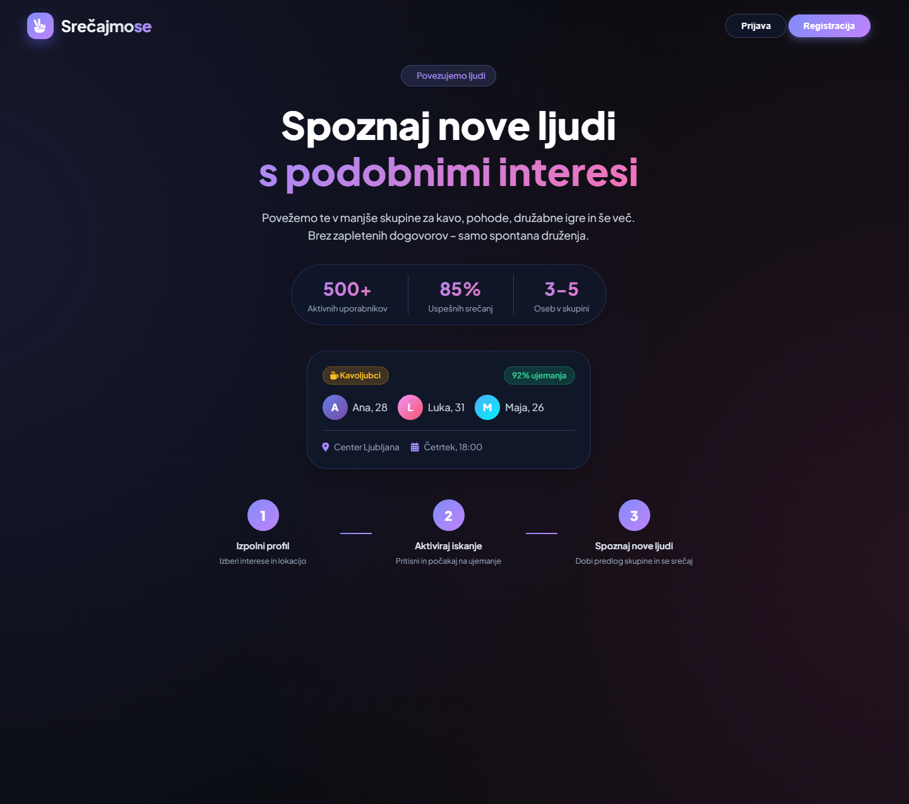

1. Uporabnik vidi kratek opis platforme v osrednjem delu strani.
2. Glava strani vsebuje logo ali ime aplikacije levo ter gumba za prijavo in registracijo desno.
3. Noga strani vsebuje povezave do pogostih vprašanj, kontakta, pogojev uporabe in GDPR.
4. Vsaka povezava v nogi vodi na ustrezno informacijsko masko.

###### 3.1.1.2.2 Maska za registracijo

Maska registracije omogoča prvi vnos podatkov, potrebnih za ustvarjanje računa.

Slike mask: 


1. Sistem zahteva:
   a. ime,
   b. priimek,
   c. uporabniško ime,
   d. starost,
   e. e-naslov,
   f. geslo,
   g. potrditev gesla,
   h. potrditveno kljukico za pogoje uporabe.
2. Registracija se izvaja v treh korakih in uporabniku prikazuje napredek 1/3, 2/3, 3/3:
   a. osnovni podatki,
   b. interesi,
   c. lokacija in časovna razpoložljivost.
3. Po uspešni oddaji sistem pošlje povezavo za potrditev računa na e-naslov.
4. Uporabnik lahko račun uporablja šele po uspešni potrditvi e-pošte.
5. Maska vedno vsebuje tudi povezavo za skok na prijavo.

###### 3.1.1.2.3 Maska za prijavo

Maska prijave omogoča avtentikacijo obstoječega uporabnika.

Slika maske: 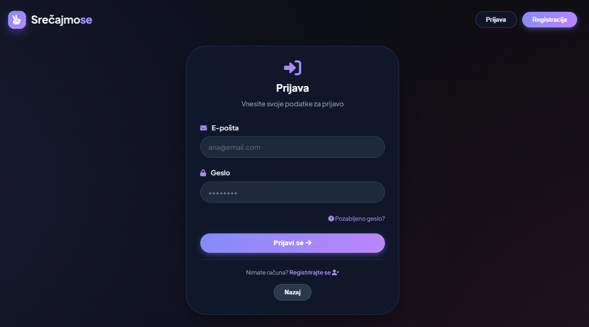

1. Sistem zahteva:
   a. e-naslov,
   b. geslo.
2. Ob uspešni prijavi sistem preusmeri uporabnika na ustrezno nadzorno ploščo glede na vlogo.
3. Administrator je po prijavi takoj preusmerjen na administratorsko nadzorno ploščo.
4. Maska vsebuje povezavo "Pozabljeno geslo", ki vodi na obrazec za zahtevo ponastavitve gesla.
5. Maska vsebuje tudi povezavo za skok na registracijo za uporabnike brez računa.

###### 3.1.1.2.4 Maska za zahtevo ponastavitve gesla

Maska omogoča začetek postopka obnovitve dostopa do računa.

Slika maske: 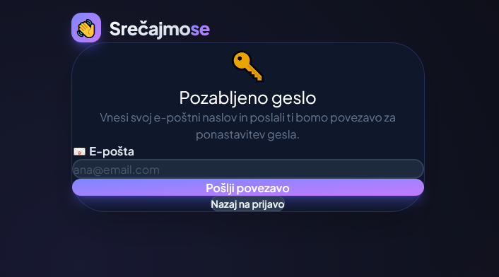

1. Uporabnik vnese e-naslov računa.
2. Sistem preveri, ali račun obstaja, in pošlje povezavo za ponastavitev gesla.
3. Sistem prikaže generično potrditev zahteve in ne razkrije, ali račun obstaja.
4. Po uspešni oddaji se uporabnik lahko vrne na prijavo.

###### 3.1.1.2.5 Maska za nastavitev novega gesla

Maska omogoča zaključek ponastavitve gesla prek e-poštne povezave.

Slika maske: 

1. Uporabnik odpre veljavno povezavo iz e-pošte.
2. Uporabnik vnese novo geslo in potrditev gesla.
3. Sistem preveri veljavnost žetona in skladnost gesel.
4. Sistem shrani novo geslo in uporabnika preusmeri na masko za prijavo.

###### 3.1.1.2.6 Maska uporabniške nadzorne plošče

Maska združuje ključne funkcije uporabnika po prijavi.

Slika maske: 

1. Leva stran prikazuje kratek profil (slika, ime, priimek, vzdevek, e-pošta), status iskanja skupine in hitra dejanja.
2. Prikazani so interesi uporabnika ter dostop do urejanja profila.
3. Prikazana so pretekla srečanja z osnovnimi podatki in dostopom do preteklih chatov.
4. Sredinski del prikazuje predlagane skupine in akcije potrdi, zavrni in chat.

###### 3.1.1.2.7 Maska za predloge skupin

Maska prikazuje predlagane skupine in omogoča hiter pregled članov pred potrditvijo.

Slika maske: 

1. Uporabnik vidi seznam predlaganih skupin z osnovnimi podatki, odstotkom ujemanja in ključnimi razlogi za predlog.
2. Uporabnik lahko pri vsaki predlagani skupini odpre hiter pregled članov skupine.
3. Hiter pregled članov je dostopen neposredno iz posameznega predloga skupine.
4. Uporabnik lahko iz predloga nadaljuje na potrditev, zavrnitev ali dostop do chata.
5. Hiter pregled članov je ločen od skupinskega chata in v njem ni pošiljanja sporočil.

###### 3.1.1.2.8 Maska skupinskega chata

Maska prikazuje komunikacijo skupine.

Slika maske: 

1. Maska vsebuje osnovne informacije o skupini in seznam članov.
2. Uporabnik lahko pregleduje zgodovino sporočil.
3. Uporabnik lahko pošilja nova sporočila.
4. Seznam članov je prikazan informativno, brez potrebe po odpiranju njihovih podrobnosti iz chata.

###### 3.1.1.2.9 Maska za urejanje profila

Maska profila omogoča upravljanje preferenc za delovanje algoritma.

Slika maske: 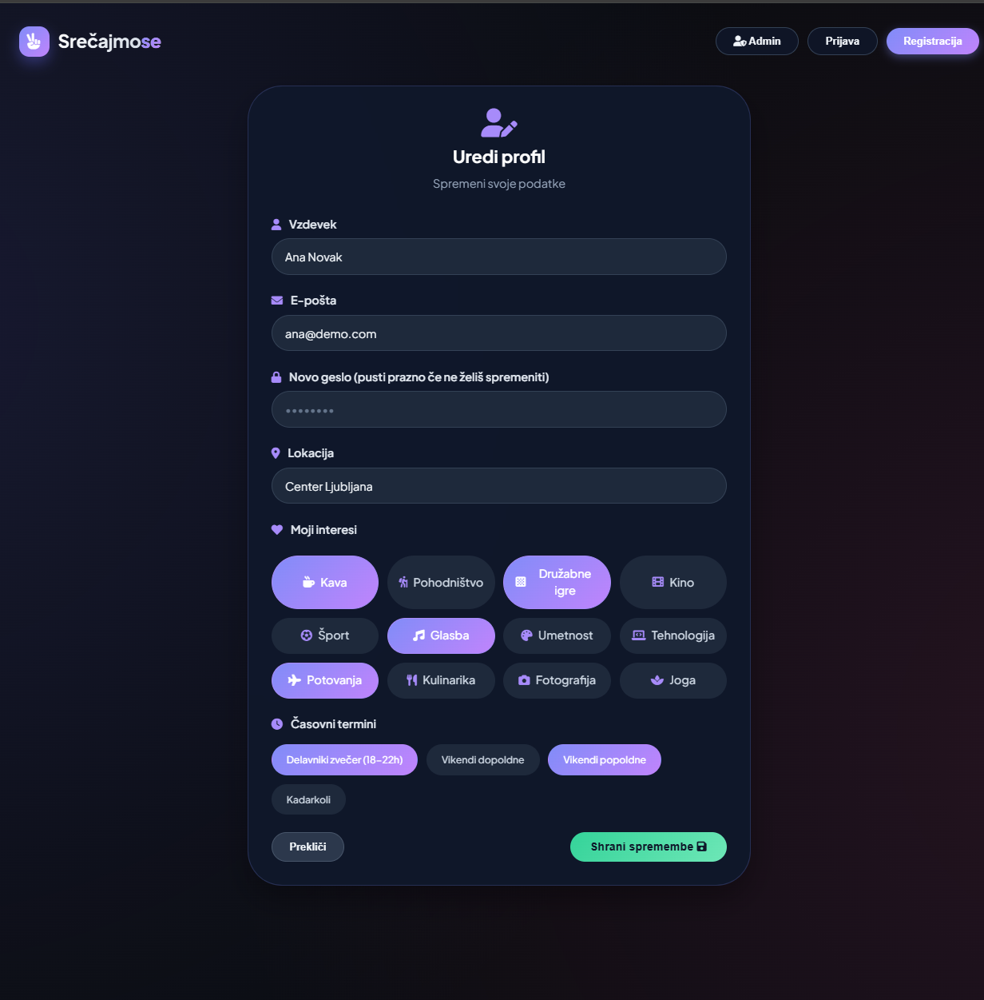

1. Uporabnik lahko ureja:
   a. interese,
   b. približno lokacijo,
   c. časovno razpoložljivost.
2. Sistem spremembe validira in shrani.

###### 3.1.1.2.10 Maska za povratno informacijo

Maska povratne informacije omogoča oddajo ocene po srečanju.

Slika maske: 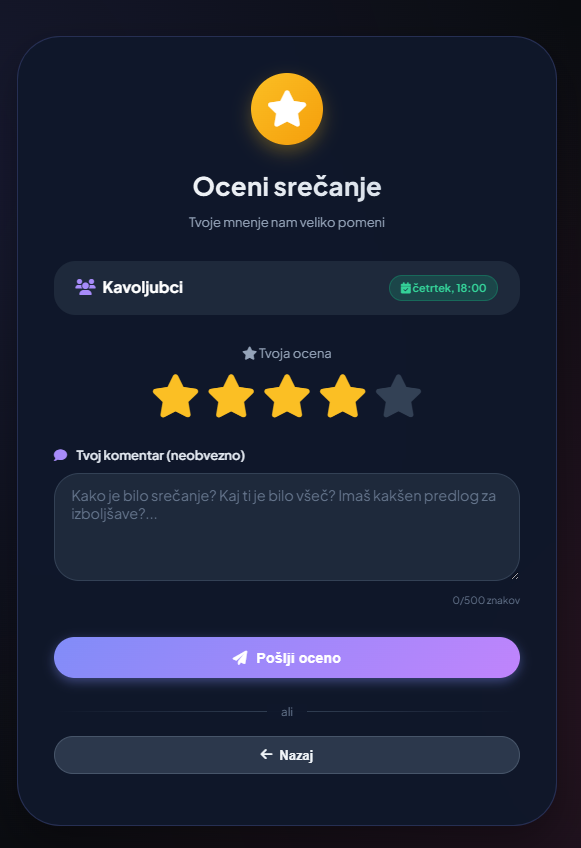

1. Uporabnik poda oceno in kratek komentar.
2. Sistem shrani odgovor in potrdi uspešen vnos.

###### 3.1.1.2.11 Maska administratorske nadzorne plošče

Maska omogoča operativni nadzor sistema.

Slike mask: 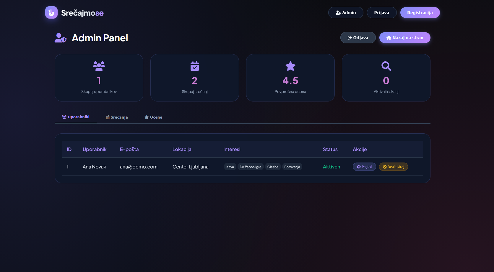

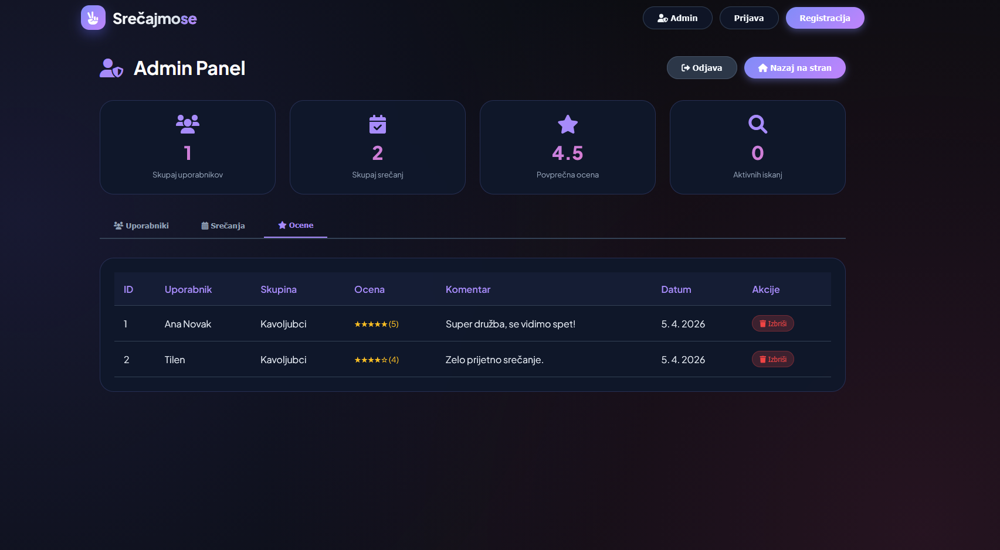


1. Administratorski vmesnik uporablja navigacijski meni s sekcijami: Sistem, Uporabniki, Obvestila, Skupine, Pametna komponenta.
2. Začetni pogled prikazuje osnovne podatke in statistike delovanja sistema.
3. Sekcija Uporabniki vsebuje tabelo uporabnikov s paginacijo, iskanjem in akcijami blokiraj, deblokiraj, aktiviraj in deaktiviraj.
4. Uporabnik z aktivnim opozorilom je vizualno označen z rumeno barvo.
5. Sekcija Obvestila vsebuje seznam vprašanj, prijav in drugih sporočil ter vpogled v podrobnosti.
6. Sekcija Skupine vsebuje pregled vseh ustvarjenih skupin, statusov, članov in dostop do skupinskega chata.
7. Sekcija Pametna komponenta vsebuje metrike kakovosti in nastavitve parametrov algoritma.

###### 3.1.1.2.12 Maska informacijskih strani in kontakta

Maske pokrivajo strani, dostopne iz noge strani (footer).

Slik mask: 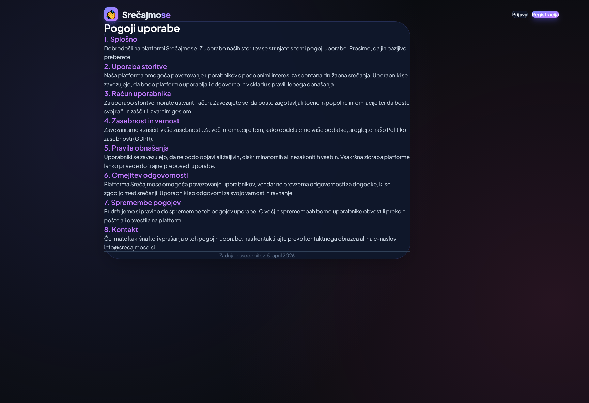

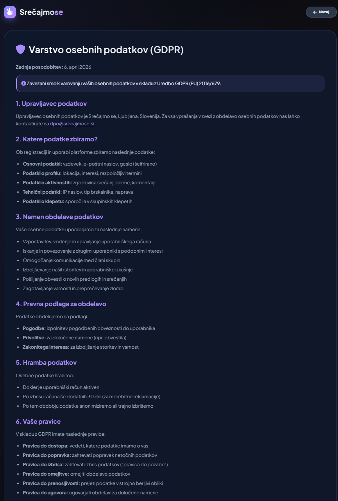
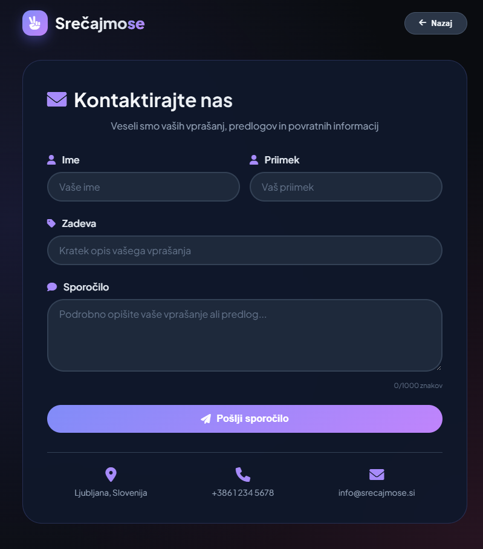

1. Maska pogojev uporabe vsebuje opis pogojev uporabe sistema.
2. Maska GDPR vsebuje opis obdelave osebnih podatkov in uporabnikovih pravic.
3. Maska pogostih vprašanj vsebuje odgovore na najpogostejša vprašanja uporabnikov.
4. Maska kontakta omogoča oddajo sporočila z osnovnimi podatki, kot so ime, priimek, e-naslov, zadeva in sporočilo.
5. Sistem po oddaji kontakta prikaže potrditev prejema sporočila.

#### 3.1.2 Slovar pojmov

V nadaljevanju je slovar ključnih izrazov, ki se uporabljajo v predlogu projekta in tem poročilu.

##### 3.1.2.1 Uporabnik

Registriran končni uporabnik aplikacije, ki upravlja svoj profil, išče skupine, sprejema ali zavrača predloge, uporablja skupinski chat ter oddaja povratne informacije.

##### 3.1.2.2 Primarni naročnik

Skupina končnih uporabnikov (mladi odrasli v urbanih okoljih), za katero se sistem razvija in katere potrebe so osnova funkcionalnih zahtev.

##### 3.1.2.3 Sekundarni deležniki

Zunanji deležniki, ki od sistema nimajo neposredne operativne vloge, imajo pa posredne koristi (npr. lokalna skupnost, ponudniki prostorov).

##### 3.1.2.4 Administrator sistema

Vloga z razširjenimi pravicami za obravnavo prijav, upravljanje uporabnikov, moderatorski vpogled v skupine/chat in spremljanje kakovosti delovanja sistema.

##### 3.1.2.5 Uporabniški profil

Strukturiran zapis o uporabniku, ki vključuje podatke za delovanje sistema (interesi, lokacija, časovna razpoložljivost) in se uporablja pri izračunu predlogov skupin.

##### 3.1.2.6 Interesi

Seznam aktivnosti oziroma tem, ki predstavljajo enega ključnih vhodov za izračun podobnosti med uporabniki.

##### 3.1.2.7 Časovna razpoložljivost

Podatki o prostih terminih uporabnika, uporabljeni za izračun časovnega prekrivanja med potencialnimi člani skupine.

##### 3.1.2.8 Geografska bližina

Mera prostorske oddaljenosti med uporabniki oziroma njihovimi približnimi lokacijami, uporabljena kot kriterij pri razvrščanju predlogov.

##### 3.1.2.9 Kompatibilnost skupine

Skupna ocena ujemanja članov skupine glede na izbrane kriterije (interesi, lokacija, časovna razpoložljivost).

##### 3.1.2.10 Predlog skupine

Rezultat delovanja pametne komponente, ki vsebuje seznam potencialnih članov, predlagan termin, okvirno lokacijo in ključne razloge za ujemanje.

##### 3.1.2.11 Potrditev udeležbe

Odločitev uporabnika, da sprejme predlog skupine in sodeluje pri srečanju; odločitev je vidna ostalim članom preko statusnega indikatorja.

##### 3.1.2.12 Zavrnitev predloga

Odločitev uporabnika, da predloga skupine ne sprejme; status predloga se posodobi brez odstranitve predloga iz zgodovine.

##### 3.1.2.13 Povratna informacija

Ocena in morebitni komentar uporabnika po srečanju, namenjena merjenju kakovosti predlogov in iterativnemu izboljševanju sistema.

##### 3.1.2.14 Prijava neprimernega vedenja

Funkcionalnost, s katero uporabnik odda prijavo neprimernega ravnanja ali vsebine v obravnavo administratorju.

##### 3.1.2.15 Pametna komponenta

Notranja komponenta sistema, ki izvaja izračun kompatibilnosti in oblikovanje predlogov skupin; v kontekstu primerov uporabe ni zunanji akter.

##### 3.1.2.16 Scoring model

Ocenjevalni model, ki združuje več kriterijev ujemanja v enotno numerično oceno za razvrščanje kandidatov in predlogov skupin.

##### 3.1.2.17 MVP

Minimalni delujoči produkt z osnovnimi funkcionalnostmi, potrebnimi za validacijo ideje in preverjanje ključnih predpostavk.

##### 3.1.2.18 REST API

Slog komunikacije med odjemalcem, strežnikom in zunanjimi sistemi prek HTTP protokola.

##### 3.1.2.19 JSON

Format za strukturirano izmenjavo podatkov med sistemi in komponentami aplikacije.

##### 3.1.2.20 GDPR

Pravni okvir varstva osebnih podatkov, ki določa pravila obdelave, hrambe in zaščite osebnih podatkov uporabnikov.

##### 3.1.2.21 Razpoložljivost sistema

Stopnja dostopnosti sistema uporabnikom v določenem časovnem obdobju, izražena z dogovorjenimi ciljnimi metrikami.

##### 3.1.2.22 Razširljivost sistema

Sposobnost sistema, da podpira nove funkcionalnosti in večji obseg uporabe brez večje prenove arhitekture.

##### 3.1.2.23 Skupinski chat

Komunikacijski kanal znotraj aplikacije, ki je na voljo članom predlagane skupine za usklajevanje podrobnosti srečanja.

##### 3.1.2.24 Verifikacijska povezava

Časovno omejena povezava, poslana na e-pošto ob registraciji, s katero uporabnik potrdi lastništvo e-naslova in aktivira račun.

##### 3.1.2.25 Ponastavitveni žeton

Enkratno uporaben, časovno omejen žeton za varno nastavitev novega gesla v postopku "Pozabljeno geslo".

##### 3.1.2.26 Status odziva

Prikaz odločitve uporabnika glede predloga skupine (potrjeno/zavrnjeno), vizualno označen z barvnim indikatorjem.

#### 3.1.3 Uporabniške vloge in zunanji akterji

Spodaj so opredeljene vloge, ki sodelujejo v primerih uporabe, skupaj z njihovo naravo (vloga ali zunanji sistem). Akter v primeru uporabe je vedno zunanja entiteta glede na obravnavani sistem.

##### 3.1.3.1 Uporabniška vloga

Uporabnik je primarni poslovni akter sistema.
Njegova vloga je vnos in vzdrževanje profila, sprožanje iskanja skupin, odločanje o predlogih (potrditev/zavrnitev), uporaba skupinskega chata ter oddaja povratnih informacij in prijav neprimernega vedenja.

##### 3.1.3.2 Gostovska vloga

Gost je neprijavljen uporabnik sistema.
Njegova vloga je dostop do začetne strani ter informacijskih strani v nogi, možnost registracije, prijave in zahtevka za ponastavitev gesla.

##### 3.1.3.3 Administratorska vloga

Administrator je operativni in nadzorni akter sistema.
Njegova vloga je obravnava prijav, upravljanje uporabniških računov, pregled skupin in moderatorski vpogled v chat ter spremljanje metrik kakovosti pametne komponente.

##### 3.1.3.4 Geokodirni API (zunanji sistem)

Geokodirni API je podporni zunanji sistem.
Njegova vloga je pretvorba uporabniško vnesene lokacije v standardizirano obliko in koordinate, ki jih sistem uporabi za ocenjevanje geografske bližine.

##### 3.1.3.5 E-poštni servis (zunanji sistem)

E-poštni servis je komunikacijski zunanji sistem.
Njegova vloga je pošiljanje verifikacijskih povezav ob registraciji in povezav/obvestil za ponastavitev gesla ter komunikacije z uporabniki.

##### 3.1.3.6 Pametna komponenta (notranja komponenta sistema)

Pametna komponenta je notranji del sistema in se v strogi UML razlagi ne šteje kot zunanji akter.
V dokumentu je navedena zaradi preglednosti odgovornosti znotraj primerov uporabe, kjer izvaja izračun ujemanja in pripravo predlogov skupin.

#### 3.1.4 Opisi primerov uporabe

V nadaljevanju so za ključne cilje naročnika podani formalizirani opisi primerov uporabe po enotni strukturi.

##### 3.1.4.1 Registracija

1. **Naslov**: Registracija
2. **Akterji**: Gostovska vloga, Uporabniška vloga
3. **Povzetek funkcionalnosti**: Nov uporabnik opravi registracijo v treh korakih in aktivira račun prek e-pošte.
4. **Osnovni tok**:
   1. Gost odpre masko za registracijo.
   2. Izpolni korake 1/3, 2/3 in 3/3.
   3. Sistem validira podatke, ustvari račun v stanju "nepotrjen" in pošlje verifikacijsko povezavo.
   4. Gost odpre verifikacijsko povezavo.
   5. Sistem aktivira račun in zaključi primer uporabe.
5. **Alternativni tokovi in napake**:
   - A1: Gost popravi vnos v prejšnjem koraku.
     1. Gost odpre masko za registracijo.
     2. Izpolni korake 1/3, 2/3 in 3/3.
     3. Gost v tretjem koraku ugotovi, da je treba dopolniti prejšnji vnos.
     4. Gost se vrne na 2/3 ali 1/3 in popravi podatke.
     5. Sistem ohrani že veljavne podatke, da jih ni treba ponovno vpisovati.
     6. Gost znova nadaljuje do 3/3 in odda registracijo.
     7. Sistem validira podatke, ustvari račun v stanju "nepotrjen" in pošlje verifikacijsko povezavo.
     8. Gost odpre verifikacijsko povezavo.
     9. Sistem aktivira račun in zaključi primer uporabe.
   - E1: E-naslov je že registriran.
     1. Gost odpre masko za registracijo.
     2. Izpolni korake 1/3, 2/3 in 3/3.
     3. Gost pri oddaji vnese e-naslov, ki že obstaja v sistemu.
     4. Sistem zavrne registracijo in prikaže napako o že uporabljenem e-naslovu.
     5. Gost vnese drug e-naslov in ponovno odda obrazec.
     6. Sistem validira podatke, ustvari račun v stanju "nepotrjen" in pošlje verifikacijsko povezavo.
     7. Gost odpre verifikacijsko povezavo.
     8. Sistem aktivira račun in zaključi primer uporabe.
   - E2: Verifikacijska povezava je potekla.
     1. Gost odpre masko za registracijo.
     2. Izpolni korake 1/3, 2/3 in 3/3.
     3. Sistem validira podatke, ustvari račun v stanju "nepotrjen" in pošlje verifikacijsko povezavo.
     4. Gost odpre povezavo za potrditev računa po pretečenem roku.
     5. Sistem zavrne aktivacijo in prikaže obvestilo o neveljavni povezavi.
     6. Gost zahteva novo verifikacijsko povezavo.
     7. Sistem pošlje novo povezavo.
     8. Gost odpre novo verifikacijsko povezavo.
     9. Sistem aktivira račun in zaključi primer uporabe.
6. **Predpogoj**: Gost še nima računa v sistemu.
7. **Popogoj, posledice in učinki**: Uspeh: račun je aktiviran. Neuspeh: račun ostane neaktiven.
8. **Posebne zahteve**: Varna obravnava gesla in validacija obveznih polj.
9. **Prioriteta (MoSCoW)**: Must
10. **Sprejemni testi**:

| Primer uporabe  | Funkcijski sistem       | Začetno stanje   | Vhod                          | Pričakovan izhod                                  |
| --------------- | ----------------------- | ---------------- | ----------------------------- | ------------------------------------------------- |
| Registrirati se | Registracija uporabnika | Gost nima računa | Veljavni podatki registracije | Ustvarjen nepotrjen račun in poslana verifikacija |

11. **Razširitev - pogostost uporabe in triggerji**: Pogostost: nizka. Trigger: klik na registracijo.

##### 3.1.4.2 Prijava

1. **Naslov**: Prijaviti se
2. **Akterji**: Uporabnik (vloga), Administrator (vloga)
3. **Povzetek funkcionalnosti**: Akter se avtenticira in je preusmerjen na ustrezen pogled.
4. **Osnovni tok**:
      1. Uporabnik odpre masko za prijavo.
      2. Vnese e-naslov in geslo.
      3. Sistem preveri poverilnice in vlogo.
      4. Sistem vzpostavi sejo.
      5. Sistem preusmeri na uporabniško nadzorno ploščo.
5. **Alternativni tokovi in napake**:
    - A1: Prijava administratorja.
      1. Admin odpre masko za prijavo.
      2. Vnese e-naslov in geslo za administratorski račun.
      3. Sistem preveri poverilnice in vlogo.
      4. Sistem prepozna administratorsko vlogo.
      5. Sistem vzpostavi sejo.
      6. Sistem preusmeri na administratorsko nadzorno ploščo.
    - A2: Pozabljeno geslo in ponastavitev.
      1. uporabnik odpre masko za prijavo.
      2. Vnese e-naslov in napačno geslo.
      3. Sistem preveri poverilnice in zavrne prijavo.
      4. Sistem poveča števec neuspelih poskusov in prikaže napako.
      5. Ime razširitve: Ponastavitev gesla ob pozabljenem geslu, Pogoj: pozabljeno geslo: Primer uporabe, ki se izvede: Ponastavitev gesla.
      5. Uporabnik vnese novo geslo.
      6. Sistem preveri poverilnice in vlogo.
      7. Sistem vzpostavi sejo.
      8. Sistem preusmeri na ustrezno nadzorno ploščo.
    - E1: Napačno geslo.
      1. uporabnik odpre masko za prijavo.
      2. Vnese e-naslov in napačno geslo.
      3. Sistem preveri poverilnice in zavrne prijavo.
      4. Sistem poveča števec neuspelih poskusov in prikaže napako.
      5. Uporabnik popravi geslo in ponovno odda prijavo.
      6. Sistem preveri poverilnice in vlogo.
      7. Sistem vzpostavi sejo.
      8. Sistem preusmeri na ustrezno nadzorno ploščo.
    - E2: Račun ni verificiran.
      1. Uporabnik odpre masko za prijavo.
      2. Vnese e-naslov in geslo neverificiranega računa.
      3. Sistem preveri poverilnice in ugotovi, da račun ni verificiran.
      4. Sistem zavrne prijavo in ponudi ponovno pošiljanje verifikacije.
      5. Uporabnik potrdi e-poštni naslov preko nove verifikacijske povezave.
      6. Uporabnik ponovno odpre prijavno masko in vnese e-naslov ter geslo.
      7. Sistem preveri poverilnice in vlogo.
      8. Sistem vzpostavi sejo in preusmeri na ustrezno nadzorno ploščo.
6. **Predpogoj**: Račun obstaja.
7. **Popogoj, posledice in učinki**: Uspeh: aktivna seja. Neuspeh: seja ni vzpostavljena.
8. **Posebne zahteve**: Zaščita prijavnega toka in varna seja.
9. **Prioriteta (MoSCoW)**: Must
10. **Sprejemni testi**:

| Primer uporabe | Funkcijski sistem        | Začetno stanje      | Vhod                       | Pričakovan izhod                |
| -------------- | ------------------------ | ------------------- | -------------------------- | ------------------------------- |
| Prijaviti se   | Avtentikacija uporabnika | Uporabnik ima račun | Veljaven e-naslov in geslo | Uspešna prijava in preusmeritev |

11. **Razširitev - pogostost uporabe in triggerji**: Pogostost: visoka. Trigger: klik na prijavo.

11. **Razširitev - pogostost uporabe in triggerji**: Pogostost: visoka. Trigger: klik na prijavo.

##### 3.1.4.3 Ponastavitev gesla

1. **Naslov**: Ponastavitev gesla
2. **Akterji**: Gostovska vloga, Uporabniška vloga
3. **Povzetek funkcionalnosti**: Uporabnik zahteva povezavo za ponastavitev in nastavi novo geslo.
4. **Osnovni tok**:
   1. Gost klikne možnost "Pozabljeno geslo".
   2. Vnese e-naslov računa.
   3. Sistem pošlje ponastavitveno povezavo.
   4. Gost odpre povezavo, vnese novo geslo in potrditev gesla.
   5. Sistem shrani geslo in preusmeri na prijavo.
      Razširitev: Neposredna prijava po ponastavitvi gesla : Geslo je uspešno ponastavljeno : Prijava.
5. **Alternativni tokovi in napake**:
   - A1: Takojšnja prijava po spremembi gesla.
     1. Gost klikne možnost "Pozabljeno geslo".
     2. Vnese e-naslov računa.
     3. Sistem pošlje ponastavitveno povezavo.
     4. Gost odpre povezavo, vnese novo geslo in potrditev gesla.
     5. Sistem shrani geslo in preusmeri na prijavo.
        Razširitev: Neposredna prijava po ponastavitvi gesla : Geslo je uspešno ponastavljeno : Prijava.
     6. Uporabnik takoj vnese nove poverilnice in odda prijavo.
     7. Sistem uspešno vzpostavi sejo.
   - E1: Povezava je neveljavna ali potekla.
     1. Gost klikne možnost "Pozabljeno geslo".
     2. Vnese e-naslov računa.
     3. Sistem pošlje ponastavitveno povezavo.
     4. Uporabnik odpre neveljavno ali poteklo povezavo za ponastavitev.
     5. Sistem zavrne spremembo in ponudi novo zahtevo.
     6. Uporabnik zahteva novo povezavo.
     7. Sistem pošlje novo povezavo.
     8. Uporabnik odpre novo povezavo, vnese novo geslo in potrditev gesla.
     9. Sistem shrani geslo in preusmeri na prijavo.
        Razširitev: Neposredna prijava po ponastavitvi gesla : Geslo je uspešno ponastavljeno : Prijava.
   - E2: Gesli se ne ujemata.
     1. Gost klikne možnost "Pozabljeno geslo".
     2. Vnese e-naslov računa.
     3. Sistem pošlje ponastavitveno povezavo.
     4. Gost odpre povezavo in vnese novo geslo ter potrditev gesla.
     5. Sistem zazna neujemanje gesel in zavrne oddajo.
     6. Uporabnik popravi vnos in znova odda obrazec.
     7. Sistem shrani geslo in preusmeri na prijavo.
        Razširitev: Neposredna prijava po ponastavitvi gesla : Geslo je uspešno ponastavljeno : Prijava.
6. **Predpogoj**: Uporabnik ima ustvarjen račun.
7. **Popogoj, posledice in učinki**: Uspeh: geslo je spremenjeno. Neuspeh: geslo ostane nespremenjeno.
8. **Posebne zahteve**: Časovna omejenost in enkratna uporaba žetona.
9. **Prioriteta (MoSCoW)**: Must
10. **Sprejemni testi**:

| Primer uporabe    | Funkcijski sistem | Začetno stanje      | Vhod                            | Pričakovan izhod          |
| ----------------- | ----------------- | ------------------- | ------------------------------- | ------------------------- |
| Ponastaviti geslo | Obnovitev dostopa | Uporabnik ima račun | Veljavna povezava in novo geslo | Geslo uspešno spremenjeno |

11. **Razširitev - pogostost uporabe in triggerji**: Pogostost: nizka. Trigger: klik na "Pozabljeno geslo".

##### 3.1.4.4 Odjava

1. **Naslov**: Odjava
2. **Akterji**:
   - Uporabniška vloga
   - Administratorska vloga
3. **Povzetek funkcionalnosti**:
   - Prijavljen uporabnik ali administrator zaključi sejo in se vrne na javni del aplikacije.
4. **Osnovni tok**:
   1. Akter izbere možnost "Odjava".
   2. Sistem prekine aktivno sejo.
   3. Sistem uporabnika preusmeri na začetno/prijavno stran.
5. **Alternativni tokovi in napake**:
   - A1: Samodejna odjava zaradi neaktivnosti.
     1. Akter je prijavljen in uporablja aplikacijo.
     2. Sistem zazna presežen čas neaktivnosti.
     3. Sistem opozori akterja o bližnjem izteku seje.
     4. Po izteku sistem invalidira sejo.
     5. Sistem akterja preusmeri na začetno/prijavno stran.
   - E1: Seja je že potekla.
     1. Akter izbere možnost "Odjava".
     2. Sistem preveri aktivno sejo in ugotovi, da je ta že potekla.
     3. Sistem ne izvaja dodatnega zaključevanja seje.
     4. Sistem vseeno izvede preusmeritev na začetno/prijavno stran.
6. **Predpogoj**:
   - Akter je prijavljen.
7. **Popogoj, posledice in učinki**:
   - Uspeh: seja je zaključena.
   - Neuspeh: seja ostane aktivna in sistem prikaže obvestilo.
8. **Posebne zahteve**:
   - Brisanje/invalidacija sejne identitete (token/cookie).
9. **Prioriteta (MoSCoW)**:
   - Must
10. **Sprejemni testi**:

| Primer uporabe | Funkcijski sistem | Začetno stanje          | Vhod           | Pričakovan izhod                         |
| -------------- | ----------------- | ----------------------- | -------------- | ---------------------------------------- |
| Odjaviti se    | Upravljanje seje  | Uporabnik je prijavljen | Klik na odjava | Seja zaključena, preusmeritev na prijavo |
| Odjaviti se    | Upravljanje seje  | Seja je že potekla      | Klik na odjava | Preusmeritev na prijavo brez napake      |

11. **Razširitev - pogostost uporabe in triggerji**:
    - Pogostost: visoka.
    - Trigger: uporabnik/administrator izbere možnost odjave.

##### 3.1.4.5 Urejanje profila

1. **Naslov**: Urejanje profila
2. **Akterji**:
   - Uporabniška vloga
3. **Povzetek funkcionalnosti**:
   - Uporabnik posodobi preference in/ali osnovne podatke profila.
4. **Osnovni tok**:
   1. Uporabnik odpre profil.
   2. Uporabnik spremeni želene podatke.
   3. Sistem validira in shrani spremembe.
5. **Alternativni tokovi in napake**:
   - A1: Posodobitev samo enega sklopa.
     1. Uporabnik odpre profil.
     2. Uporabnik spremeni le en sklop podatkov (npr. interese).
     3. Sistem validira spremenjeni sklop.
     4. Sistem shrani spremembo.
     5. Sistem potrdi uspeh in ostale podatke pusti nespremenjene.
   - E1: Neveljaven format podatkov.
     1. Uporabnik odpre profil in spremeni želene podatke.
     2. Uporabnik odda neveljaven podatek v enem od polj.
     3. Sistem zavrne shranjevanje in označi napačno polje.
     4. Uporabnik popravi podatek in ponovno odda spremembe.
     5. Sistem validira in shrani spremembe.
   - E2: Konflikt sočasnih sprememb.
     1. Uporabnik odpre profil in spremeni želene podatke.
     2. Uporabnik odda spremembe na zastarelem stanju profila.
     3. Sistem zazna konflikt in zahteva osvežitev.
     4. Uporabnik osveži podatke, ponovno uredi profil in odda spremembe.
     5. Sistem validira in shrani novo stanje profila.
6. **Predpogoj**:
   - Uporabnik je prijavljen.
7. **Popogoj, posledice in učinki**:
   - Uspeh: profil je posodobljen.
   - Neuspeh: ostanejo prejšnji podatki.
8. **Posebne zahteve**:
   - Validacija obveznih profilnih podatkov.
9. **Prioriteta (MoSCoW)**:
   - Must
10. **Sprejemni testi**:

| Primer uporabe    | Funkcijski sistem   | Začetno stanje          | Vhod                 | Pričakovan izhod                           |
| ----------------- | ------------------- | ----------------------- | -------------------- | ------------------------------------------ |
| Posodobiti profil | Upravljanje profila | Uporabnik je prijavljen | Novi podatki profila | Podatki so uspešno shranjeni               |
| Posodobiti profil | Upravljanje profila | Uporabnik je prijavljen | Neveljavni podatki   | Shranjevanje zavrnjeno in prikazana napaka |

11. **Razširitev - pogostost uporabe in triggerji**:
    - Pogostost: srednja.
    - Trigger: uporabnik spremeni preference ali profilne podatke.

##### 3.1.4.6 Iskanje skupin

1. **Naslov**: Iskanje skupin
2. **Akterji**:
   - Uporabniška vloga
3. **Povzetek funkcionalnosti**:
   - Prijavljen uporabnik sproži iskanje skupine; sistem zažene izračun predlogov.
4. **Osnovni tok**:
   1. Uporabnik na nadzorni plošči izbere akcijo "Išči skupino".
   2. Sistem preveri, da je profil ustrezno izpolnjen.
   3. Sistem sproži izračun predlogov.
   4. Sistem pripravi seznam predlogov za prikaz.
5. **Alternativni tokovi in napake**:
   - A1: Ponovitev iskanja po posodobitvi profila.
     1. Uporabnik odpre nadzorno ploščo.
     2. Uporabnik izbere akcijo "Išči skupino".
     3. Sistem preveri profil in uporabnik ugotovi, da želi posodobiti preference.
     4. Uporabnik posodobi profil z novimi interesi, lokacijo ali razpoložljivostjo.
     5. Uporabnik ponovno izbere akcijo "Išči skupino".
     6. Sistem preveri, da je profil ustrezno izpolnjen.
     7. Sistem sproži izračun predlogov.
     8. Sistem pripravi in prikaže osvežen nabor predlogov.
   - E1: Profil ni dovolj izpolnjen.
     1. Uporabnik odpre nadzorno ploščo in izbere akcijo "Išči skupino".
     2. Sistem preveri profil in ugotovi manjkajoče podatke.
     3. Sistem zavrne iskanje in navede manjkajoča polja.
     4. Uporabnik dopolni profil in ponovno izbere akcijo "Išči skupino".
     5. Sistem ponovno preveri profil.
     6. Sistem sproži izračun predlogov.
     7. Sistem pripravi seznam predlogov za prikaz.
   - E2: Pametna komponenta je začasno nedosegljiva.
     1. Uporabnik izbere akcijo "Išči skupino".
     2. Sistem preveri profil in sproži izračun predlogov.
     3. Klic pametne komponente ne uspe.
     4. Sistem prikaže obvestilo in možnost ponovnega poskusa.
     5. Uporabnik ponovi zahtevo.
     6. Sistem ponovno sproži izračun predlogov.
     7. Sistem pripravi seznam predlogov za prikaz.
6. **Predpogoj**:
   - Uporabnik je prijavljen.
7. **Popogoj, posledice in učinki**:
   - Uspeh: uporabnik lahko dostopa do predlogov skupin.
   - Neuspeh: predlogi niso pripravljeni in sistem poda razlog.
8. **Posebne zahteve**:
   - Sistem mora jasno prikazati stanje iskanja (v teku/uspeh/napaka).
9. **Prioriteta (MoSCoW)**:
   - Must
10. **Sprejemni testi**:

| Primer uporabe | Funkcijski sistem  | Začetno stanje                              | Vhod                   | Pričakovan izhod                          |
| -------------- | ------------------ | ------------------------------------------- | ---------------------- | ----------------------------------------- |
| Iskati skupine | Iskalni tok skupin | Uporabnik je prijavljen in profil izpolnjen | Klik na "Išči skupino" | Iskanje sproženo in pripravljeni predlogi |
| Iskati skupine | Iskalni tok skupin | Profil ni izpolnjen                         | Klik na "Išči skupino" | Poziv k dopolnitvi profila                |

11. **Razširitev - pogostost uporabe in triggerji**:
    - Pogostost: srednja do visoka.
    - Trigger: uporabnik izbere akcijo za iskanje skupine.

##### 3.1.4.7 Pregled skupin in chata

1. **Naslov**: Pregled skupin in chata
2. **Akterji**:
   - Uporabniška vloga
3. **Povzetek funkcionalnosti**:
   - Uporabnik odpre izbrano predlagano skupino in na istem mestu pregleda osnovne podatke skupine, člane ter skupinski chat.
4. **Osnovni tok**:
   1. Uporabnik iz seznama predlogov odpre izbrano skupino.
   2. Sistem prikaže čas srečanja, približno lokacijo in ključne razloge ujemanja.
   3. Sistem prikaže ikone oziroma kratke kartice članov skupine.
   4. Uporabnik odpre kratek pregled profila posameznega člana.
   5. Sistem prikaže osnovne podatke izbranega člana.
   6. Uporabnik odpre skupinski chat iste skupine.
   7. Sistem prikaže zgodovino sporočil in omogoči nadaljnjo komunikacijo.
5. **Alternativni tokovi in napake**:
   - A1: Pregled posameznega člana.
     1. Uporabnik iz seznama predlogov odpre izbrano skupino.
     2. Sistem prikaže čas srečanja, približno lokacijo in ključne razloge ujemanja.
     3. Uporabnik klikne ikono člana.
     4. Sistem odpre kratek profil člana.
     5. Uporabnik zapre kratek profil in se vrne na pregled skupine.
   - A2: Branje skupinskega chata brez pošiljanja sporočila.
     1. Uporabnik iz seznama predlogov odpre izbrano skupino.
     2. Sistem prikaže osnovne podatke skupine in člane.
     3. Uporabnik odpre skupinski chat.
     4. Sistem naloži zgodovino sporočil.
     5. Uporabnik pregleda vsebino in chat zapre brez novega vnosa.
     6. Sistem ohrani stanje pogovora nespremenjeno.
   - E1: Podatki skupine ali članov niso dosegljivi.
     1. Uporabnik iz seznama predlogov odpre izbrano skupino.
     2. Sistem poskuša prikazati podatke skupine in članov, vendar nalaganje ne uspe.
     3. Sistem prikaže opozorilo in možnost ponovnega nalaganja.
     4. Uporabnik ponovi nalaganje.
     5. Sistem prikaže podatke skupine in članov.
   - E2: Skupina med prikazom postane neveljavna.
     1. Uporabnik iz seznama predlogov odpre izbrano skupino.
     2. Sistem prikaže osnovne podatke skupine.
     3. Sistem zazna, da je skupina med prikazom postala neveljavna.
     4. Sistem zapre pregled skupine in osveži seznam predlogov.
     5. Uporabnik izbere drugo veljavno skupino.
6. **Predpogoj**:
   - Uporabnik je prijavljen in vidi vsaj en predlog skupine.
7. **Popogoj, posledice in učinki**:
   - Uspeh: uporabnik vidi podatke skupine, člane in po potrebi chat.
   - Neuspeh: pregled skupine ni prikazan.
8. **Posebne zahteve**:
   - Pregled mora vključevati čas, lokacijo, razloge ujemanja in neposreden dostop do kratkih profilov članov ter chata.
9. **Prioriteta (MoSCoW)**:
   - Must
10. **Sprejemni testi**:

| Primer uporabe             | Funkcijski sistem | Začetno stanje                  | Vhod                       | Pričakovan izhod                                   |
| -------------------------- | ----------------- | ------------------------------- | -------------------------- | -------------------------------------------------- |
| Pregledati skupino in chat | Predlog skupine   | Uporabnik vidi predlog          | Odprtje predlagane skupine | Prikazani podatki skupine, člani in chat           |
| Pregledati skupino in chat | Predlog skupine   | Podatki skupine niso dosegljivi | Odprtje predlagane skupine | Prikazano opozorilo in možnost ponovnega nalaganja |

11. **Razširitev - pogostost uporabe in triggerji**:
    - Pogostost: srednja.
    - Trigger: uporabnik odpre predlagano skupino iz seznama predlogov.

##### 3.1.4.8 Odločitev o udeležbi

1. **Naslov**: Odločitev o udeležbi
2. **Akterji**:
   - Uporabniška vloga
3. **Povzetek funkcionalnosti**:
   - Uporabnik po pregledu skupine potrdi ali zavrne predlog in sistem posodobi status odziva.
4. **Osnovni tok**:
   1. Uporabnik iz pregleda skupine izbere potrditev ali zavrnitev.
   2. Sistem preveri, ali je skupina še veljavna.
   3. Sistem zabeleži odločitev.
   4. Sistem posodobi status odziva in ga prikaže ostalim članom.
5. **Alternativni tokovi in napake**:
   - A1: Potrditev udeležbe.
     1. Uporabnik iz pregleda skupine izbere potrditev.
     2. Sistem preveri, ali je skupina še veljavna.
     3. Sistem zabeleži status "potrjeno".
     4. Sistem posodobi status odziva in potrdi uspeh.
   - A2: Zavrnitev predloga.
     1. Uporabnik iz pregleda skupine izbere zavrnitev.
     2. Sistem preveri, ali je skupina še veljavna.
     3. Sistem zabeleži status "zavrnjeno".
     4. Sistem posodobi status odziva in potrdi uspeh.
   - E1: Predlog ni več aktiven.
     1. Uporabnik iz pregleda skupine izbere potrditev ali zavrnitev.
     2. Sistem zazna, da predlog ni več veljaven.
     3. Sistem zavrne akcijo in osveži seznam predlogov.
     4. Uporabnik izbere drug veljaven predlog.
     5. Uporabnik ponovno odpre pregled skupine.
6. **Predpogoj**:
   - Uporabnik ima prikazan veljaven predlog skupine.
7. **Popogoj, posledice in učinki**:
   - Uspeh: status predloga je posodobljen.
   - Neuspeh: status ostane nespremenjen.
8. **Posebne zahteve**:
   - Dosledno beleženje sprememb statusa in barvno označevanje odziva.
9. **Prioriteta (MoSCoW)**:
   - Must
10. **Sprejemni testi**:

| Primer uporabe                 | Funkcijski sistem            | Začetno stanje              | Vhod               | Pričakovan izhod                                          |
| ------------------------------ | ---------------------------- | --------------------------- | ------------------ | --------------------------------------------------------- |
| Potrditi ali zavrniti udeležbo | Upravljanje predlogov skupin | Prikazan je aktiven predlog | Potrditev udeležbe | Status predloga posodobljen, oznaka ostalim članom        |
| Potrditi ali zavrniti udeležbo | Upravljanje predlogov skupin | Prikazan je aktiven predlog | Zavrnitev predloga | Status predloga posodobljen in predlog ostane v zgodovini |

11. **Razširitev - pogostost uporabe in triggerji**:
    - Pogostost: srednja.
    - Trigger: uporabnik izbere akcijo na predlogu po pregledu skupine.

##### 3.1.4.9 Oddaja povratne informacije

1. **Naslov**: Oddaja povratne informacije
2. **Akterji**:
   - Uporabniška vloga
3. **Povzetek funkcionalnosti**:
   - Uporabnik po srečanju odda oceno in komentar za izbrano skupino.
4. **Osnovni tok**:
   1. Sistem prikaže poziv za oddajo povratne informacije.
   2. Uporabnik vnese oceno in komentar.
   3. Sistem preveri veljavnost in shrani povratno informacijo.
5. **Alternativni tokovi in napake**:
   - A1: Oddaja samo ocene.
     1. Sistem prikaže poziv za oddajo povratne informacije.
     2. Uporabnik vnese oceno in pusti komentar prazen.
     3. Sistem preveri veljavnost in sprejme oddajo.
     4. Sistem shrani povratno informacijo in potrdi uspeh.
   - E1: Uporabnik je že oddal povratno informacijo.
     1. Sistem prikaže poziv za oddajo povratne informacije.
     2. Uporabnik vnese oceno in komentar za isti dogodek, za katerega je že oddal odgovor.
     3. Sistem zazna podvojitev in zavrne oddajo.
     4. Sistem prikaže obvestilo o obstoječi oddaji.
     5. Uporabnik obrazec zapre ali preide na drug dogodek.
   - E2: Napaka pri shranjevanju.
     1. Sistem prikaže poziv za oddajo povratne informacije.
     2. Uporabnik vnese oceno in komentar.
     3. Sistem preveri veljavnost, vendar ne uspe shraniti podatkov.
     4. Sistem ponudi ponovni poskus.
     5. Uporabnik ponovi oddajo.
     6. Sistem uspešno shrani povratno informacijo in potrdi uspeh.
6. **Predpogoj**:
   - Uporabnik je sodeloval v srečanju.
7. **Popogoj, posledice in učinki**:
   - Uspeh: povratna informacija je shranjena.
   - Neuspeh: povratna informacija ni shranjena.
8. **Posebne zahteve**:
   - Vprašalnik mora biti kratek.
9. **Prioriteta (MoSCoW)**:
   - Should
10. **Sprejemni testi**:

| Primer uporabe              | Funkcijski sistem          | Začetno stanje                  | Vhod                       | Pričakovan izhod                           |
| --------------------------- | -------------------------- | ------------------------------- | -------------------------- | ------------------------------------------ |
| Oddati povratno informacijo | Modul povratnih informacij | Uporabnik ima zaključen dogodek | Ocena in komentar          | Podatki so shranjeni in potrjeni           |
| Oddati povratno informacijo | Modul povratnih informacij | Uporabnik ima zaključen dogodek | Manjkajoči obvezni podatki | Shranjevanje zavrnjeno in prikazana napaka |

11. **Razširitev - pogostost uporabe in triggerji**:
    - Pogostost: srednja.
    - Trigger: sistem po srečanju pošlje poziv za oddajo ocene.

##### 3.1.4.10 Prijava neprimernega vedenja

1. **Naslov**: Prijaviti neprimerno vedenje
2. **Akterji**:
   - Uporabniška vloga
3. **Povzetek funkcionalnosti**:
   - Uporabnik odda prijavo za neprimerno vedenje uporabnika znotraj gruppe.
4. **Osnovni tok**:
   1. Uporabnik odpre skupino in izbere uporabnika, ki se je neprimerno vedel.
   2. Uporabnik izbere možnost "Prijavi neprimerno vedenje".
   3. Sistem prikaže obrazec za prijavo.
   4. Uporabnik vnese opis incidenta in oddaja prijavo.
   5. Sistem preveri veljavnost podatkov.
   6. Sistem shrani prijavo in potrdi prejem.
5. **Alternativni tokovi in napake**:
   - A1: Dopolnitev prijave.
     1. Uporabnik odda prijavo.
     2. Sistem potrdi prejem prijave.
     3. Uporabnik se lahko vrne in dopolni opis, če je potrebno.
     4. Sistem shrani spremembo.
   - E1: Neprimerno izpolnjena prijava.
     1. Uporabnik odpre obrazec za prijavo.
     2. Uporabnik vpiše podatke, ki ne izpolnjujejo zahtev.
     3. Sistem zavrne oddajo in označi obavezna polja.
     4. Uporabnik popravi podatke in ponovno odda prijavo.
     5. Sistem shrani prijavo in potrdi prejem.
6. **Predpogoj**:
   - Uporabnik je prijavljen in je član aktivne skupine.
7. **Popogoj, posledice in učinki**:
   - Uspeh: prijava je shranjena in potrjena.
   - Neuspeh: prijava ni shranjena.
8. **Posebne zahteve**:
   - Zaupna obravnava prijav.
9. **Prioriteta (MoSCoW)**:
   - Should
10. **Sprejemni testi**:

| Primer uporabe               | Funkcijski sistem | Začetno stanje       | Vhod                    | Pričakovan izhod                       |
| ---------------------------- | ----------------- | -------------------- | ----------------------- | -------------------------------------- |
| Prijaviti neprimerno vedenje | Varnostni modul   | Uporabnik je v grupi | Oddaja veljavne prijave | Prijava shranjena in potrjena          |
| Prijaviti neprimerno vedenje | Varnostni modul   | Obrazec je prazan    | Oddaja praznega obrazca | Prikazana napaka, zahtevana izpolnitev |

11. **Razširitev - pogostost uporabe in triggerji**:
    - Pogostost: nizka.
    - Trigger: uporabnik zazna neprimerno vedenje znotraj skupine.

##### 3.1.4.11 Pregled informacij

1. **Naslov**: Pregled informacij
2. **Akterji**:
   - Gostovska vloga
   - Uporabniška vloga
3. **Povzetek funkcionalnosti**:
   - Gost ali uporabnik prek footer povezav dostopa do pogojev uporabe, GDPR in pogostih vprašanj.
4. **Osnovni tok**:
   1. Gost ali uporabnik v footerju odpre izbrano informacijsko stran.
   2. Sistem prikaže vsebino izbrane strani.
   3. Uporabnik po potrebi odpre še drugo informacijsko stran.
5. **Alternativni tokovi in napake**:
   - A1: Branje več informacijskih strani.
     1. Gost ali uporabnik v footerju odpre prvo informacijsko stran.
     2. Sistem prikaže vsebino strani.
     3. Gost ali uporabnik odpre dodatno informacijsko stran.
     4. Sistem prikaže njeno vsebino.
     5. Uporabnik zapre informacijske strani brez nadaljnjih dejanj.
   - E1: Informacijska stran ni dosegljiva.
     1. Gost ali uporabnik v footerju odpre izbrano informacijsko stran.
     2. Sistem poskuša naložiti vsebino, vendar nalaganje ne uspe.
     3. Sistem prikaže opozorilo in možnost ponovnega nalaganja.
     4. Uporabnik ponovi zahtevo.
     5. Sistem prikaže vsebino strani.
6. **Predpogoj**:
   - Gost ali uporabnik ima dostop do spletnega vmesnika.
7. **Popogoj, posledice in učinki**:
   - Uspeh: informacije so prikazane.
   - Neuspeh: izbrana stran ni prikazana.
8. **Posebne zahteve**:
   - Strani morajo biti dostopne tudi brez prijave.
9. **Prioriteta (MoSCoW)**:
   - Should
10. **Sprejemni testi**:

| Primer uporabe                     | Funkcijski sistem   | Začetno stanje              | Vhod                        | Pričakovan izhod                                   |
| ---------------------------------- | ------------------- | --------------------------- | --------------------------- | -------------------------------------------------- |
| Dostopati do informacijskih strani | Informacijski modul | Uporabnik je na aplikaciji  | Klik na povezavo v footerju | Odprta ustrezna informacijska stran                |
| Dostopati do informacijskih strani | Informacijski modul | Stran začasno ni dosegljiva | Poskus odpiranja strani     | Prikazano opozorilo in možnost ponovnega nalaganja |

11. **Razširitev - pogostost uporabe in triggerji**:
    - Pogostost: nizka.
    - Trigger: uporabnik klikne povezavo v footerju.

##### 3.1.4.12 Kontaktni obrazec

1. **Naslov**: Kontaktni obrazec
2. **Akterji**:
   - Gostovska vloga
   - Uporabniška vloga
3. **Povzetek funkcionalnosti**:
   - Gost ali uporabnik prek kontaktnega obrazca pošlje sporočilo sistemu.
4. **Osnovni tok**:
   1. Gost ali uporabnik v footerju odpre stran "Kontakt".
   2. Vpiše ime, priimek, e-naslov, zadevo in sporočilo.
   3. Sistem preveri veljavnost podatkov.
   4. Sistem shrani sporočilo in potrdi prejem.
5. **Alternativni tokovi in napake**:
   - A1: Dopolnitev obrazca pred oddajo.
     1. Gost ali uporabnik v footerju odpre stran "Kontakt".
     2. Vpiše del obrazca, nato opazi manjkajoče podatke.
     3. Dopolni obvezna polja in ponovno odda obrazec.
     4. Sistem preveri veljavnost podatkov.
     5. Sistem shrani sporočilo in potrdi prejem.
   - E1: Neveljavno izpolnjen kontaktni obrazec.
     1. Gost ali uporabnik v footerju odpre stran "Kontakt".
     2. Uporabnik odda obrazec z manjkajočimi ali napačnimi podatki.
     3. Sistem zavrne oddajo in označi napake v poljih.
     4. Uporabnik popravi obrazec in ponovno odda sporočilo.
     5. Sistem shrani sporočilo in potrdi prejem.
6. **Predpogoj**:
   - Gost ali uporabnik ima dostop do spletnega vmesnika.
7. **Popogoj, posledice in učinki**:
   - Uspeh: kontaktno sporočilo je oddano in potrjeno.
   - Neuspeh: sporočilo ni oddano.
8. **Posebne zahteve**:
   - Sistem mora potrditi prejem, ne glede na to, ali je vprašanje vsebinsko že obravnavano.
9. **Prioriteta (MoSCoW)**:
   - Should
10. **Sprejemni testi**:

| Primer uporabe             | Funkcijski sistem | Začetno stanje          | Vhod                        | Pričakovan izhod                              |
| -------------------------- | ----------------- | ----------------------- | --------------------------- | --------------------------------------------- |
| Oddati kontaktno sporočilo | Kontaktni modul   | Uporabnik odpre kontakt | Oddano kontaktno sporočilo  | Potrditev prejema sporočila                   |
| Oddati kontaktno sporočilo | Kontaktni modul   | Obrazec vsebuje napake  | Oddaja neveljavnega obrazca | Prikazane napake v poljih in zavrnjena oddaja |

11. **Razširitev - pogostost uporabe in triggerji**:
    - Pogostost: nizka.
    - Trigger: uporabnik klikne povezavo v footerju in odpre kontaktni obrazec.

##### 3.1.4.13 Upravljanje uporabnikov (administrator)

1. **Naslov**: Upravljanje uporabnikov
2. **Akterji**:
   - Administratorska vloga
3. **Povzetek funkcionalnosti**:
   - Administrator pregleduje seznam uporabnikov in izvaja ukrepe nad računi, vključno z opozorilom uporabniku.
4. **Osnovni tok**:
   1. Administrator odpre sekcijo Uporabniki.
   2. Sistem prikaže paginiran seznam uporabnikov.
   3. Administrator izvede akcijo blokiraj/deblokiraj/aktiviraj/deaktiviraj/opozori.
5. **Alternativni tokovi in napake**:
   - A1: Opozorilo uporabniku.
     1. Administrator odpre sekcijo Uporabniki.
     2. Sistem prikaže paginiran seznam uporabnikov.
     3. Administrator odpre izbranega uporabnika in izbere akcijo "Opozori".
     4. Sistem shrani opozorilo.
     5. Sistem uporabnika označi z rumeno vizualno oznako.
   - E1: Administrator nima ustreznih pravic.
     1. Administrator odpre sekcijo Uporabniki.
     2. Sistem prikaže seznam uporabnikov.
     3. Administrator sproži administrativno akcijo na uporabniku.
     4. Sistem preveri pravice in akcijo zavrne.
     5. Sistem prikaže razlog zavrnitve.
     6. Seznam uporabnikov ostane nespremenjen.
   - E2: Konflikt stanja računa.
     1. Administrator odpre sekcijo Uporabniki.
     2. Sistem prikaže paginiran seznam uporabnikov.
     3. Administrator izvede akcijo nad uporabnikom.
     4. Sistem zazna konflikt stanja v drugi seji.
     5. Sistem osveži seznam uporabnikov.
     6. Administrator ponovi akcijo na osveženih podatkih.
6. **Predpogoj**:
   - Administrator je prijavljen.
7. **Popogoj, posledice in učinki**:
   - Uspeh: status uporabnika je posodobljen.
   - Neuspeh: status ostane nespremenjen.
8. **Posebne zahteve**:
   - Revizijska sled administrativnih akcij.
   - Uporabnik z opozorilom je v seznamu vizualno označen z rumeno.
9. **Prioriteta (MoSCoW)**:
   - Must
10. **Sprejemni testi**:

| Primer uporabe        | Funkcijski sistem                  | Začetno stanje              | Vhod                                             | Pričakovan izhod                      |
| --------------------- | ---------------------------------- | --------------------------- | ------------------------------------------------ | ------------------------------------- |
| Upravljati uporabnike | Administratorski modul uporabnikov | Administrator je prijavljen | Akcija blokiraj/deblokiraj/aktiviraj/deaktiviraj | Status uporabnika uspešno posodobljen |
| Upravljati uporabnike | Administratorski modul uporabnikov | Administrator brez pravic   | Poskus akcije                                    | Akcija zavrnjena                      |

11. **Razširitev - pogostost uporabe in triggerji**:
    - Pogostost: srednja.
    - Trigger: administrator odpre sekcijo Uporabniki.

##### 3.1.4.14 Pregled kontaktnih obrazcev in prijav neprimernega vedenja

1. **Naslov**: Pregled kontaktnih obrazcev in prijav neprimernega vedenja
2. **Akterji**:
   - Administratorska vloga
3. **Povzetek funkcionalnosti**:
   - Administrator pregleda prijave, vprašanja in povratna sporočila uporabnikov.
4. **Osnovni tok**:
   1. Administrator odpre sekcijo Obvestila.
   2. Sistem prikaže seznam obvestil.
   3. Administrator odpre podrobnosti in označi obvestilo kot obdelano.
5. **Alternativni tokovi in napake**:
   - A1: Eskalacija obvestila.
     1. Administrator odpre sekcijo Obvestila.
     2. Sistem prikaže seznam obvestil.
     3. Administrator odpre obvestilo visoke prioritete.
     4. Administrator izbere možnost eskalacije.
     5. Sistem označi obvestilo kot eskalirano in ga posreduje v nadaljnjo obravnavo.
     6. Seznam obvestil se osveži s posodobljenim statusom.
   - A2: Eskalacija na upravljanje uporabnika.
     1. Administrator odpre sekcijo Obvestila.
     2. Sistem prikaže seznam obvestil in prijav.
     3. Administrator odpre prijavo ali kontaktni obrazec.
     4. Administrator ugotovi, da je potrebna administrativna akcija (npr. opozorilo, blokiranje ali deaktivacija uporabnika).
     5. Administrator izbere možnost "Upravljaj uporabnika".
     6. Sistem ga preusmeri na sekcijo Upravljati uporabnike s podatki relevantnega uporabnika.
        Razširitev: Eskalacija na upravljanje uporabnikov : Potrebna je administrativna akcija nad uporabnikom : Upravljanje uporabnikov.
     7. Administrator izvede ustrezno akcijo (blokiraj, deblokiraj, aktiviraj, deaktiviraj, opozori).
     8. Sistem zabeleži akcijo in posodobi status v obvestilih.
   - E1: Podrobnosti obvestila niso dosegljive.
     1. Administrator odpre sekcijo Obvestila.
     2. Sistem prikaže seznam obvestil.
     3. Administrator odpre obvestilo.
     4. Sistem ne naloži podrobnosti.
     5. Sistem prikaže opozorilo in možnost ponovnega nalaganja.
     6. Administrator ponovi zahtevo.
     7. Sistem naloži podrobnosti obvestila.
     8. Administrator obvestilo označi kot obdelano.
6. **Predpogoj**:
   - Administrator je prijavljen.
7. **Popogoj, posledice in učinki**:
   - Uspeh: obvestilo je obravnavano.
   - Neuspeh: obvestilo ostane odprto.
8. **Posebne zahteve**:
   - Zaupna obravnava občutljivih vsebin.
9. **Prioriteta (MoSCoW)**:
   - Should
10. **Sprejemni testi**:

| Primer uporabe                                  | Funkcijski sistem               | Začetno stanje              | Vhod                             | Pričakovan izhod                |
| ----------------------------------------------- | ------------------------------- | --------------------------- | -------------------------------- | ------------------------------- |
| Pregledati obvestila in prijave (administrator) | Administratorski modul obvestil | Administrator je prijavljen | Odprtje obvestila                | Prikazane podrobnosti obvestila |
| Pregledati obvestila in prijave (administrator) | Administratorski modul obvestil | Administrator je prijavljen | Označitev obvestila kot obdelano | Status obvestila posodobljen    |

11. **Razširitev - pogostost uporabe in triggerji**:
    - Pogostost: srednja.
    - Trigger: administrator odpre sekcijo Obvestila.

##### 3.1.4.15 Pregled skupin in chata

1. **Naslov**: Pregled skupin in chata
2. **Akterji**:
   - Administratorska vloga
3. **Povzetek funkcionalnosti**:
   - Administrator ima vpogled v vse ustvarjene skupine, njihove člane in vsebino skupinskega chata.
4. **Osnovni tok**:
   1. Administrator odpre sekcijo Skupine.
   2. Sistem prikaže seznam vseh ustvarjenih skupin.
   3. Administrator odpre izbrano skupino in pregled chata.
5. **Alternativni tokovi in napake**:
   - A1: Filtriranje pred vpogledom.
     1. Administrator odpre sekcijo Skupine.
     2. Sistem prikaže seznam vseh ustvarjenih skupin.
     3. Administrator nastavi filtre (status, obdobje, št. članov).
     4. Sistem osveži seznam skupin.
     5. Administrator odpre izbrano skupino in nadaljuje na pregled chata.
   - E1: Podatki chata niso dosegljivi.
     1. Administrator odpre sekcijo Skupine.
     2. Sistem prikaže seznam vseh ustvarjenih skupin.
     3. Administrator odpre izbrano skupino in pregled chata.
     4. Sistem ne uspe naložiti podatkov chata.
     5. Sistem prikaže opozorilo in možnost ponovnega poskusa.
     6. Administrator ponovi nalaganje in sistem prikaže chat.
6. **Predpogoj**:
   - Administrator je prijavljen.
7. **Popogoj, posledice in učinki**:
   - Uspeh: vpogled je uspešno izveden.
   - Neuspeh: vpogled ni izveden.
8. **Posebne zahteve**:
   - Revizijska sled vpogledov administratorja v chat.
9. **Prioriteta (MoSCoW)**:
   - Must
10. **Sprejemni testi**:

| Primer uporabe             | Funkcijski sistem             | Začetno stanje              | Vhod                              | Pričakovan izhod                                 |
| -------------------------- | ----------------------------- | --------------------------- | --------------------------------- | ------------------------------------------------ |
| Pregledati skupine in chat | Administratorski modul skupin | Administrator je prijavljen | Odprtje izbrane skupine           | Prikazani člani, statusi in chat                 |
| Pregledati skupine in chat | Administratorski modul skupin | Administrator je prijavljen | Chat podatki začasno nedosegljivi | Prikazano opozorilo in možnost ponovnega poskusa |

11. **Razširitev - pogostost uporabe in triggerji**:
    - Pogostost: srednja.
    - Trigger: administrator odpre sekcijo Skupine.

##### 3.1.4.16 Pregled povratnih informacij (administrator)

1. **Naslov**: Pregled povratnih informacij
2. **Akterji**:
   - Administratorska vloga
3. **Povzetek funkcionalnosti**:
   - Administrator pregleda povratne informacije, ki so jih člani oddali za posamezno skupino.
4. **Osnovni tok**:
   1. Administrator odpre sekcijo Skupine.
   2. Sistem prikaže seznam vseh ustvarjenih skupin.
   3. Administrator odpre izbrano skupino.
   4. Sistem prikaže povprečno oceno, število oddanih ocen in seznam komentarjev.
5. **Alternativni tokovi in napake**:
   - A1: Filtriranje povratnih informacij po skupini.
     1. Administrator odpre sekcijo Skupine.
     2. Sistem prikaže seznam vseh ustvarjenih skupin.
     3. Administrator uporabi filtre za določeno skupino ali obdobje.
     4. Sistem osveži prikaz povratnih informacij.
     5. Administrator pregleda podatke za izbrano skupino.
   - E1: Povratne informacije za skupino niso dosegljive.
     1. Administrator odpre sekcijo Skupine.
     2. Sistem prikaže seznam vseh ustvarjenih skupin.
     3. Administrator odpre izbrano skupino.
     4. Sistem ne naloži povratnih informacij.
     5. Sistem prikaže opozorilo in možnost ponovnega nalaganja.
     6. Administrator ponovi nalaganje.
     7. Sistem prikaže razpoložljive povratne informacije.
6. **Predpogoj**:
   - Administrator je prijavljen.
7. **Popogoj, posledice in učinki**:
   - Uspeh: povratne informacije za izbrano skupino so prikazane.
   - Neuspeh: podatki o povratnih informacijah niso prikazani.
8. **Posebne zahteve**:
   - Prikaz mora ločiti povprečne ocene od posameznih komentarjev.
9. **Prioriteta (MoSCoW)**:
   - Should
10. **Sprejemni testi**:

| Primer uporabe                          | Funkcijski sistem             | Začetno stanje              | Vhod                                  | Pričakovan izhod                                   |
| --------------------------------------- | ----------------------------- | --------------------------- | ------------------------------------- | -------------------------------------------------- |
| Pregledati povratne informacije skupine | Administratorski modul skupin | Administrator je prijavljen | Odprtje izbrane skupine               | Prikazane povprečne ocene in komentarji            |
| Pregledati povratne informacije skupine | Administratorski modul skupin | Podatki niso dosegljivi     | Poskus odpiranja povratnih informacij | Prikazano opozorilo in možnost ponovnega nalaganja |

11. **Razširitev - pogostost uporabe in triggerji**:
    - Pogostost: srednja.
    - Trigger: administrator odpre izbrano skupino v sekciji Skupine.

##### 3.1.4.17 Upravljanje pametne komponente

1. **Naslov**: Upravljanje pametne komponente
2. **Akterji**:
   - Administratorska vloga
   - Pametna komponenta (notranja komponenta sistema)
3. **Povzetek funkcionalnosti**:
   - Administrator spremlja metrike kakovosti matching algoritma in po potrebi prilagodi parametre.
4. **Osnovni tok**:
   1. Administrator odpre sekcijo Pametna komponenta.
   2. Sistem prikaže ključne metrike kakovosti.
   3. Administrator po potrebi spremeni parametre algoritma.
   4. Sistem zabeleži spremembo in prikaže primerjavo metrik pred/po spremembi.
5. **Alternativni tokovi in napake**:
   - A1: Spremljanje brez spremembe parametrov.
     1. Administrator odpre sekcijo Pametna komponenta.
     2. Sistem prikaže ključne metrike kakovosti.
     3. Administrator pregleda trend po obdobjih.
     4. Administrator ne spremeni parametrov in zapre pogled.
     5. Sistem ne zabeleži spremembe nastavitev.
   - E1: Parametri so izven dovoljenih mej.
     1. Administrator odpre sekcijo Pametna komponenta.
     2. Sistem prikaže ključne metrike kakovosti.
     3. Administrator spremeni parameter algoritma z neveljavno vrednostjo.
     4. Sistem zavrne spremembo in prikaže dovoljene meje.
     5. Administrator vnese veljavno vrednost.
     6. Sistem zabeleži spremembo in prikaže primerjavo metrik pred/po.
   - E2: Konflikt sočasnih sprememb.
     1. Administrator odpre sekcijo Pametna komponenta.
     2. Sistem prikaže ključne metrike kakovosti in trenutne parametre.
     3. Administrator spremeni parameter, medtem ko drug administrator sočasno ureja isti parameter.
     4. Sistem pri shranjevanju zazna konflikt.
     5. Sistem zahteva osvežitev zadnje verzije.
     6. Administrator osveži podatke, ponovno odda spremembo in sistem jo zabeleži.
6. **Predpogoj**:
   - Administrator je prijavljen in ima pravice za upravljanje parametrov.
7. **Popogoj, posledice in učinki**:
   - Uspeh: sprememba je zabeležena in uporabljena v nadaljnjih izračunih.
   - Neuspeh: parametri ostanejo nespremenjeni.
8. **Posebne zahteve**:
   - Sistem vodi zgodovino sprememb parametrov.
9. **Prioriteta (MoSCoW)**:
   - Should
10. **Sprejemni testi**:

| Primer uporabe                                         | Funkcijski sistem                         | Začetno stanje              | Vhod                                    | Pričakovan izhod                                   |
| ------------------------------------------------------ | ----------------------------------------- | --------------------------- | --------------------------------------- | -------------------------------------------------- |
| Spremljati kakovost pametne komponente (administrator) | Administratorski modul pametne komponente | Administrator je prijavljen | Pregled metrik                          | Prikazane aktualne metrike kakovosti               |
| Spremljati kakovost pametne komponente (administrator) | Administratorski modul pametne komponente | Administrator je prijavljen | Sprememba parametrov v dovoljenih mejah | Sprememba zabeležena, prikazana primerjava pred/po |

11. **Razširitev - pogostost uporabe in triggerji**:
    - Pogostost: srednja.
    - Trigger: administrator odpre sekcijo Pametna komponenta.
      
#### Diagram primerov uporabe


**Diagram primerov uporabe** (izvorna koda [PlantUML](./gradivo/plantuml/Use_case_diagram.puml))

### 3.2 Merila uspeha

Merila uspeha v tem projektu ne merijo le tehnične izvedbe, temveč predvsem to, ali sistem naročniku res prinese uporabno vrednost: boljše ujemanje uporabnikov, manj ročnega usklajevanja in možnost postopnega izboljševanja na podlagi podatkov. Zato smo kriterije oblikovali skladno s povratnimi informacijami po posameznih iteracijah.

#### 3.2.1 Povratne informacije po iteracijah

V prvi iteraciji smo poslali začetni predlog projekta in nato še popravljeno različico z bolj fokusiranim MVP. Povratna informacija je bila, da je problem smiseln in zanimiv, vendar je treba:
- jasno primerjati rešitev s sorodnimi sistemi,
- natančno opredeliti dodano vrednost,
- fokusirati obseg na izvedljiv MVP,
- jedro rešitve postaviti na algoritem za oblikovanje skupin,
- kakovost skupin ovrednotiti z analitiko uporabe in vprašalniki.

V drugi iteraciji smo poslali zaslonske maske in opis uporabniškega toka. Povratna ocena je bila uporabljena predvsem za usklajevanje prikaza aplikacije z dejanskimi uporabniškimi koraki in za potrditev, da so ključni tokovi registracija, prijava, iskanje skupin, pregled predloga in chat dovolj jasno zasnovani.

V tretji iteraciji smo predlagali še strike sistem kot dodatni varnostni mehanizem za obravnavo neprimernega vedenja, vendar na ta predlog nismo prejeli dodatne povratne informacije. Zato ga obravnavamo kot razširitev nad jedrom MVP, ne pa kot del osnovnega merila uspeha projekta.

Povratne informacije iz prve iteracije so dodatno poudarile, da:
- ne bomo razvijali algoritma iz nič, ampak bomo uporabili in prilagodili obstoječe pristope,
- za MVP LLM ni potreben,
- bolj primeren je preprost scoring pristop, kjer se kombinirajo podobnost interesov, oddaljenost in časovno prekrivanje,
- vhodni podatki morajo biti jasno določeni že v dokumentaciji.

#### 3.2.2 Kako vemo, da je naročnik dobil želene koristi

Za naročnika je projekt uspešen, če sistem doseže naslednje učinke:

1. **Jasna dodana vrednost glede na sorodne rešitve**.
   - Merilo: dokumentirana primerjava s sorodnimi sistemi za spoznavanje ljudi in organizacijo dogodkov.
   - Ciljna vrednost: v poročilu je prikazana primerjava najmanj 5 sorodnih rešitev in razvidno, v čem je naš pristop drugačen.

2. **Fokusiran in izvedljiv MVP**.
   - Merilo: sistem pokrije jedrni tok registracija oziroma vnos podatkov, izračun kompatibilnosti in predlog skupine.
   - Ciljna vrednost: implementirane so samo funkcionalnosti, ki so nujne za validacijo ideje.

3. **Kakovost predlaganih skupin**.
   - Merilo: ocena uporabnikov po pregledu skupine in delež sprejetih predlogov.
   - Ciljna vrednost: povprečna ocena predloga je vsaj 3,8/5, delež sprejetih predlogov pa vsaj 60 %.

4. **Merljivost pametne komponente**.
   - Merilo: delujoč scoring model, ki združuje podobnost interesov, oddaljenost in časovno prekrivanje.
   - Ciljna vrednost: model ima dokumentirane vhode, uteži in izhod ter stabilno generira predloge skupin.

5. **Možnost učenja na podlagi podatkov**.
   - Merilo: sistem beleži odzive uporabnikov, potrditve, zavrnitve in povratne informacije po srečanju.
   - Ciljna vrednost: za dovolj velik vzorec testnih uporabnikov je mogoče primerjati predlog, odziv in povratno oceno.

6. **Varnost in obvladovanje neprimernega vedenja**.
   - Merilo: sistem omogoča prijavo neprimernega vedenja in administrativno obravnavo.
   - Ciljna vrednost: prijava je sledljiva, statusi so vidni administratorju, dodatni varnostni mehanizmi pa so lahko vključeni kot razširitev jedrnega MVP.

#### 3.2.3 Metoda preverjanja meril

Merila preverjamo z naslednjimi postopki:
- primerjava s sorodnimi rešitvami in dokumentiran pregled literature,
- pregled delujočega MVP in ključnih uporabniških tokov,
- analiza sprejemanja predlogov in kratki vprašalniki po srečanjih,
- beleženje odzivov uporabnikov ter administrativnih dejanj,
- ocena rezultatov pametne komponente na testnem naboru podatkov.


## 4 Opis sistema

### 4.1 Pregled sistema

Sistem za spontana družabna srečanja je spletna aplikacija, ki na podlagi profilov registriranih uporabnikov (interesi, lokacija, časovna razpoložljivost) samodejno oblikuje manjše kompatibilne skupine (3–5 oseb) in jim omogoča usklajevanje srečanja prek vgrajenega skupinskega chata. Sistem je zasnovan po tristopenjski arhitekturi: Angular SPA frontend, Node.js/Express REST API backend ter MongoDB podatkovna baza. Za komunikacijo v realnem času (skupinski chat) je vzporedno z REST API-jem vzpostavljen WebSocket strežnik (Socket.io).

Jedro sistema je **pametna komponenta** – algoritem za oblikovanje skupin, ki kombinira tri kriterije ujemanja v skupno oceno kompatibilnosti:

```
score = w1 * similarity_interesov + w2 * blizina_geografska + w3 * prekrivanje_casa
```

Podobnost interesov se izračuna z Jaccard indeksom (razmerje skupnih do vseh interesov para), geografska bližina s Haversine formulo (razdalja v km med koordinatama dveh lokacij), časovno prekrivanje pa kot delež skupnih urnih blokov razpoložljivosti. Uteži `w1`, `w2`, `w3` so nastavljivi parametri; privzete vrednosti se bodo kalibrirale na podlagi podatkov iz testiranja in uporabe.

**Glavne načrtovalske odločitve in njihove utemeljitve:**

- **MongoDB** kot podatkovna baza: Interesi in časovna razpoložljivost so po naravi polstrukturirani in variabilni med uporabniki. Dokumentni model MongoDB omogoča shranjevanje teh podatkov brez stroge relacijske sheme ter pospešuje razvoj v MVP fazi, hkrati pa podpira enostavno razširitev z novimi atributi brez migracij.
- **Node.js/Express** za backend: JavaScript full-stack pristop zmanjšuje kontekstualni preklop med frontendom in backendom ter omogoča souporabo validacijske logike. Express je uveljavljen mikro-framework, primeren za hitro postavitev RESTful API-ja z dobro podporo za JWT middleware in integracijo Socket.io.
- **Angular** za frontend: Ekipa ima predhodno izkušnjo z Angularom. Komponentna arhitektura ogrodja ustreza modularni naravi aplikacije (profil, predlogi skupin, chat, admin panel). Reaktivni pristop prek RxJS je primeren za obvladovanje asinhronih REST klicev in WebSocket dogodkov.
- **JWT avtentikacija**: Brezstanovno preverjanje pristnosti je naravno za SPA arhitekturo – strežnik ne vzdržuje sej, žeton pa nosi informacijo o vlogi (uporabnik/administrator), kar poenostavlja zaščito API poti z middleware.
- **Socket.io** za skupinski chat: Zahteva po dvosmerni komunikaciji v realnem času narekuje WebSocket pristop. Socket.io zagotavlja zanesljivo abstrakcijo s samodejnim fallback mehanizmom ter sobami (rooms), ki naravno ustrezajo konceptu skupin v sistemu.
- **Resend** za e-pošto: Preprosta integracija za MVP;

**Kontekstni diagram sistema** prikazuje meje sistema in ključne zunanje interakcije:


**Opis zunanjih interakcij sistema:**

Sistem komunicira s tremi zunanjimi entitetami:

1. **Geokodirni API** (npr. OpenStreetMap Nominatim): Ob vnosu lokacije v profilu sistem pošlje besedilni niz zunanjemu servisu, ki vrne standardizirane geografske koordinate. Koordinate se shranijo v MongoDB in pri vsakem klicu algoritma za oblikovanje skupin uporabijo za izračun geografske razdalje po Haversine formuli. Ob nedosegljivosti zunanjega servisa sistem prikaže napako in omogoča ponovni vnos.

2. **E-poštni servis** (SMTP prek Resenda): Sistem pošlje verifikacijsko e-pošto ob registraciji in e-pošto za ponastavitev gesla ob zahtevi. Prek tega kanala se prenašajo izključno sistemska obvestila; vsebina skupinskih chatov in osebni podatki se ne prenašajo. Ob nedosegljivosti servisa sistem zabeleži napako v dnevnik in obvesti uporabnika.

3. **Spletni brskalnik (odjemalec)**: Vsi uporabniki (gostje, registrirani uporabniki, administratorji) dostopajo do sistema prek spletnega brskalnika. Komunikacija med Angular SPA in backendom poteka prek HTTPS za REST API klice ter prek WSS (WebSocket Secure) za skupinski chat v realnem času.

Znotraj meja sistema so vse komponente: Angular frontend, Node.js/Express REST API, Socket.io strežnik, MongoDB podatkovna baza in pametna komponenta (algoritem za oblikovanje skupin)

### 4.2 Osrednji arhitekturni pogledi

## Razredni diagram
Razredni diagram prikazuje strukturo sistema na treh ravneh: mejne razrede (zeleni), ki predstavljajo zaslonske maske, kontrolne razrede (rdeči), ki vsebujejo poslovno logiko, in entitetne razrede (modri), ki hranijo podatke. Mejni razredi so vsaka stran v aplikaciji (registracija, prijava, profil, nadzorna plošča, admin plošče). Kontrolni razredi upravljajo procese, kot so registracija, prijava, iskanje skupin in pošiljanje e-pošte. Entitetni razredi predstavljajo trajne podatke: uporabnike, profile, skupine, sporočila, prijave in parametre algoritma. Povezave med razredi so označene s števnostmi (npr. en uporabnik ima en profil, ena skupina ima več članov). Diagram je izhodišče za izvedbo podatkovne baze in programskih razredov.

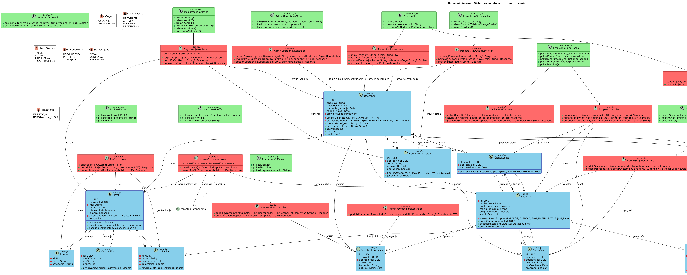

## Arhitektura sistema
Seznam elementov in skrbnikov:
| Element | Namen | Skrbnik |
|---------|-------|---------|
| Nadzorna plošča uporabnika | Pregled predlogov skupin in profila | Tim Pezdirc |
| Nadzorna plošča administratorja | Prikaz statistike platforme (št. uporabnikov, aktivnih iskanj, ...) | Tim Pezdirc |
| Avtentikacija | Skrbi za prijavo uporabnikov, preverjanje gesel in generiranje JWT žetonov | Aleks Gogić |
| Chat | Prikaz klepeta skupine | Miha Fabčič |
| Kontakt | Pregled sporočil uporabnikov (feedback) | Miha Fabčič |
| Urejanje profila | Skrbi za urejanje profila (spremembe interesov, lokacije, ...) | Jakob Jesenko |
| Ponastavitev gesla | Prikaz strani za ponastavitev gesla | Jakob Jesenko |
| Pametna komponenta | Skrbi za predloge skupin na podlagi formule | Leja Petrič |
| Krmilniki | Upravljanje različnih delov aplikacije | Leja Petrič |
| E-mail servis | Pošilja e-maile za verifikacijo profila in ponastavitev gesla | Aleks Gogić |

## Logični pogled (paketni diagram)


## Procesni pogled (diagram aktivnosti)


## Razvojni pogled (komponentni diagram)


## Fizični pogled (postavitveni diagram)


## Diagrami zaporedja za osnovne in alternativne tokove
### 1. Registracija

**Osnovni tok:** Gost odpre masko za registracijo, izpolni tri korake, sistem validira podatke, ustvari nepotrjen račun in pošlje verifikacijsko povezavo. Gost odpre povezavo in sistem aktivira račun.

.png)

**Alternativni tok A1 (popravi vnos v prejšnjem koraku):** Gost med izpolnjevanjem ugotovi, da je treba dopolniti prejšnji korak. Vrne se, popravi podatke, sistem ohrani že veljavne podatke in postopek se nadaljuje.

.png)

**Izjemni tok E1 (e-naslov že registriran):** Gost vnese e-naslov, ki že obstaja v sistemu. Sistem zavrne registracijo in prikaže napako. Gost vnese drug e-naslov in ponovno odda obrazec.

.png)

**Izjemni tok E2 (verifikacijska povezava potekla):** Gost odpre verifikacijsko povezavo po preteku roka. Sistem zavrne aktivacijo. Gost zahteva novo povezavo, sistem jo pošlje in ob odprtju aktivira račun.

.png)

---

### 2. Prijava

**Osnovni tok:** Gost odpre masko za prijavo, vnese e-naslov in geslo, sistem preveri poverilnice, vzpostavi sejo in preusmeri na ustrezno nadzorno ploščo.

.png)

**Alternativni tok A1 (prijava administratorja):** Gost vnese poverilnice za administratorski račun. Sistem prepozna vlogo administratorja in preusmeri na administratorsko nadzorno ploščo.

.png)

**Izjemni tok E1 (napačno geslo):** Gost vnese napačno geslo. Sistem zavrne prijavo in poveča števec neuspelih poskusov. Gost popravi geslo in se uspešno prijavi.

.png)

**Izjemni tok E2 (račun ni verificiran):** Gost vnese poverilnice neverificiranega računa. Sistem zavrne prijavo in ponudi ponovno pošiljanje verifikacije. Gost potrdi e-pošto in se nato uspešno prijavi.

.png)

---

### 3. Ponastavitev gesla

**Osnovni tok:** Gost klikne "Pozabljeno geslo", vnese e-naslov, sistem pošlje ponastavitveno povezavo. Gost odpre povezavo, vnese novo geslo, sistem ga shrani in preusmeri na prijavo.

.png)

**Alternativni tok A1 (takojšnja prijava po spremembi gesla):** Po uspešni spremembi gesla sistem uporabnika ne preusmeri samo na prijavo, ampak ga takoj prijavi z novimi poverilnicami.

.png)

**Izjemni tok E1 (povezava neveljavna ali potekla):** Gost odpre neveljavno ali poteklo povezavo. Sistem zavrne spremembo in ponudi novo zahtevo. Gost zahteva novo povezavo in nato uspešno spremeni geslo.

.png)

**Izjemni tok E2 (gesli se ne ujemata):** Gost vnese novo geslo in potrditev, ki se ne ujemata. Sistem zavrne oddajo. Gost popravi vnos in uspešno spremeni geslo.

.png)

---

### 4. Odjava

**Osnovni tok:** Akter izbere možnost "Odjava", sistem prekine aktivno sejo in preusmeri na začetno/prijavno stran.

.png)

**Alternativni tok A1 (samodejna odjava zaradi neaktivnosti):** Sistem zazna presežen čas neaktivnosti, opozori akterja in po izteku invalidira sejo ter preusmeri na prijavno stran.

.png)

**Izjemni tok E1 (seja je že potekla):** Akter izbere "Odjava", vendar je seja že potekla. Sistem ne izvaja dodatnega zaključevanja, vseeno pa izvede preusmeritev.

.png)

---

### 5. Urejanje profila

**Osnovni tok:** Uporabnik odpre profil, spremeni želene podatke, sistem validira in shrani spremembe.


**Alternativni tok A1 (posodobitev samo enega sklopa):** Uporabnik spremeni le en sklop podatkov (npr. interese). Sistem validira samo spremenjeni sklop in shrani spremembo.

.png)

**Izjemni tok E1 (neveljaven format podatkov):** Uporabnik odda neveljaven podatek. Sistem zavrne shranjevanje in označi napačno polje. Uporabnik popravi podatek in uspešno shrani.

.png)

**Izjemni tok E2 (konflikt sočasnih sprememb):** Uporabnik odda spremembe na zastarelem stanju profila. Sistem zazna konflikt in zahteva osvežitev. Uporabnik osveži podatke, ponovno uredi profil in odda spremembe.

.png)

---

### 6. Iskanje skupin

**Osnovni tok:** Uporabnik izbere "Išči skupino", sistem preveri profil, sproži izračun predlogov in prikaže seznam.

.png)

**Alternativni tok A1 (ponovitev iskanja po posodobitvi profila):** Uporabnik sproži iskanje, nato posodobi profil in ponovno sproži iskanje. Sistem upošteva nove podatke in prikaže osvežen nabor predlogov.

.png)

**Izjemni tok E1 (profil ni dovolj izpolnjen):** Sistem preveri profil in ugotovi manjkajoče podatke. Zavrne iskanje in navede manjkajoča polja. Uporabnik dopolni profil in ponovno sproži iskanje.

.png)

**Izjemni tok E2 (pametna komponenta nedosegljiva):** Sistem poskusi klic pametne komponente, vendar ta ne uspe. Prikaže obvestilo in možnost ponovnega poskusa. Uporabnik ponovi zahtevo in sistem uspešno vrne predloge.

.png)

---

### 7. Pregled skupin in chata (uporabnik)

**Osnovni tok:** Uporabnik odpre izbrano skupino iz seznama predlogov. Sistem prikaže čas, lokacijo, razloge ujemanja in kartice članov. Uporabnik si lahko ogleda kratek profil člana in odpre skupinski chat z zgodovino.

.png)

**Alternativni tok A1 (pregled posameznega člana):** Uporabnik klikne ikono člana, sistem odpre kratek profil, uporabnik si ga ogleda in zapre.

.png)

**Alternativni tok A2 (branje chata brez pošiljanja sporočila):** Uporabnik odpre chat, pregleda zgodovino sporočil in ga zapre brez novega vnosa. Sistem ohrani stanje pogovora nespremenjeno.

.png)

**Izjemni tok E1 (podatki niso dosegljivi):** Sistem poskuša prikazati podatke skupine in članov, vendar nalaganje ne uspe. Prikaže opozorilo in možnost ponovnega nalaganja. Uporabnik ponovi in sistem prikaže podatke.

.png)

**Izjemni tok E2 (skupina med prikazom postane neveljavna):** Sistem med prikazom zazna, da je skupina postala neveljavna. Zapre pregled skupine in osveži seznam predlogov.

.png)

---

### 8. Odločitev o udeležbi

**Osnovni tok:** Uporabnik iz pregleda skupine izbere potrditev ali zavrnitev. Sistem preveri, ali je skupina še veljavna, zabeleži odločitev in posodobi status odziva.


**Alternativni tok A1 (potrditev udeležbe):** Uporabnik izbere potrditev. Sistem preveri veljavnost skupine, zabeleži status "potrjeno" in posodobi status odziva.

.png)

**Alternativni tok A2 (zavrnitev predloga):** Uporabnik izbere zavrnitev. Sistem preveri veljavnost skupine, zabeleži status "zavrnjeno" in posodobi status odziva.

.png)

**Izjemni tok E1 (predlog ni več aktiven):** Uporabnik izbere potrditev ali zavrnitev, vendar sistem zazna, da predlog ni več veljaven. Zavrne akcijo in osveži seznam predlogov.

.png)

---

### 9. Oddaja povratne informacije

**Osnovni tok:** Sistem prikaže poziv za oddajo povratne informacije. Uporabnik vnese oceno in komentar. Sistem preveri veljavnost in shrani povratno informacijo.


**Alternativni tok A1 (oddaja samo ocene):** Uporabnik vnese samo oceno in pusti komentar prazen. Sistem sprejme oddajo in shrani povratno informacijo.

.png)

**Izjemni tok E1 (uporabnik je že oddal povratno informacijo):** Uporabnik poskuša oddati povratno informacijo za isti dogodek. Sistem zazna podvojitev in zavrne oddajo.

.png)

**Izjemni tok E2 (napaka pri shranjevanju):** Sistem ne uspe shraniti podatkov. Ponudi ponovni poskus. Uporabnik ponovi oddajo in sistem uspešno shrani.

.png)

---

### 10. Prijava neprimernega vedenja

**Osnovni tok:** Uporabnik odpre skupino, izbere uporabnika in možnost "Prijavi neprimerno vedenje". Sistem prikaže obrazec. Uporabnik vnese opis incidenta in odda prijavo. Sistem shrani prijavo in potrdi prejem.


**Alternativni tok A1 (dopolnitev prijave):** Uporabnik odda prijavo. Sistem potrdi prejem. Uporabnik se vrne in dopolni opis. Sistem shrani spremembo.

.png)

**Izjemni tok E1 (neprimerno izpolnjena prijava):** Uporabnik vpiše podatke, ki ne izpolnjujejo zahtev. Sistem zavrne oddajo in označi obvezna polja. Uporabnik popravi podatke in ponovno odda prijavo.

.png)

---

### 11. Pregled informacij

**Osnovni tok:** Gost ali uporabnik v footerju odpre izbrano informacijsko stran. Sistem prikaže vsebino izbrane strani.


**Alternativni tok A1 (branje več informacijskih strani):** Uporabnik odpre prvo informacijsko stran, nato odpre še drugo. Sistem prikaže obe vsebini.

.png)

**Izjemni tok E1 (informacijska stran ni dosegljiva):** Sistem poskuša naložiti vsebino, vendar nalaganje ne uspe. Prikaže opozorilo in možnost ponovnega nalaganja. Uporabnik ponovi zahtevo in sistem prikaže vsebino.

.png)

---

### 12. Kontaktni obrazec

**Osnovni tok:** Gost ali uporabnik odpre stran "Kontakt", vpiše podatke in odda obrazec. Sistem preveri veljavnost, shrani sporočilo in potrdi prejem.


**Alternativni tok A1 (dopolnitev obrazca pred oddajo):** Uporabnik vpiše del obrazca, nato opazi manjkajoče podatke. Dopolni obvezna polja in ponovno odda obrazec.

.png)

**Izjemni tok E1 (neveljavno izpolnjen kontaktni obrazec):** Uporabnik odda obrazec z manjkajočimi ali napačnimi podatki. Sistem zavrne oddajo in označi napake v poljih. Uporabnik popravi obrazec in ponovno odda.

.png)

---

### 13. Upravljanje uporabnikov (administrator)

**Osnovni tok:** Administrator odpre sekcijo Uporabniki. Sistem prikaže paginiran seznam uporabnikov. Administrator izvede akcijo (blokiraj/deblokiraj/aktiviraj/deaktiviraj/opozori).

.png)

**Alternativni tok A1 (opozorilo uporabniku):** Administrator odpre izbranega uporabnika in izbere akcijo "Opozori". Sistem shrani opozorilo in uporabnika označi z rumeno vizualno oznako.

.png)

**Izjemni tok E1 (administrator nima ustreznih pravic):** Administrator sproži administrativno akcijo, vendar sistem preveri pravice in akcijo zavrne. Prikaže razlog zavrnitve.

.png)

**Izjemni tok E2 (konflikt stanja računa):** Administrator izvede akcijo nad uporabnikom, vendar sistem zazna konflikt stanja v drugi seji. Sistem osveži seznam uporabnikov in administrator ponovi akcijo.

.png)

---

### 14. Pregled kontaktnih obrazcev in prijav (administrator)

**Osnovni tok:** Administrator odpre sekcijo Obvestila. Sistem prikaže seznam obvestil. Administrator odpre podrobnosti in označi obvestilo kot obdelano.


**Alternativni tok A1 (eskalacija obvestila):** Administrator odpre obvestilo visoke prioritete in izbere možnost eskalacije. Sistem označi obvestilo kot eskalirano in ga posreduje v nadaljnjo obravnavo.

.png)

**Alternativni tok A2 (eskalacija na upravljanje uporabnika):** Administrator pri pregledu prijave ugotovi, da je potrebna administrativna akcija. Izbere možnost "Upravljaj uporabnika", sistem ga preusmeri na sekcijo za upravljanje uporabnikov. Po izvedeni akciji se vrne nazaj.

.png)

**Izjemni tok E1 (podrobnosti obvestila niso dosegljive):** Sistem ne naloži podrobnosti obvestila. Prikaže opozorilo in možnost ponovnega nalaganja. Administrator ponovi zahtevo in sistem naloži podrobnosti.

.png)

---

### 15. Pregled skupin in chata (administrator)

**Osnovni tok:** Administrator odpre sekcijo Skupine. Sistem prikaže seznam vseh skupin. Administrator odpre izbrano skupino in pregleda chat.


**Alternativni tok A1 (filtriranje pred vpogledom):** Administrator nastavi filtre (status, obdobje, št. članov). Sistem osveži seznam skupin. Administrator nato odpre izbrano skupino.

.png)

**Izjemni tok E1 (podatki chata niso dosegljivi):** Sistem ne uspe naložiti podatkov chata. Prikaže opozorilo in možnost ponovnega poskusa. Administrator ponovi nalaganje in sistem prikaže chat.

.png)

---

### 16. Pregled povratnih informacij (administrator)

**Osnovni tok:** Administrator odpre sekcijo Skupine, nato izbrano skupino. Sistem prikaže povprečno oceno, število oddanih ocen in seznam komentarjev.


**Alternativni tok A1 (filtriranje povratnih informacij po skupini):** Administrator uporabi filtre za določeno skupino ali obdobje. Sistem osveži prikaz povratnih informacij.

.png)

**Izjemni tok E1 (povratne informacije za skupino niso dosegljive):** Sistem ne naloži povratnih informacij. Prikaže opozorilo in možnost ponovnega nalaganja. Administrator ponovi nalaganje in sistem prikaže podatke.

.png)

---

### 17. Upravljanje pametne komponente

**Osnovni tok:** Administrator odpre sekcijo Pametna komponenta. Sistem prikaže ključne metrike kakovosti. Administrator po potrebi spremeni parametre algoritma. Sistem zabeleži spremembo in prikaže primerjavo metrik pred/po spremembi.


**Alternativni tok A1 (spremljanje brez spremembe parametrov):** Administrator pregleda metrike in trend po obdobjih, vendar ne spremeni parametrov. Sistem ne zabeleži spremembe nastavitev.

.png)

**Izjemni tok E1 (parametri so izven dovoljenih mej):** Administrator spremeni parameter z neveljavno vrednostjo. Sistem zavrne spremembo in prikaže dovoljene meje. Administrator vnese veljavno vrednost in sistem zabeleži spremembo.

.png)

**Izjemni tok E2 (konflikt sočasnih sprememb):** Administrator spremeni parameter, medtem ko drug administrator sočasno ureja isti parameter. Sistem pri shranjevanju zazna konflikt in zahteva osvežitev. Administrator osveži podatke, ponovno odda spremembo in sistem jo zabeleži.

.png)


## Diagram stanj

*Diagram stanj za uporabnika*
Uporabniški račun je lahko v štirih stanjih: **Nepotrjen** (takoj po registraciji), **Aktiven** (po uspešni verifikaciji), **Blokiran** in **Deaktiviran** (slednji dve stanji nastavi administrator). Iz nepotrjenega stanja uporabnik preide v aktivnega z odprtjem verifikacijske povezave. Administrator lahko aktivnega uporabnika blokira ali deaktivira ter ga iz teh stanj tudi vrne nazaj v aktivnega.


*Diagram stanj za skupino*
Skupina (predlog za srečanje) ima štiri stanja: **Predlog** (ustvarjen s strani pametne komponente), **Aktivna** (ko vsaj trije člani potrdijo udeležbo), **Zaključena** (po izvedenem srečanju) in **Razveljavljena** (če premalo članov potrdi udeležbo ali administrator odpove srečanje).


*Diagram stanj za člana skupine*
Vsak član skupine ima svoj status odziva: **Neodločen** (privzeto po vstopu v skupino), **Potrdil** (uporabnik je potrdil udeležbo) in **Zavrnil** (uporabnik je zavrnil udeležbo). Dokler skupina ni aktivna, lahko uporabnik svojo odločitev poljubno spreminja.


*Diagram stanj za prijavo neprimernega vedenja*
Prijava, ki jo odda uporabnik, ima tri stanja: **Nova** (pravkar oddana, čaka na obravnavo), **Obdelana** (administrator jo je pregledal in zaključil) in **Eskalirana** (administrator jo je posredoval v nadaljnjo obravnavo). Eskalirano prijavo nato zaključi višji administrator.


*Diagram stanj za verifikacijski žeton*
Verifikacijski žeton (za potrditev e-pošte ali ponastavitev gesla) je lahko **Veljaven** (ustvarjen in poslan uporabniku), **Uporabljen** (uporabnik je odprl povezavo) ali **Potekel** (uporabnik povezave ni odprl v časovni omejitvi, npr. 24 ur).


*Diagram stanj za parametre algoritma*
Parametri pametne komponente (uteži w1, w2, w3) imajo tri stanja: **Osnovni** (privzeti parametri ob zagonu sistema), **Spremenjeni** (administrator je spremenil parametre) in **Arhivirani** (stara verzija parametrov, shranjena v zgodovino). Arhivirani parametri se po enem letu izbrišejo.


*Diagram stanj za uporabniško sejo (JWT)*
Uporabniška seja ima tri stanja: **Brez seje** (uporabnik ni prijavljen), **Aktivna seja** (uporabnik je uspešno prijavljen) in **Potekla seja** (JWT žeton je potekel zaradi neaktivnosti ali izteka časa). Iz potekle seje se uporabnik vrne v stanje brez seje, ko poskusi dostopati do zaščitene strani.


## 5 Končno stanje

### Kaj deluje?

- Registracija, ki sestoji iz treh korakov in vsebuje potrditev preko maila

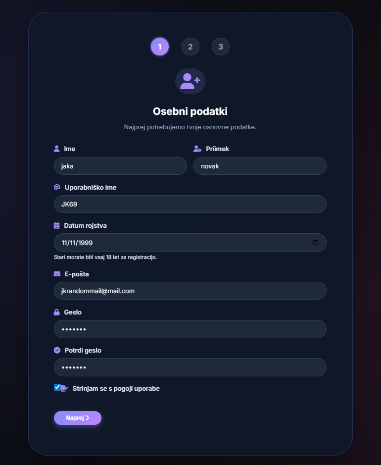

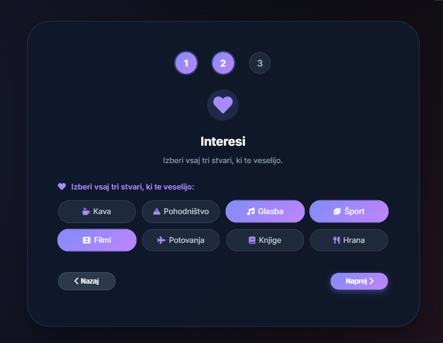

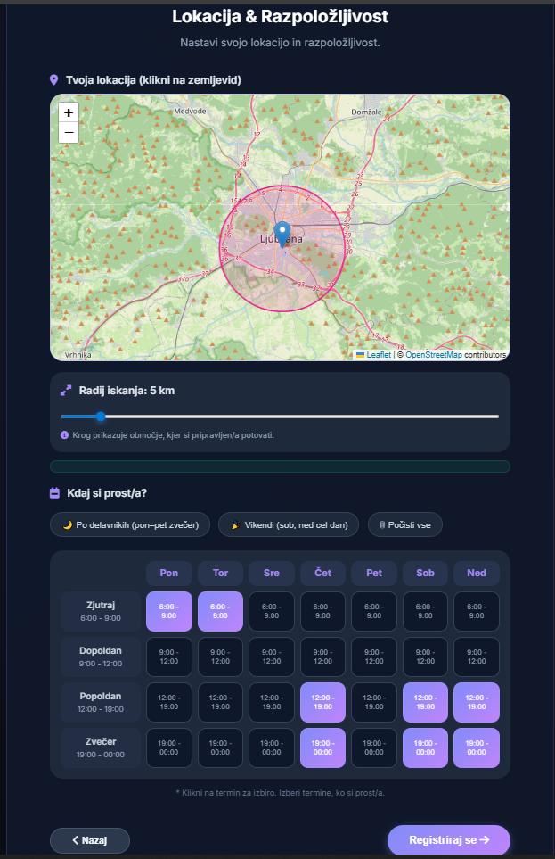

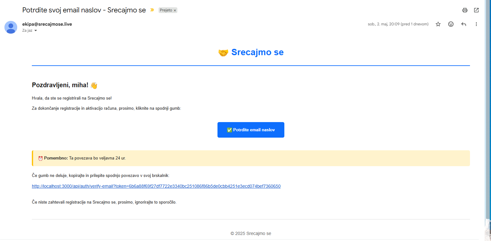

- Prijava v račun

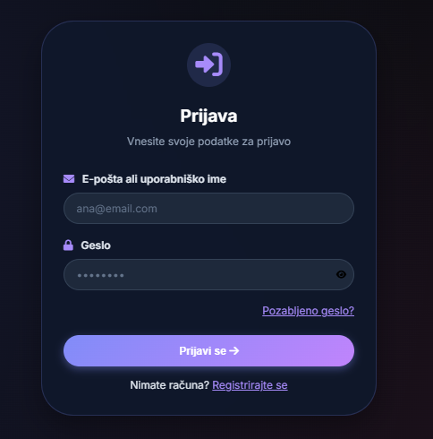

- Dashboard, ki poišče in prikaže predloge za skupine z največjo verjetnostjo ujemanja

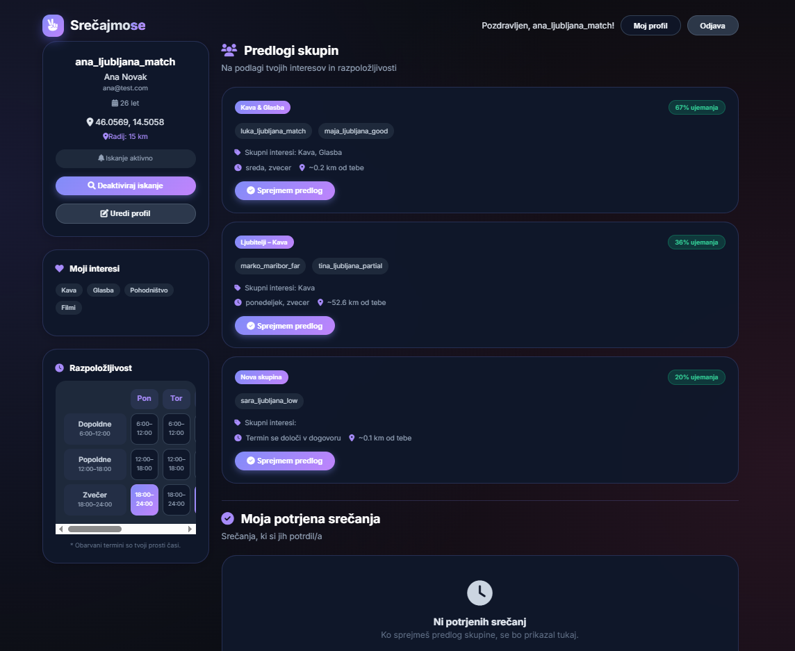

- Možnost urejanja profila

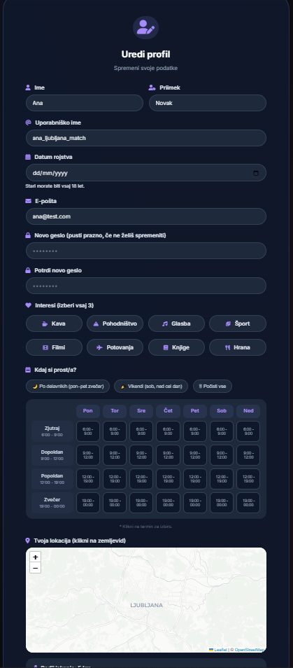

- Potrjevanje/zapustitev srečanj in prikaz le-teh

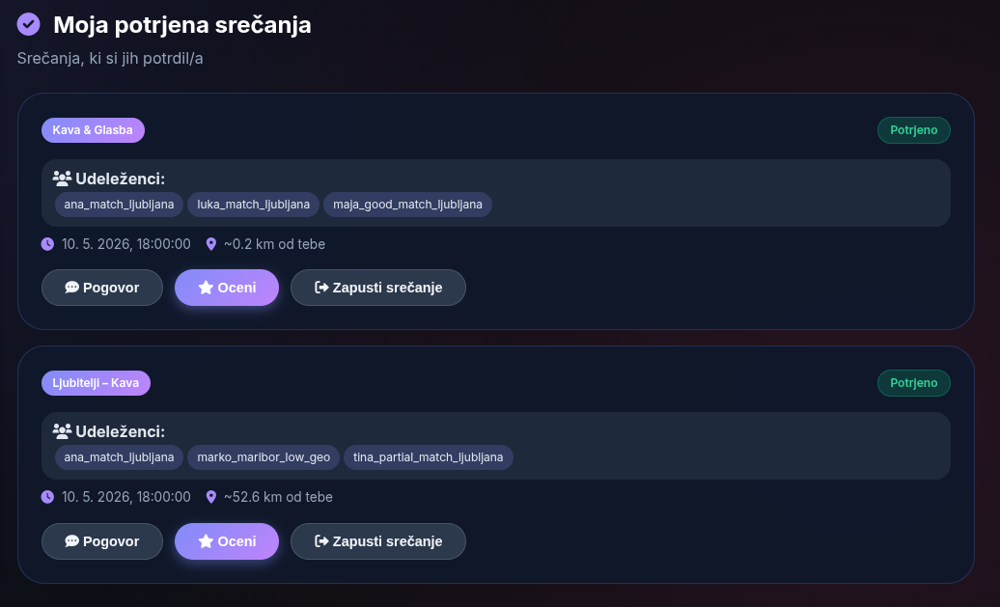

- Pogovor (chat) znotraj potrjenega srečanja

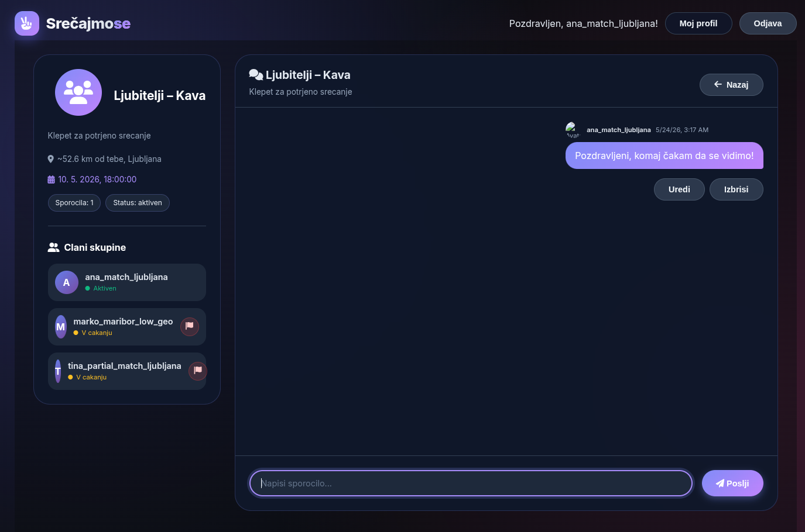

- Po srečanju možnost podati oceno in komentar o srečanju

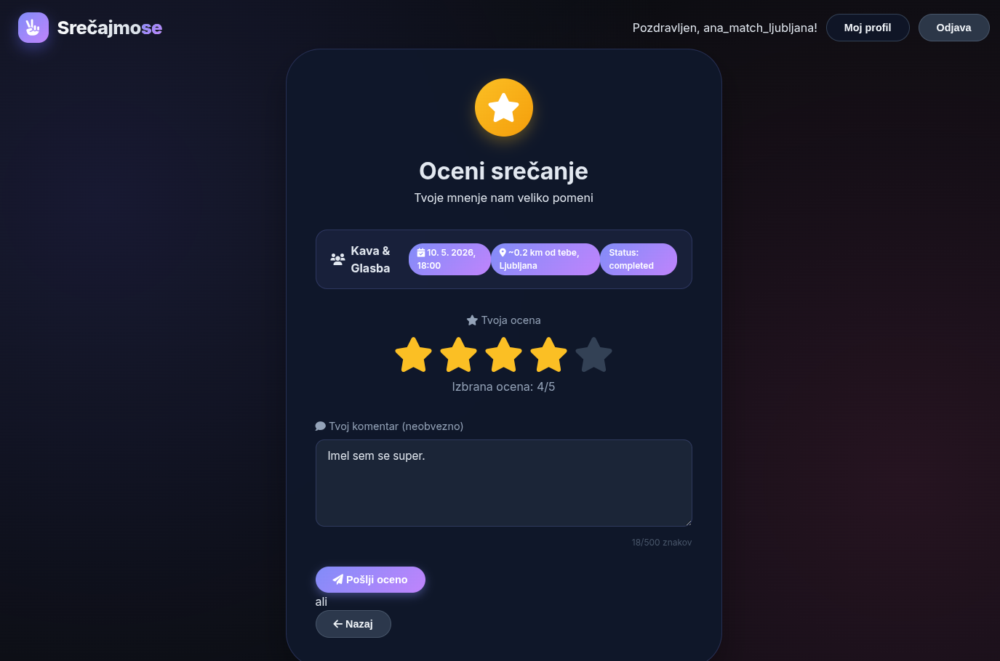

- Admin nadzorna plošča za pregled in upravljanje z utežmi pametne komponente, uporabniki, srečanji, prijavami in ocenami

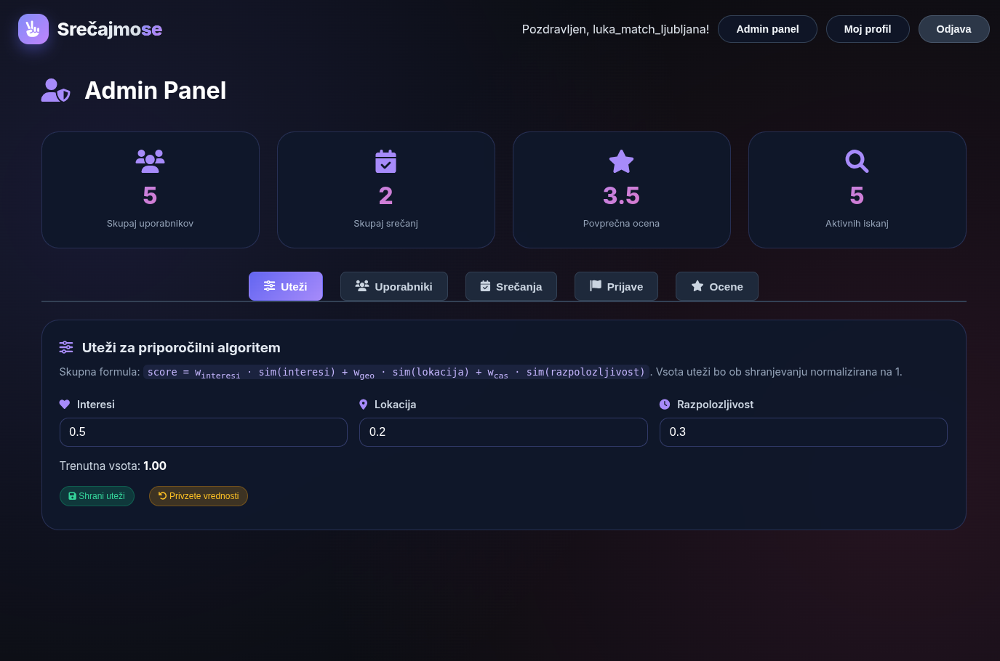

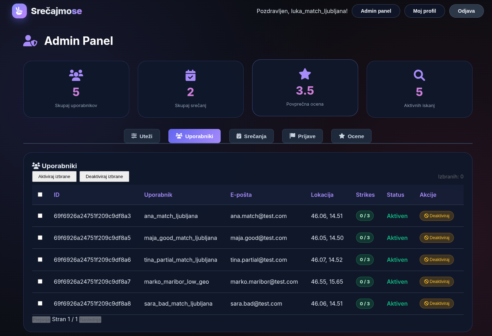

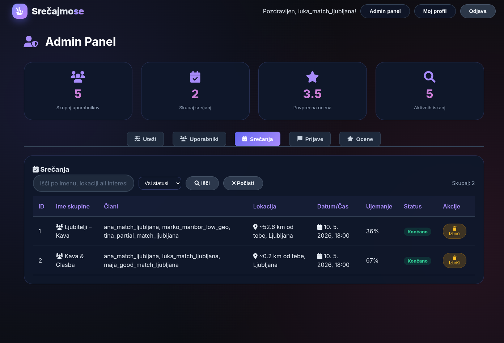

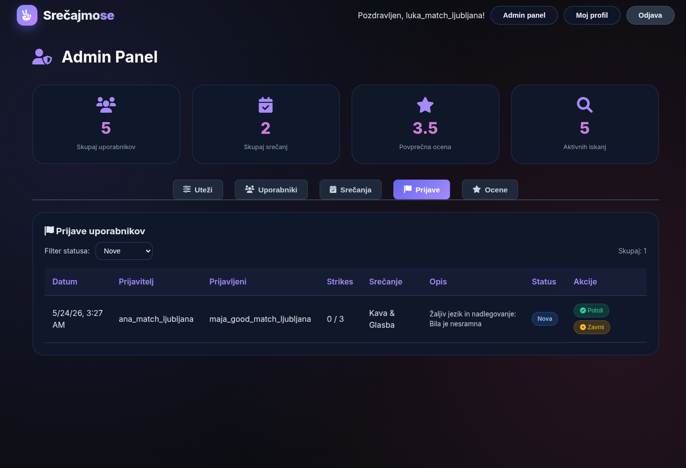

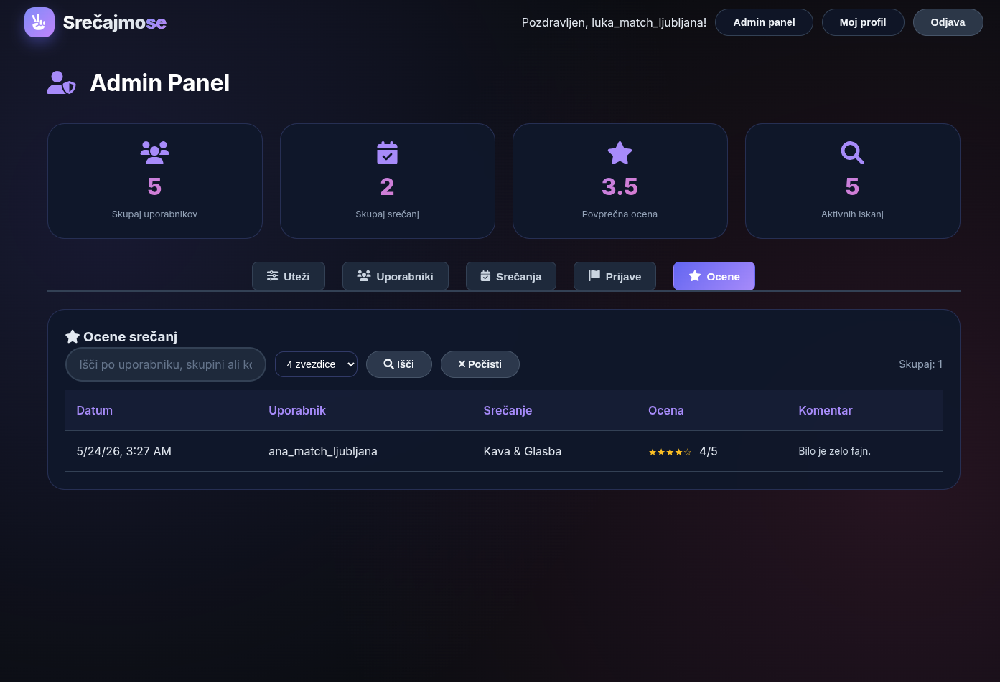

### Blokovni diagram sistema


**Blokovni diagram sistema** (izvorna koda [PlantUML](./gradivo/plantuml/BlockDiagram.puml))

Diagram prikazuje trenutno arhitekturo sistema za spontana družabna srečanja. Uporabniki do aplikacije dostopajo prek Angular uporabniškega vmesnika, ki omogoča registracijo, prijavo, urejanje profila, pregled predlogov srečanj, chat in administratorski pregled. Zahteve se pošiljajo na backend, implementiran z Node.js in Express, kjer se izvajajo avtentikacija, upravljanje uporabnikov, predlogi srečanj, chat, ocene, prijave in administracija. Aplikacijski nivo komunicira z MongoDB podatkovno plastjo, ki vsebuje kolekcije users, meetings, messages, ratings, reports, contacts in analytics.
Sistem uporablja tudi zunanje storitve, predvsem e-poštni servis za verifikacijo računa in ponastavitev gesla ter geokodirni API za pretvorbo lokacije v koordinate.

### Katere teste ste izvedli in ocena ustreznosti testov

V projektu smo do trenutne faze izvedli predvsem dve skupini avtomatiziranih testov: backend API teste v mapi `src/test` ter Angular unit in integration teste v `src/srecajmo-se/src/app/**/*.spec.ts`. Poleg že izvedenih testov smo pripravili in deloma implementirali tudi E2E (end-to-end) testiranje, ki predstavlja naslednji korak pri preverjanju celotnega delovanja sistema skozi dejanski uporabniški vmesnik v brskalniku.

Na strani backenda smo preverjali predvsem modelno in integracijsko plast sistema. Med unit testi smo pokrili validacijo modelov za uporabnike, srečanja, sporočila, ocene, prijave, kontakte, analitiko ter pomožne storitve za JWT avtentikacijo in pošiljanje e-pošte. Testi preverjajo ključne omejitve shem, privzete vrednosti, pravilno hashiranje gesel ter robne primere, kot so podvojeni vnosi, neveljavna polja in napačni podatki. Med integracijskimi testi smo preverili glavne REST tokove za avtentikacijo, uporabnike, srečanja, sporočila, ocene, prijave, kontaktni obrazec in predloge skupin. Posebej smo testirali administratorske tokove pri obravnavi prijav, vključno z logiko strike-ov in blokado uporabnika ob tretji potrjeni prijavi. Backend testni sklop tako potrjuje pravilno delovanje ključnih endpointov in osnovnih poslovnih procesov v izoliranem in-memory MongoDB okolju.

Na strani frontenda smo izvedli Angular unit in integration teste za glavne komponente uporabniškega in administratorskega dela aplikacije. Pokriti so bili tokovi registracije, prijave, ponastavitve gesla, dashboarda, urejanja profila, FAQ strani, skupinskega chata, oddaje ocen, kontaktnega obrazca ter administratorskih pregledov uporabnikov, prijav, srečanj, ocen in nastavitev algoritma pametne komponente. V testih smo preverjali pravilno validacijo obrazcev, prikaz podatkov, pošiljanje HTTP zahtev, odziv sistema na napake, preklapljanje administratorskih tabov, osveževanje podatkov po akcijah administratorja ter uporabniške tokove, kot sta zapustitev srečanja in prijava neprimernega vedenja v chatu. Frontend testni sklop je avtomatiziran, ponovljiv in primeren za regresijsko testiranje po nadaljnjem razvoju sistema.

Poleg unit in integration testov smo izvedli tudi del E2E testov v pravem brskalniškem okolju. Implementirani in uspešno preverjeni so bili predvsem scenariji prijave uporabnika ter administratorskega pregleda in obravnave prijav. Pri tem smo preverili pravilno delovanje uporabniškega prijavnega toka, preusmeritev na dashboard po uspešni avtentikaciji ter administratorski tok reševanja prijav in posodabljanja statusov uporabnikov. Ostali E2E scenariji so pripravljeni v obliki testne matrike in predstavljajo osnovo za nadaljnjo implementacijo celovitih uporabniških testov.

| E2E scenarij | Status | Namen | Predpogoji | Potek testa | Pričakovani rezultat |
|---|---|---|---|---|---|
| Registracija uporabnika | V pripravi | Preveriti celoten registracijski tok | Aplikacija je zagnana, uporabnik še nima računa | Uporabnik odpre začetno stran, izvede registracijo skozi vse 3 korake in odda obrazec | Račun je uspešno ustvarjen in uporabnik prejme potrditev ali preusmeritev na prijavo |
| Prijava in dostop do dashboarda | Izvedeno | Preveriti prijavni tok in prehod v uporabniški del sistema | Obstaja veljaven uporabniški račun | Uporabnik vnese e-pošto in geslo ter odda prijavni obrazec | Sistem uporabnika uspešno prijavi in preusmeri na dashboard |
| Iskanje skupine in potrditev predloga | V pripravi | Preveriti glavni tok iskanja skupin | Uporabnik je prijavljen in ima izpolnjen profil | Uporabnik sproži iskanje skupine, pregleda predlog in potrdi udeležbo | Predlog se premakne med potrjena srečanja |
| Skupinski chat | V pripravi | Preveriti komunikacijo znotraj potrjene skupine | Uporabnik ima potrjeno srečanje | Uporabnik odpre chat, pregleda zgodovino in pošlje novo sporočilo | Sporočilo se uspešno prikaže v chatu |
| Zapustitev srečanja | V pripravi | Preveriti odstranitev uporabnika iz skupine | Uporabnik ima potrjeno srečanje | Uporabnik izbere možnost zapustitve srečanja in potrdi akcijo | Srečanje se odstrani iz potrjenih srečanj |
| Admin: pregled in rešitev prijave | Izvedeno | Preveriti administratorski tok obravnave prijav | Administrator je prijavljen in obstaja prijava | Administrator odpre prijavo in jo označi kot rešeno | Status prijave se posodobi, uporabniku pa se po potrebi doda strike oziroma blokada |

Ocena ustreznosti izvedenih testov je za trenutno fazo razvoja dobra, saj pokrivajo večino ključnih poslovnih tokov in pomembnih robnih primerov tako na backendu kot na frontendu. Testi omogočajo učinkovito regresijsko preverjanje po spremembah kode ter hitro zaznavanje napak v modelih, API pogodbah in komponentni logiki. Delno implementirani E2E testi dodatno potrjujejo pravilno delovanje ključnih uporabniških in administratorskih scenarijev skozi dejanski uporabniški vmesnik. Kljub temu testna pokritost še ni popolna. Trenutno še niso implementirani vsi načrtovani E2E scenariji, prav tako še niso pokrite nefunkcionalne lastnosti sistema, kot so zmogljivost, obremenitveno testiranje in primerjava delovanja v različnih brskalnikih. Nadaljnja implementacija E2E testov zato predstavlja pomemben naslednji korak pri zagotavljanju kakovosti sistema.


### Število vrstic kode

- Število vrstic (demo aplikacija): 2500
- Število vrstic kode aplikacije: okrog 22.000

## 6 Vodenje projekta

**Razvojni proces**: Iterativni razvoj po tedenskih "rezinah" (1 teden)

Ekipa ne uporablja strogega Scrum procesa, ker bi vsakodnevna formalna srečanja predstavljala prevelik časovni strošek glede na druge obveznosti. Namesto tega uporabljamo lažji iterativni pristop:
- Na začetku tedna določimo cilje tedenske rezine.
- Med tednom člani samostojno izvajajo dogovorjene naloge.
- Ob koncu tedna (sobota ali nedelja) izvedemo skupni pregled napredka in dogovor popravkov.
- Če kdo naloge ne more dokončati, to pravočasno javi v Discordu, da se delo prerazporedi ali dobi pomoč.

**Dobre prakse, ki bodo uporabljene na projektu so naslednje:**
- **Verzije kode**: Git + GitHub (repositorij struktura: main, develop, feature branches)
- **Code reviews**: Vsaka sprememba gre skozi pregled najmanj enega člana ekipe in se potrdi
- **Dokumentacija**: Sproti pisanje komentarjev v kodi in posodabljanje README.md
- **Sledenje nalogam**: Trenutno sprotni dogovor v ekipi; formalno orodje (npr. GitHub Projects/Trello) bomo uvedli po potrebi

### Dnevnik sprememb

Projekt je potekal od 23. 2. 2026 do 24. 5. 2026.

| Datum | Motivacija | Opis spremembe | Posledica |
|-------|------------|----------------|------------|
| 1. 3. 2026 | Začetek projekta | Formalni začetek projekta, vzpostavitev Git repozitorija in osnovne strukture projekta. | Ekipna razdelitev vlog, priprava razvojnega okolja in načrt za iteracije. |
| 6. 4. 2026 | Prvo testiranje z naročniki | Predstavili smo prve zaslonske maske (wireframe-i osnovnih tokov: registracija, vnos profila, prikaz predlogov) naročniku in zbrali povratne informacije. | Uskladitev prioritet in zmanjšanje obsega na MVP; korigiran načrt razvoja. |
| 8. 4. 2026 | Tehnična odločitev | Izbira tehnologij za MVP: Node.js (backend), MongoDB (baza), Angular (frontend). | Priprava razvojnega okolja in začetek implementacije jedrnih modulov. |
| 10. 4. 2026 | Poenostavitev obsega | Opustitev avtomatskega iskanja v ozadju za MVP. | Iskanje skupin se sproži eksplicitno s strani uporabnika (gumb "Išči skupino"); zmanjšana časovna zahtevnost razvoja. |
| 22. 4. 2026 | Izboljšava scoring algoritma | Na testnih podatkih smo prilagodili scoring: uvedli normalizacijo razdalje in dodatno utež za število preteklih srečanj. | Bolj stabilne ocene ujemanja; razvoj pametne komponente podaljšan za približno 3 dni. |
| 28. 4. 2026 | Zamuda pri administratorskem vmesniku | Delni zamik razvoja administratorske plošče zaradi preusmeritve virov na jedrne uporabniške tokove. | Administratorski vmesnik je delno implementiran (pregled uporabnikov); napredne funkcije (metrike, upravljanje skupin) prestavljene v naslednjo iteracijo. |
| 2. 5. 2026 | Sprememba implementacije chata | Zaradi časovnih omejitev je bil realno‑časni chat začasno implementiran kot REST‑polling namesto WebSocket povezave. | Funkcionalnost chata je na voljo kot simulacija; polni realno‑časni Socket.io chat je načrtovan za naslednjo iteracijo. |
| 12. 5. 2026 | Posodobitev plana | Posodobitev PERT grafa in Ganttovega diagrama, uskladitev terminskega načrta z dejanskim tempom razvoja. | Posodobljeni diagrami so vključeni v gradivo (gradivo/plantuml), razporedi so usklajeni z dnevnikom sprememb. |
| 20. 5. 2026 | Testni napredek | Izvedeni so enotni in integracijski testi; delno implementirani E2E scenariji (prijava, admin obravnava prijav). | Pripravljena testna matrika za preostale E2E scenarije; dodatno testiranje nefunkcionalnih lastnosti še ni izvedeno. |
| 24. 5. 2026 | Zadnji popravki na admin strani | Izvedeni so bili še zadnji popravki aplikacije na administratorskem delu (admin side), predvsem stabilizacija prikazov in manjši UX popravki. | Administratorski del je funkcionalno zaključen in pripravljen za končno oddajo. |

### 6.1 Usklajevanje ekipe

**Razporeditev dela:**
- Delo razdelimo po tedenskih rezinah z jasno določenimi nalogami za vsakega člana.
- Na začetku tedna določimo prioritete in odgovorne osebe.
- Če kdo naloge ne more dokončati, to označi v Discordu, da se dogovorimo za pomoč ali prerazporeditev.
- Formalnega orodja za projektno vodenje (GitHub Projects/Trello) trenutno še ne uporabljamo; odločitev bomo sprejeli kasneje.

**Sestanki ekipe:**
- **Glavni tedenski sestanek**: Enkrat tedensko, praviloma konec tedna (sobota ali nedelja), online preko Discorda.
  - Trajanje: približno 60-90 minut.
  - Namen: pregled opravljenega dela, določitev nalog za naslednji teden, uskladitev odprtih težav.
- **Vmesna uskladitev po potrebi**: krajši ad-hoc klici ali sporočila v Discordu, kadar se pojavi blokada.

**Cilji sestankov:**
- Spremljanje napredka projekta
- Razreševanje tehničnih težav in ovir
- Usklajevanje odločitev glede arhitekture in implementacije
- Razporeditev nalog za naslednjo tedensko rezino
- Priprava na zagovore in predstavitve

**Komunikacija:**
- **Sprotna komunikacija**: Discord kanal (glavni komunikacijski kanal ekipe)
- **Dokumentacija**: Markdown dokumenti v repozitoriju + po potrebi deljeni dokumenti
- **Koda**: GitHub repository z jasnimi pull request-i in code reviews

### 6.2 Projektni načrt

- Povzetek razdelitve projekta na aktivnosti s seznamom izdelkov, vključno z Ganttovim diagramom in grafom PERT.

**Razdelitev projekta na aktivnosti in izdelki:**

Projekt je razdeljen na **10 aktivnosti** razporejenih čez 4 iteracije. Vsaka aktivnost je opisana z oznako, datumom začetka in konca, trajanjem, imenom, opisom, obsegom, cilji, odvisnostmi od ostalih aktivnosti, omejitvami, rezultati ter informacijo o tem, ali je na kritični poti.

---

**Aktivnost A1: Analiza problema in definicija projektne ideje**

| **Oznaka** | **Datum začetka** | **Datum konca** | **Trajanje** | **Na kritični poti** |
|:---:|:---:|:---:|:---:|:---:|
| A1 | 23. 2. 2026 | 27. 2. 2026 | 5 delovnih dni |  Da |

- **Ime**: Analiza problema in definicija projektne ideje
- **Opis**: Ekipa analizira obstoječe rešitve (Tinder, Bumble, Meetup, Timeleft, We3, 222), identificira problemsko domeno socialne izolacije v urbanih okoljih ter definira projektno idejo, motivacijo in namen sistema.
- **Obseg aktivnosti**: Pregled in primerjava vsaj 5 sorodnih aplikacij; definicija problemske domene; opredelitev motivacije, namena in smernic projekta; identifikacija ciljne skupine in končnih uporabnikov.
- **Cilji aktivnosti**: Jasno opredeljena projektna ideja z dokumentirano primerjavo sorodnih rešitev in definirano dodano vrednostjo predlagane rešitve.
- **Odvisnost od ostalih aktivnosti**: Ni odvisna od nobene aktivnosti.
- **Omejitve**: Časovna omejitev 1 teden; dostop le do javno dostopnih informacij o sorodnih platformah.
- **Rezultati**: Dokumentirana analiza problemske domene (poglavje 0 in 1), primerjalna analiza sorodnih rešitev.

---

**Aktivnost A2: Analiza zahtev in definicija ciljev projekta**

| **Oznaka** | **Datum začetka** | **Datum konca** | **Trajanje** | **Na kritični poti** |
|:---:|:---:|:---:|:---:|:---:|
| A2 | 2. 3. 2026 | 6. 3. 2026 | 5 delovnih dni |  Da |

- **Ime**: Analiza zahtev in definicija ciljev projekta
- **Opis**: Definicija potreb in zahtev deležnikov, oblikovanje 6 uporabniških zgodb s testi sprejemljivosti ter določitev merljivih projektnih ciljev. Validacija ideje z zunanjim naročnikom (asistentom predmeta TPO).
- **Obseg aktivnosti**: Identifikacija primarnih in sekundarnih deležnikov; opredelitev 6 uporabniških zgodb; definicija 6 merljivih projektnih ciljev (C1–C6); merila uspeha in validacija z naročnikom.
- **Cilji aktivnosti**: Dokumentirane in validirane zahteve sistema z merljivimi cilji, pripravljene za načrtovanje implementacije.
- **Odvisnost od ostalih aktivnosti**: A1 (razumevanje problemske domene in sorodnih rešitev).
- **Omejitve**: Časovna omejitev 1 teden; dostop do zunanjega naročnika za validacijo.
- **Rezultati**: Poglavje 2 (Potrebe naročnika), poglavje 3 (Cilji projekta), 6 uporabniških zgodb s testi sprejemljivosti, povratna informacija naročnika.

---

**Aktivnost A3: Načrt sistema in projektno vodenje**

| **Oznaka** | **Datum začetka** | **Datum konca** | **Trajanje** | **Na kritični poti** |
|:---:|:---:|:---:|:---:|:---:|
| A3 | 9. 3. 2026 | 16. 3. 2026 | 6 delovnih dni |  Da |

- **Ime**: Načrt sistema in projektno vodenje
- **Opis**: Oblikovanje arhitekture sistema, izbira tehnologij (Node.js, MongoDB, Angular), določitev projektnega pristopa, vodenja in komunikacije; priprava Ganttovega diagrama in PERT grafa; COCOMO II finančna ocena; definicija vlog in odgovornosti. **Vse mora biti zaključeno do 16. 3. 2026 (oddaja predloga projekta).**
- **Obseg aktivnosti**: Blokovni diagram sistema; definicija tehnologij, orodij in knjižnic; terminski načrt (Gantt.puml – vključno s točnimi datumi); PERT graf za analizo kritične poti (PERT.puml); COCOMO II ocena stroškov; definicija vlog in odgovornosti ter projektnega pristopa; finalizacija celotnega predloga projekta.
- **Cilji aktivnosti**: Celoten predlog projekta z dokumentiranim načrtom implementacije, terminskim načrtom in finančno oceno, oddan 16. 3. 2026.
- **Odvisnost od ostalih aktivnosti**: A1, A2.
- **Omejitve**: Vsi diagrami (Gantt, PERT, COCOMO II) morajo biti dokončani pred oddajo 16. 3.; znanje ekipe o razpoložljivih tehnologijah in razvojnih pristopih.
- **Rezultati**: Celoten predlog projekta (ta dokument), Ganttov diagram (Gantt.puml), PERT graf (PERT.puml), COCOMO II ocena.

---

**Aktivnost A4: Postavitev razvojnega okolja**

| **Oznaka** | **Datum začetka** | **Datum konca** | **Trajanje** | **Na kritični poti** |
|:---:|:---:|:---:|:---:|:---:|
| A4 | 23. 3. 2026 | 27. 3. 2026 | 5 delovnih dni |  Da |

- **Ime**: Postavitev razvojnega okolja in projektne infrastrukture
- **Opis**: Inicializacija Git repozitorija s strukturiranimi vejami (main, develop, feature), konfiguracija Docker razvojnega okolja, vzpostavitev CI/CD pipeline (GitHub Actions) ter določitev osnovne projektne strukture Node.js in Angular aplikacije.
- **Obseg aktivnosti**: Git repozitorij z vejami; Docker in docker-compose konfiguracija; CI/CD z avtomatiziranimi testi ob vsaki spremembi; osnovna projektna struktura (backend, frontend, tests); README z navodili za vzpostavitev.
- **Cilji aktivnosti**: Delujoče, standardizirano razvojno okolje za vse člane ekipe z avtomatizirano CI/CD integracijo.
- **Odvisnost od ostalih aktivnosti**: A3 (odločitve o tehnologijah in arhitekturi).
- **Omejitve**: Poznavanje DevOps orodij; brezplačni tir oblačnih storitev.
- **Rezultati**: Git repozitorij, Docker konfiguracija, CI/CD pipeline, osnovna projektna struktura.

---

**Aktivnost A5: Implementacija podatkovne baze in backend API**

| **Oznaka** | **Datum začetka** | **Datum konca** | **Trajanje** | **Na kritični poti** |
|:---:|:---:|:---:|:---:|:---:|
| A5 | 30. 3. 2026 | 10. 4. 2026 | 10 delovnih dni |  Ne |

- **Ime**: Implementacija podatkovne baze in backend REST API
- **Opis**: Modeliranje in implementacija MongoDB podatkovne baze ter razvoj REST API za registracijo, prijavo in CRUD operacije za uporabniške profile (interesi, lokacija, časovna razpoložljivost) z JWT avtentikacijo.
- **Obseg aktivnosti**: MongoDB sheme (uporabniki, interesi, lokacija, razpoložljivost, srečanja); REST API z vsaj 10 endpointi; JWT avtentikacija; validacija vhodnih podatkov; unit testi za ključne endpointe.
- **Cilji aktivnosti**: Delujoč backend, ki podpira registracijo, prijavo in vse CRUD operacije za profil – osnova za integracijo algoritma in frontenda.
- **Odvisnost od ostalih aktivnosti**: A4 (razvojno okolje).
- **Omejitve**: Časovna omejitev 2 tedna; zahteva poznavanje Node.js in MongoDB.
- **Rezultati**: Delujoč REST API, MongoDB sheme, unit testi API endpointov, Postman kolekcija.

---

**Aktivnost A6: Razvoj algoritma za oblikovanje skupin**

| **Oznaka** | **Datum začetka** | **Datum konca** | **Trajanje** | **Na kritični poti** |
|:---:|:---:|:---:|:---:|:---:|
| A6 | 30. 3. 2026 | 24. 4. 2026 | 20 delovnih dni |  Da |

- **Ime**: Razvoj algoritma za oblikovanje skupin
- **Opis**: Razvoj jedrne komponente sistema – algoritma za oblikovanje skupin na podlagi scoring funkcije `score = w1 * similarity + w2 * distance + w3 * time_overlap`. Vključuje modul za podobnost interesov (Cosine Similarity), modul za geografsko razdaljo in modul za časovno usklajevanje, z iterativno optimizacijo uteži na sintetičnih podatkih.
- **Obseg aktivnosti**: Implementacija vseh treh modulov; definicija in implementacija scoring funkcije; testiranje na sintetičnih podatkih (100+ profilov); primerjava metrik (Cosine Similarity, Jaccard Index); optimizacija uteži glede na testne rezultate.
- **Cilji aktivnosti**: Delujoč algoritem z dokumentiranimi utežmi, ki dosega: povprečna podobnost interesov > 0,6, geografska razdalja < 10 km, časovno prekrivanje > 2 uri.
- **Odvisnost od ostalih aktivnosti**: A4, A5 (osnovna podatkovna baza za testne podatke).
- **Omejitve**: Časovna omejitev 4 tedne; zahteva ekspertizo pri algoritmih podobnosti; tveganje nizke kakovosti skupin.
- **Rezultati**: Algoritem za oblikovanje skupin z dokumentiranimi utežmi, unit testi algoritma, evalvacijska poročila na testnih podatkih.

---

**Aktivnost A7: Razvoj uporabniškega vmesnika**

| **Oznaka** | **Datum začetka** | **Datum konca** | **Trajanje** | **Na kritični poti** |
|:---:|:---:|:---:|:---:|:---:|
| A7 | 30. 3. 2026 | 17. 4. 2026 | 15 delovnih dni |  Ne |

- **Ime**: Razvoj uporabniškega vmesnika (Angular)
- **Opis**: Razvoj Angular spletne aplikacije s ključnimi maskami: registracija, prijava, upravljanje profila (interesi, lokacija, časovna razpoložljivost), prikaz predlaganih skupin in oddaja povratnih informacij. Integracija z backend API.
- **Obseg aktivnosti**: Angular aplikacija z vsaj 6 maskami; integracija z REST API; responziven dizajn; osnovno testiranje UI komponent.
- **Cilji aktivnosti**: Intuitiven UI, ki omogoča registracijo in prejem predlogov skupin v manj kot 5 minutah (cilj C4).
- **Odvisnost od ostalih aktivnosti**: A4, A5 (API mora biti vsaj delno funkcionalen).
- **Omejitve**: Časovna omejitev 3 tedne; zahteva izkušnje z Angular-jem; UX mora biti intuitiven in enostaven.
- **Rezultati**: Delujoča Angular aplikacija integrirana z backend API; end-to-end tok od registracije do predloga skupin.

---

**Aktivnost A8: Celovito testiranje sistema**

| **Oznaka** | **Datum začetka** | **Datum konca** | **Trajanje** | **Na kritični poti** |
|:---:|:---:|:---:|:---:|:---:|
| A8 | 27. 4. 2026 | 8. 5. 2026 | 10 delovnih dni |  Da |

- **Ime**: Celovito testiranje sistema
- **Opis**: Sistematično testiranje vseh komponent: unit testi za algoritem in API, integracijski testi, funkcionalni testi ključnih tokov ter end-to-end testi. Odpravljanje napak in stabilizacija sistema.
- **Obseg aktivnosti**: Unit testi (pokritost > 70%); integracijski testi za vse ključne API endpointe; funkcionalni testi za vsaj 3 ključne tokove (registracija, iskanje skupin, povratne informacije); E2E testi.
- **Cilji aktivnosti**: Stabilen sistem brez kritičnih napak, z dokumentirano pokritostjo testov, pripravljen za testiranje z realnimi uporabniki.
- **Odvisnost od ostalih aktivnosti**: A5, A6, A7 (vsi razvojni moduli morajo biti dokončani).
- **Omejitve**: Časovna omejitev 2 tedna; treba je pokriti vse kritične funkcionalnosti.
- **Rezultati**: Testna poročila, dokumentirana pokritost testov, seznam in odprava napak, stabilna verzija sistema.

---

**Aktivnost A9: Testiranje z realnimi uporabniki**

| **Oznaka** | **Datum začetka** | **Datum konca** | **Trajanje** | **Na kritični poti** |
|:---:|:---:|:---:|:---:|:---:|
| A9 | 11. 5. 2026 | 22. 5. 2026 | 10 delovnih dni |  Da |

- **Ime**: Testiranje z realnimi uporabniki (alfa in beta)
- **Opis**: Dvofazno testiranje z realnimi uporabniki: alfa testiranje z manjšo skupino (5–10 oseb) za kvalitativne povratne informacije in iterativne popravke, nato beta testiranje z večjo skupino (20+ oseb) za zbiranje kvantitativnih metrik kakovosti skupin in zadovoljstva.
- **Obseg aktivnosti**: Alfa testiranje (5–10 testnih uporabnikov, kvalitativne povratne informacije, iterativne izboljšave); beta testiranje (20+ uporabnikov, kvantitativne metrike); analiza ocen predlaganih skupin; merjenje dejansko izvedenih srečanj.
- **Cilji aktivnosti**: Potrditev ciljev C3–C6: > 70% zadovoljstvo uporabnikov, > 60% dejansko izvedenih srečanj, < 5 minut od registracije do predloga skupin.
- **Odvisnost od ostalih aktivnosti**: A8 (stabilen sistem brez kritičnih napak).
- **Omejitve**: Dostop do 20+ testnih uporabnikov; čas usklajevanja srečanj; skladnost z GDPR.
- **Rezultati**: Evalvacijska poročila, statistike zadovoljstva uporabnikov, evidenca izvedenih srečanj, seznam prioritetnih izboljšav za finalizacijo.

---

**Aktivnost A10: Optimizacija, dokumentacija in predstavitev**

| **Oznaka** | **Datum začetka** | **Datum konca** | **Trajanje** | **Na kritični poti** |
|:---:|:---:|:---:|:---:|:---:|
| A10 | 20. 5. 2026 | 25. 5. 2026 | 4 delovnih dni |  Da |

- **Ime**: Optimizacija, dokumentacija in predstavitev projekta
- **Opis**: Implementacija prioritetnih izboljšav na podlagi beta testiranja, poliranje UI, odpravljanje preostalih napak, priprava celovite končne dokumentacije (arhitekturni načrt, opis algoritma, tehnično poročilo) in priprava zaključne predstavitve.
- **Obseg aktivnosti**: Implementacija vsaj 3 prioritetnih izboljšav iz beta testiranja; poliranje UI; finalna dokumentacija sistema; analiza in sinteza rezultatov evalvacijske študije; zaključna predstavitev.
- **Cilji aktivnosti**: Finalna, stabilna verzija sistema z dokumentacijo; uspešna zaključna predstavitev projekta.
- **Odvisnost od ostalih aktivnosti**: A9; aktivnost se v zaključnem delu lahko delno izvaja vzporedno z zadnjimi dnevi beta testiranja.
- **Omejitve**: Časovna omejitev 2 tedna; prioritizacija izboljšav glede na razpoložljiv čas.
- **Rezultati**: Finalna verzija sistema, celovito končno poročilo, zaključna predstavitev projekta.

---


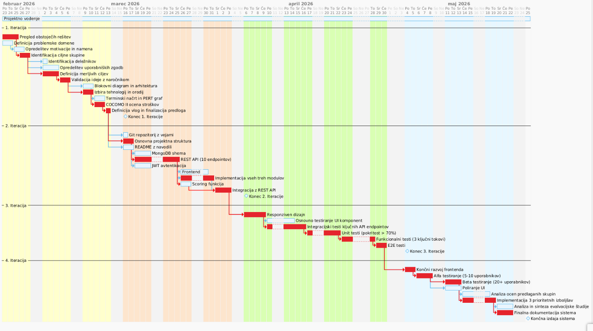
**Ganttov diagram**


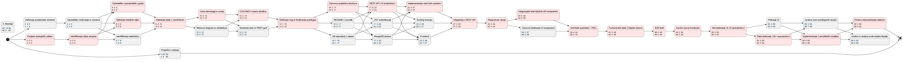
**Graf PERT**


### 6.3 Finančni načrt

Dekompozicija na funkcijske točke

Na podlagi specifikacije (8 zaslonskih mask + administratorski vmesnik) identificiram funkcionalnosti:

| Vrsta FP | Ime funkcionalnosti | Objekt | Določitev obsega | Utež |
| :--- | :--- | :--- | :--- | :--- |
| **EI (External Input)** | | | | |
| EI1 | Registracija (3 koraki) | zaslon | AVG (3-koračni obrazec) | 4 |
| EI2 | Prijava v sistem | zaslon | LOW (enostaven vnos) | 3 |
| EI3 | Urejanje profila | zaslon | AVG (nekaj polj) | 4 |
| EI4 | Aktivacija iskanja (gumb) | zaslon | LOW (en gumb) | 3 |
| EI5 | Sprejem/zavrnitev skupine | zaslon | LOW (dva gumba) | 3 |
| EI6 | Oddajanje ocene po srečanju | zaslon | AVG (ocene in komentar) | 4 |
| EI7 | Administratorski vnos (interesi) | zaslon | LOW | 3 |
| **EQ (External Query)** | | | | |
| EQ1 | Osnovna stran (prijavljen uporabnik) | zaslon | AVG (agregacija podatkov) | 4 |
| EQ2 | Prikaz predlagane skupine | zaslon | AVG (prikaz profilov) | 4 |
| EQ3 | Prikaz potrjenih/preteklih srečanj | poročilo | AVG (seznam s filtri) | 4 |
| **EO (External Output)** | | | | |
| EO1 | Prikaz lokacije na zemljevidu | izhod | AVG (integracija z API) | 5 |
| EO2 | Administrativno poročilo (statistika) | poročilo | AVG (grafi, števci) | 5 |
| **ILF (Internal Logical File)** | | | | |
| ILF1 | Uporabnik (in povezane tabele) | baza | AVG (> 5 tabel) | 10 |
| ILF2 | Srečanje (in članstva, lokacije) | baza | AVG (> 5 tabel) | 10 |
| ILF3 | Ocene | baza | LOW | 7 |
| **EIF (External Interface File)** | | | | |
| EIF1 | Zemljevid (Google Maps / OpenStreetMap) | zunanji sistem | AVG | 7 |

Izračun funkcijskih točk (FP)

Seštevek uteži:

| Kategorija | Vsota uteži |
| :--- | :--- |
| EI (7 funkcionalnosti) | 4+3+4+3+3+4+3 = 24 |
| EQ (3 funkcionalnosti) | 4+4++4 = 12 |
| EO (2 funkcionalnosti) | 5+5 = 10 |
| ILF (3 tabele) | 10+10+7 = 27 |
| EIF (1 zunanji sistem) | 7 |
| **SKUPAJ FP** | **80** |

Skupno število funkcijskih točk = **80**.

Pretvorba v vrstice kode (SLOC) za JavaScript

Po tabeli QSM 2014 za JavaScript: `1 FP = 47 SLOC` (povprečje).

`size = FP × SLOC_JavaScript = 80 × 47 = 3.760 SLOC`

`size_KSLOC =3.760 / 1000 = **3,76 KSLOC**`

Izračun parametra B (Eksponent)

Na podlagi ocene projektne skupine (upoštevajoč, da gre za študentski projekt):

| Dejavnik | Opis | Vrednost | Utež (wᵢ) |
| :--- | :--- | :--- | :--- |
| PREC (Precedenčnost) | Nizka (Nov projekt, nekaj izkušenj) | Nizka | 4 |
| FLEX (Fleksibilnost) | Visoka (Študenti lahko prilagajajo) | Visoka | 2 |
| RESL (Obvladovanje tveganj) | Nizka (Omejene izkušnje s tveganji) | Nizka | 4 |
| TEAM (Uigranost skupine) | Zelo nizka (Nova, neuigrana skupina) | Zelo nizka | 5 |
| PMAT (Zrelost procesa) | Zelo nizka (CMM Level 1) | Zelo nizka | 5 |
| **SKUPAJ** | | | **20** |

Formula: `B = 1.01 + 0.01 × ∑wi`

`B = 1.01 + 0.01 × 20 = 1.01 + 0,20 = **1,21**`

Izračun parametra M (Množitelji napora)

Realna ocena za študentski projekt z uporabo JavaScript/Node.js:

| Dejavnik | Opis | Ocena | Utež | Obrazložitev |
| :--- | :--- | :--- | :--- | :--- |
| PERS | Sposobnost osebja | Nizka | 1,12* | Študenti, omejene izkušnje |
| PREX | Izkušnje s platformo | Nizka | 1,10* | Omejene izkušnje z JS ekosistemom |
| RCPX | Zanesljivost in kompleksnost | Nominalna | 1,00 | Srednje kompleksen projekt |
| RUSE | Zahteve za ponovno uporabo | Zelo nizka | 0,91* | Koda se ne bo ponovno uporabljala |
| PDIF | Težavnost platforme | Nominalna | 1,00 | Standardni JS/Node.js |
| SCED | Časovni pritisk | Nominalna | 1,00 | Privzeto |
| FCIL | Orodja in komunikacija | Visoka | 0,90* | Sodobna orodja, GitHub, Discord |

Izračun M:

`M = 1,12 × 1,10 × 1,00 × 0,91 × 1,00 × 1,00 × 0,90 = **1,01**`

Končni izračun časovne zahtevnosti

Formula: `effort_PM = A × size^B × M`, kjer je `A = 2,94`.

Izračun potence `size^B`:
- `size_KSLOC = 3,76`
- `B = 1,21`
- `size^B = 4,97`

Vstavimo v formulo:

`effort_PM = 2,94 × 4,97 × 1,01 = **14,75 PM**`

Preračun v študentske dni in koledarski čas

**Predpostavke:**
- 1 človek-mesec (PM) = 160 ur (standard)
- Študentski delovni dan = 5 ur (popravljeno)
- Število študentov = 5 (predpostavka za projekt TPO)

**Izračun:**
- Napor iz Cocomo 2 pretvorjen v ČD = 295 ČD
- Pretvorba ČD v ŠČD = 472 ŠČD 

### 6.4 Končni rezultati

| Parameter | Vrednost |
| :--- | :--- |
| Funkcijske točke (FP) | 80 |
| Ocenjeno število vrstic kode (SLOC) | 3.76 |
| Velikost v KSLOC | 3,76 KSLOC |
| Eksponent B | 1,21 |
| Množitelji napora M | 1,01 |
| Človek-meseci (profesionalni, referenčna COCOMO ocena) | 14,75 PM |
| Študentski dnevi | ~472 ŠČD |
| Ocena stroškov | 472 ŠČD * 10 € => 4720 €


## 7. Ekipa

### 7.1 Predznanje

#### Predhodne izkušnje ekipe

**Aleks Gogić**

- **Izkušnje s podatkovnimi bazami:**
  - Dobro poznavanje relacijskih in nerelacijskih podatkovnih baz.
  - Praktične izkušnje na samostojnem projektu in seminarski nalogi s področja SQL in MongoDB.
  - Osnovno do srednje poznavanje vektorskih baz, uporabljeno pri projektu z LLM RAG pristopom.
- **Razvoj programske opreme:**
  - Backend razvoj v okolju Node.js.
  - Frontend razvoj v Angularju.
  - Izkušnje z razvojem spletne aplikacije (fakultetni projekt spletne trgovine), kjer so bile uporabljene komponente od uporabniškega vmesnika do strežniške logike in podatkovne plasti.
- **Relevantnost za ta projekt:**
  - Znanje SQL/MongoDB je neposredno uporabno pri modeliranju uporabnikov, interesov, razpoložljivosti in rezultatov ujemanja.
  - Izkušnje z Node.js in Angularjem omogočajo hitrejšo izdelavo MVP (API + spletni vmesnik).
  - Poznavanje vektorskih pristopov pomaga pri delu s podobnostjo interesov in pripravi podatkov za pametno komponento.

**Jakob Jesenko**

- **Izkušnje s podatkovnimi bazami:**
  - Znanje o relacijskih in nerelacijskih podatkovnih bazah.
  - Praktične izkušnje z bazami MongoDB in SQL.
- **Razvoj programske opreme:**
  - Backend razvoj v okolju Node.js.
  - Praktične izkušnje na skupinskem projektu s skladom MEAN.
  - Znanje o razvoju in testiranju algoritmov.
- **Relevantnost za ta projekt:**
  - Znanje SQL/MongoDB je neposredno uporabno pri modeliranju uporabnikov, interesov, razpoložljivosti in rezultatov ujemanja.
  - Izkušnje z Node.js za razvoj backenda.
  - Znanje o razvoju algoritmov je uporabno za implementacijo ključnih funkcionalnosti (algoritem za razporejanje).

**Leja Petrič**

- **Izkušnje s podatkovnimi bazami:**
  - Dobro poznavanje podatkovnih baz MongoDB in MySQL.
  - Praktične izkušnje z načrtovanjem in uporabo podatkovnih baz pri projektih spletnih aplikacij.
- **Razvoj programske opreme:**
  - Razvoj spletne aplikacije spletne trgovine v PHP z uporabo REST API.
  - Razvoj mobilne aplikacije v Java v okolju Android Studio.
  - Izkušnje z razvojem spletnih aplikacij s tehnologijama Node.js in Angular (fakultetni projekt in samostojni projekt).
  - Razvoj spletne strani v okviru fakultetnega projekta.
- **Relevantnost za ta projekt:**
  - Znanje MongoDB in MySQL je uporabno pri načrtovanju in implementaciji podatkovne baze sistema.
  - Izkušnje z REST API pomagajo pri razvoju komunikacije med frontend in backend delom aplikacije.
  - Poznavanje Node.js in Angular omogoča sodelovanje pri razvoju spletnega vmesnika in strežniške logike.

**Tim Pezdirc**

- **Izkušnje s podatkovnimi bazami:**
  - Poznavanje relacijskih in nerelacijskih podatkovnih baz.
  - Izkušnje z bazami SQL in MongoDB na projektih in seminarskih nalogah.
- **Razvoj programske opreme:**
  - Backend razvoj z uporabo Node.js in C# (.NET).
  - Razvoj REST API-jev za spletne aplikacije in implementacija komunikacije med storitvami z uporabo gRPC.
  - Frontend razvoj z uporabo ogrodja Angular.
- **Relevantnost za ta projekt:**
  - Znanje SQL in MongoDB je uporabno za načrtovanje in implementacijo podatkovnega modela.
  - Izkušnje z Node.js in C# so uporabne pri razvoju backend storitev in REST API-ja.
  - Znanje Angularja omogoča razvoj sodobnega uporabniškega vmesnika.

**Miha Fabčič**

- **Izkušnje s podatkovnimi bazami:**
  - Dobro poznavanje podatkovnih baz MongoDB in PostgreSQL.
  - Praktične izkušnje z načrtovanjem in uporabo podatkovnih baz pri razvoju spletnih aplikacij.
- **Razvoj programske opreme:**
  - Backend razvoj z uporabo Node.js in Java (Spring Boot).
  - Razvoj REST API storitev z uporabo Node.js in Spring Boot ter implementacija komunikacije med storitvami z uporabo gRPC.
  - Razvoj frontend aplikacij z uporabo ogrodja Angular.
- **Relevantnost za ta projekt:**
  - Znanje PostgreSQL in MongoDB omogoča učinkovito načrtovanje in implementacijo podatkovnega modela.
  - Izkušnje z Node.js in Spring Boot so uporabne za razvoj zanesljivih backend storitev in API-jev.
  - Znanje Angularja omogoča razvoj odzivnega uporabniškega vmesnika.

#### Skupno predznanje ekipe

- **Programski jeziki:** JavaScript, Java, C, C++, PHP
- **Frameworki:** Angular
- **Orodja:** Git, Docker, Postman
- **Metodologije:** MVC arhitektura

#### Ali je kateri član ekipe že razvil kaj podobnega?

Noben član ekipe še ni razvil aplikacije za združevanje ljudi v skupine (group formation/matching system). Ekipa je sicer razvijala spletne aplikacije (spletna trgovina, RAG projekt), vendar brez implementacije algoritmov za priporočanje skupin na podlagi interesov ali razpoložljivosti. To področje je za ekipo novo.

#### Nova področja za ekipo

- Algoritmi za oblikovanje skupin (recommendation systems)
- Vektorska podobnost in metrike podobnosti (Cosine Similarity, Jaccard Index)

V smislu podobnosti so člani ekipe razvijali spletno aplikacijo, konkretno ravno take aplikacije za združevanje ljudi pa ne.

#### Znana in nova orodja

| Tip orodja | Orodja |
|------------|--------|
| **Znana orodja** | Git, GitHub, Node.js, Angular, MongoDB, Postman, Docker, MVC arhitektura |
| **Nova orodja** | Nobeno od načrtovanih orodij ni popolnoma novo za vse člane. Vektorske baze (za RAG) so delno nove za večino, razen za enega člana. Algoritmi za podobnost (Cosine Similarity, Jaccard Index) so teoretično znani, praktično pa jih ekipa še ni uporabljala za ta namen. |

---

### 7.2 Vloge

#### Razdelitev vlog pri projektu

| Ime člana | Glavna vloga | Odgovornosti | Sekundarne vloge |
|-----------|--------------|--------------|------------------|
| Miha Fabčič | Backend Developer | Razvoj REST API, integracija s podatkovno bazo, implementacija poslovne logike, sodelovanje pri dokumentaciji | Code reviews, testiranje |
| Aleks Gogić | Algorithm Engineer | Razvoj in optimizacija algoritma za oblikovanje skupin, evalvacija kakovosti, sodelovanje pri dokumentaciji | Backend podpora, testiranje |
| Jakob Jesenko | Frontend Developer | Razvoj uporabniškega vmesnika (Angular), UX/UI design, integracija z API-jem, sodelovanje pri dokumentaciji | Testiranje, dokumentacija |
| Leja Petrič | DevOps / Tester | Postavitev CI/CD, testiranje (unit, integration, E2E), deployment, sodelovanje pri dokumentaciji | Backend podpora, dokumentacija |
| Tim Pezdirc | Project Manager | Vodenje projekta, usklajevanje ekipe, spremljanje napredka, priprava dokumentacije | Frontend/Backend podpora |

**Opomba:** Vloge so lahko fleksibilne in se prekrivajo. Vsak član lahko prispeva k različnim področjem glede na potrebe projekta.

#### Skupne odgovornosti vseh članov

- Sodelovanje na tedenskih sestankih
- Code reviews (vsaj 1 član pregleda vsak pull request)
- Pisanje dokumentacije (inline komentarji, README, uporabniški priročnik)
- Testiranje (pisanje testov za lastne module)
- Priprava predstavitev in poročil

#### Prispevki članov po katalogu elementov

| Član | Backend razvoj | Frontend razvoj | Algoritmi | Baze | Testiranje | Dokumentacija | DevOps/CI/CD | Vodenje |
|------|:---:|:---:|:---:|:---:|:---:|:---:|:---:|:---:|
| Miha Fabčič | X | | | X | X | X | | |
| Aleks Gogić | X | | X | | X | X | | |
| Jakob Jesenko | | X | | | X | X | | |
| Leja Petrič | | | | | X | X | X | |
| Tim Pezdirc | | | | | | X | | X |

**Legenda:** X – član je aktivno prispeval na tem področju.

#### Opis prispevkov po članih

- **Miha Fabčič:** Razvoj REST API, implementacija poslovne logike, integracija s podatkovno bazo, pisanje backend testov, code reviews, sodelovanje pri dokumentaciji.
- **Aleks Gogić:** Implementacija algoritma za oblikovanje skupin, priprava metrik podobnosti (Cosine/Jaccard), evalvacija kakovosti ujemanja, backend podpora pri API-ju, testiranje, dokumentacija.
- **Jakob Jesenko:** Razvoj Angular komponent, UX/UI design, integracija frontend-backend (HTTP klient), priprava uporabniškega priročnika, testiranje.
- **Leja Petrič:** Postavitev CI/CD (GitHub Actions), pisanje E2E in integracijskih testov, deployment, vzdrževanje dokumentacije, backend podpora.
- **Tim Pezdirc:** Vodenje sestankov, razporejanje nalog, priprava poročil in predstavitev, usklajevanje ekipe, pomoč pri frontend/backend kjer primanjkuje, dokumentacija.

#### Groba ocena prispevka posameznega člana ekipe (v odstotkih)

| Član | Ocena prispevka |
|------|:---------------:|
| Miha Fabčič | 21 % |
| Aleks Gogić | 21 % |
| Jakob Jesenko | 20 % |
| Leja Petrič | 19 % |
| Tim Pezdirc | 19 % |
| **Skupaj** | **100 %** |

**Opomba k odstotkom:** Prispevki so približno enakomerni, ker so vloge fleksibilne in vsi sodelujejo pri dokumentaciji, testiranju in code reviewih. Projekt manager in tester imata nekoliko nižji odstotek, ker njun prispevek ni izključno v kodo, vendar sta ključna za organizacijo in kakovost. Po potrebi se odstotki ob koncu projekta prilagodijo dejanskemu stanju.

## 8. Omejitve in tveganja

### 8.1 Omejitve, dostop do virov in odprta vprašanja

#### Ali so bile kakšne družbene, etične, politične ali pravne omejitve?

**Da, identificirali smo naslednje omejitve** in zanje pripravili ustrezne pristope:

- **Zasebnost podatkov in GDPR:** sistem obdeluje interese, lokacijo in razpoložljivost uporabnikov.
  - *Pristop:* minimalno zbiranje podatkov, anonimizacija lokacije (mesto/okraj), funkcionalnosti izvoz/izbris podatkov.
- **Varnost uporabnikov na srečanjih:** možna neprimerna vedenja ali incidenti.
  - *Pristop:* sistem prijav, možnost blokade uporabnikov, priporočila za srečanja v javnih prostorih.
- **Nediskriminatornost algoritma:** algoritem ne sme uporabljati zaščitenih osebnih značilnosti.
  - *Pristop:* ujemanje temelji na interesih, lokaciji in času; brez diskriminatornih filtrov.
- **Politične omejitve:** trenutno ni prepoznanih posebnih političnih omejitev za MVP.

#### Dostop do podatkov, storitev in virov

**Testni uporabniki:** predviden dostop prek študentov FRI in osebnih kontaktov.

**Podatkovna baza in gostovanje:** uporaba brezplačnih razvojnih okolij in lokalne alternative.

**Geokodiranje in obvestila:** javne ali freemium storitve, z lokalnim fallback pristopom.

#### Ali smo imeli dostop do podatkov, storitev in virov, ki smo jih potrebovali?

**Da, večinoma.** Podrobneje:

| Vir | Potreben? | Dostop? | Opomba |
|-----|-----------|---------|--------|
| Testni uporabniki | Da | Da | Zagotovljenih 20+ uporabnikov prek študentov FRI |
| MongoDB gostovanje | Da | Da | MongoDB Atlas (brezplačni tier) |
| Backend gostovanje | Da | Da | Render / Vercel (brezplačni tier) |
| Geokodiranje | Da | Da | Nominatim (OpenStreetMap, brezplačno) |
| Obvestila (email) | Da | Da | Nodemailer + Gmail SMTP |
| Mentorjeva povratna informacija | Da | Da | Redni tedenski sestanki |

Težav pri dostopu ni bilo, saj smo izbrali samo brezplačne storitve, ki zadostujejo za MVP.

#### Ali je bilo še kaj drugega, kar smo potrebovali?

Med izvedbo projekta smo ugotovili, da potrebujemo še naslednje:

- **Dostop do realnih podatkov o razpoložljivosti in interesih** – simulirani podatki niso popolnoma odražali realnega vedenja uporabnikov. V prihodnje bi bilo smiselno izvesti anketo med potencialnimi uporabniki pred razvojem.
- **Mehanizem za pridobivanje povratnih informacij o kakovosti skupin** – omogočil bi iterativno izboljšanje algoritma med samo evalvacijo.
- **Podrobnejša tehnična dokumentacija za deployment** – postavitev produkcijskega okolja je vzela več časa kot pričakovano.

**Druge potrebe:**

- Potrditev razpoložljivosti vsaj 20 testnih uporabnikov za beta fazo.
- Tedenski časovni vložek članov ekipe (okvirno 10–15 ur na člana).
- Redna mentorska povratna informacija v iteracijah.

---

### 8.2 Identifikacija tveganj

| Tveganje | Opis | Tip/vrsta | Na kaj vpliva |
|----------|------|-----------|---------------|
| T1 | Nizka kakovost oblikovanih skupin (slab matching) | Tehnologija | Izdelek, projekt |
| T2 | Premalo testnih uporabnikov za relevantno evalvacijo | Ljudje | Projekt, posel |
| T3 | Tehnične težave pri implementaciji (algoritem, API, deployment) | Tehnologija | Projekt, izdelek |
| T4 | Časovne zamude pri izvedbi iteracij | Organizacija | Projekt, posel |
| T5 | Cold-start problem (premalo aktivnih uporabnikov na začetku) | Zahteve | Izdelek, posel |
| T6 | Varnostni incidenti pri uporabniških srečanjih | Ljudje | Posel, izdelek |
| T7 | Neskladnost z GDPR in pravnimi zahtevami | Zahteve | Posel, projekt |
| T8 | Izpad enega ali več članov ekipe | Ljudje | Projekt |

---

### 8.3 Analiza tveganj

| Tveganje | Opis | Tip/vrsta | Na kaj vpliva | Verjetnost | Učinki/posledice |
|----------|------|-----------|---------------|------------|------------------|
| T1 | Nizka kakovost oblikovanih skupin | Tehnologija | Izdelek, projekt | Srednja | Resne – uporabniki zapustijo aplikacijo |
| T2 | Premalo testnih uporabnikov | Ljudje | Projekt, posel | Srednja | Resne – ne moremo ovrednotiti algoritma |
| T3 | Tehnične težave pri implementaciji | Tehnologija | Projekt, izdelek | Srednja | Resne – zamude, slabša kakovost |
| T4 | Časovne zamude iteracij | Organizacija | Projekt, posel | Srednja | Resne – ogrožen rok oddaje |
| T5 | Cold-start problem | Zahteve | Izdelek, posel | Visoka | Dopustne – zmanjšamo kriterije |
| T6 | Varnostni incidenti | Ljudje | Posel, izdelek | Nizka | Usodne – pravne posledice, sloves |
| T7 | Neskladnost z GDPR | Zahteve | Posel, projekt | Nizka | Resne – globe, prepoved delovanja |
| T8 | Izpad članov ekipe | Ljudje | Projekt | Nizka | Resne – prerazporeditev nalog, zamude |

#### Matrika izpostavljenosti tveganj

| Verjetnost \ Učinek | Neznatni | Dopustni | Resni | Usodni |
|---------------------|----------|----------|-------|--------|
| Visoka              |          | **T5**   |       |        |
| Srednja             |          |          | T1, T2, T3, T4 |   |
| Nizka               |          |          | T7, T8 | **T6** |
| Zelo nizka          |          |          |       |        |

**Legenda:** Tveganja v rdečem polju (T6) zahtevajo takojšnje ukrepanje. Tveganja v oranžnem polju (T1–T4, T7–T8) so visoko prioritetna.

#### Rangiranje tveganj po prioriteti (od najbolj kritičnega do najmanj kritičnega)

Na podlagi kombinacije verjetnosti in učinkov smo tveganja rangirali:

| Rang | Tveganje | Verjetnost | Učinek | Obrazložitev |
|------|----------|------------|--------|--------------|
| 1 | T6 – Varnostni incidenti | Nizka | Usodne | Posledice so lahko katastrofalne (pravne, sloves) |
| 2 | T1 – Nizka kakovost skupin | Srednja | Resne | Neposreden vpliv na uporabniško izkušnjo |
| 3 | T2 – Premalo testnih uporabnikov | Srednja | Resne | Onemogoča validacijo algoritma |
| 4 | T3 – Tehnične težave | Srednja | Resne | Ogroža izvedbo projekta |
| 5 | T4 – Časovne zamude | Srednja | Resne | Ogroža rok oddaje |
| 6 | T7 – Neskladnost z GDPR | Nizka | Resne | Pravne posledice |
| 7 | T8 – Izpad članov ekipe | Nizka | Resne | Zamude, prerazporeditev |
| 8 | T5 – Cold-start problem | Visoka | Dopustne | Rešljivo z začasnimi ukrepi |

---

### 8.4 Načrtovanje tveganj

| Tveganje | Opis strategije | Vrsta strategije |
|----------|----------------|------------------|
| T1 | Iterativno testiranje algoritma, primerjava metrik podobnosti, prilagajanje uteži na podlagi povratnih informacij. | Minimize |
| T2 | Zgodnji recruitment testnih uporabnikov, sodelovanje s študentskimi skupnostmi, priprava rezervnega scenarija s sintetičnimi podatki. | Minimize |
| T3 | Zgodnje tehnično prototipiranje kritičnih komponent, code review, redno mentorsko usklajevanje, alternativna tehnična rešitev ob blokadi. | Minimize |
| T4 | Tedensko spremljanje napredka, jasne prioritete MVP, časovne rezerve in prerazporeditev nalog ob zamudah. | Minimize |
| T5 | Začetna aktivacija manjše skupine uporabnikov, rahlo razširjeni kriteriji iskanja v začetni fazi, obvestila ob novih ujemanjih. | Minimize |
| T6 | **Strategija izogibanja:** pravila varnega srečevanja, prijava incidentov, blokada uporabnikov, jasno zapisani pogoji uporabe. <br><br>**Krizni načrt (če do incidenta pride):** <br>1. Uporabnik prijavi incident prek vgrajenega obrazca. <br>2. Sistem samodejno blokira prijavljenega uporabnika do ročnega pregleda. <br>3. Projektni manager v 24 urah pregleda prijavo in se po potrebi posvetuje z mentorjem. <br>4. Ob potrjeni kršitvi se uporabnik trajno blokira in zabeleži v interni dnevnik. <br>5. V primeru nezakonitega ravnanja se obvesti pristojne organe. | Avoid + Contingency |
| T7 | Vgradnja GDPR zahtev v funkcionalnost (izvoz/izbris), omejitev obsega podatkov, pregled dokumentacije zasebnosti pred izdajo. | Avoid |
| T8 | Delitev znanja, sprotna dokumentacija, backup nosilci nalog in zamenljivost vlog. | Minimize |

#### Spremljanje tveganj med projektom

Tveganja smo pregledovali na vsakem tedenskem sestanku in po potrebi posodabljali verjetnosti ter strategije. Nobeno od identificiranih tveganj se med izvedbo ni realiziralo v polni meri.

## 9. Refleksija

### Kaj smo se naučili pri tem projektu?

Projekt nas je kot ekipo naučil več ključnih stvari, tako na tehničnem kot na organizacijskem področju.

**Tehnična znanja:**

- **Algoritmi za oblikovanje skupin**: Spoznali smo, kako lahko relativno preproste metrike (Jaccard indeks za interese, Haversine formulo za razdaljo, časovno prekrivanje) združimo v učinkovit scoring model. Ugotovili smo, da za MVP ni potreben kompleksen ML ali LLM – preprost, pregleden in prilagodljiv pristop je pogosto boljša izbira.
- **Praktična uporaba vektorske podobnosti**: Čeprav smo na koncu uporabili Jaccard indeks, smo se seznanili s koncepti vektorskih reprezentacij interesov in razumeli, kdaj so smiselni.
- **Celovita izdelava spletne aplikacije**: Prvič smo kot ekipa izvedli celoten cikel od ideje, specifikacije, arhitekturnega načrtovanja, implementacije, testiranja do deploya. Največ smo se naučili o povezovanju frontenda (Angular) in backenda (Node.js/Express) prek REST API-ja ter o vzpostavitvi komunikacije v realnem času s Socket.io.
- **Pomen podrobne specifikacije**: Ugotovili smo, da dobra specifikacija vmesnikov in primerov uporabe pred začetkom kodiranja močno zmanjša število nesporazumov in potrebo po kasnejših spremembah.
- **Upravljanje tveganj**: Naučili smo se, da identifikacija tveganj ni prazna administrativna naloga – redno spremljanje tveganj na tedenskih sestankih nam je pomagalo pravočasno zaznati potencialne težave (npr. pomanjkanje testnih uporabnikov) in ukrepati.

**Organizacijska znanja:**

- **Koordinacija v manjši ekipi**: Pet članov je idealno število za to, da se vsi poznajo in lahko hitro komunicirajo, hkrati pa je dovolj ljudi, da se delo smiselno razdeli.
- **Git in code reviews**: Uveljavili smo pravilo, da gre vsak pull request skozi vsaj en code review. To je bistveno izboljšalo kakovost kode in zmanjšalo število napak.
- **Dokumentacija kot del razvoja**: Pisanje dokumentacije sproti (ne na koncu) se je izkazalo za ključno – ob koncu projekta ni bilo treba obsežno pisati, saj smo imeli vse že pripravljeno.

### Kaj je šlo po pričakovanjih?

**Sledeče stvari so se odvijale po načrtu ali bolje, kot smo pričakovali:**

1. **Izbira tehnološkega sklada**: Node.js + Angular + MongoDB se je izkazala za odlično izbiro. Vsi člani so poznali osnove, zato smo se hitro znajdli. Angularjev dvosmerni podatkovni tok in TypeScript sta močno olajšala razvoj frontenda.

2. **Razvoj algoritma**: Scoring model je stekel hitreje, kot smo pričakovali. Že v tretjem tednu razvoja (sredina aprila) smo imeli prvo delujočo različico, ki je na sintetičnih podatkih generirala smiselne predloge.

3. **Sodelovanje v ekipi**: Vsi člani so redno prispevali k svojim nalogam. Tedenski sestanki so bili učinkoviti, komunikacija prek Discorda pa je omogočila hitro reševanje sprotnih vprašanj.

4. **Pridobivanje testnih uporabnikov**: Uspelo nam je zbrati 23 testnih uporabnikov (večinoma študentov FRI in prijateljev), kar je preseglo naš cilj 20. To nam je omogočilo smiselno evalvacijo algoritma.

5. **Dokumentacija**: Vzpostavili smo dobro strukturo dokumentacije po zahtevah predmeta. Diagrami v PlantUML so se izkazali za odlično rešitev – spremembe so enostavne, slike pa se generirajo avtomatsko.

**Najboljša praksa, ki smo jo identificirali:**

**"Specifikacija pred kodo"** – Preden smo napisali prvo vrstico kode, smo pripravili:
- zaslonske maske za vse ključne poglede,
- 17 formalnih primerov uporabe z osnovnimi, alternativnimi in izjemnimi tokovi,
- specifikacijo REST API-ja (končne točke, zahtevani podatki, odgovori).

To se je izkazalo za **najboljšo prakso**, saj:
- smo imeli vsi člani enotno predstavo o tem, kaj gradimo,
- backend in frontend sta se lahko razvijala vzporedno,
- ob morebitnih nejasnostih smo se lahko sklicevali na dokument,
- kasnejših večjih sprememb v zahtevah je bilo zelo malo.

### Kaj ni šlo po pričakovanjih?

**Težave in odstopanja, na katere smo naleteli:**

1. **Časovna podcenjenost deploya in CI/CD**: Predvideli smo, da bo postavitev produkcijskega okolja (MongoDB Atlas, backend na Render/Vercel, frontend na Netlify) trajala približno 2–3 dni. Dejansko je trajala skoraj teden dni, saj smo naleteli na težave z okoljskimi spremenljivkami, CORS nastavitvami in povezavo med storitvami.
   - *Rešitev*: Po prvih težavah smo pripravili podroben kontrolni seznam za deployment in ga uporabili za naslednje okolje.

2. **Pomanjkanje realnih podatkov o interesih in razpoložljivosti**: Testni uporabniki so sicer izpolnili profile, vendar so bili njihovi interesi in časovna razpoložljivost pogosto preveč splošni (npr. "šport", "glasba") ali nerealni (npr. prost vsak dan cel dan). To je otežilo realistično evalvacijo algoritma.
   - *Rešitev*: Dodali smo priporočene interese (predloge) in omejili časovno razpoložljivost na realne termine (npr. med 17.00 in 22.00 ob delavnikih). Kljub temu ostaja izziv za naslednje iteracije.

3. **Nizek delež potrjenih predlogov v začetni fazi**: V prvem krogu testiranja je bil delež potrjenih predlogov le okoli 45 %, kar je pod našim ciljem 60 %. Ugotovili smo, da so uporabniki pogosto zavračali predloge, ker:
   - niso poznali drugih članov (strah pred neznanci),
   - predlagani termin jim ni ustrezal (čeprav so ga označili kot prostega),
   - lokacija je bila predaleč (čeprav so izbrali isto mesto).
   - *Rešitev*: Prilagodili smo uteži v scoring modelu – zmanjšali vpliv oddaljenosti (ker so uporabniki v istem mestu že relativno blizu) in povečali vpliv interesov. Prav tako smo dodali več informacij o članih skupine (interesi, starostna skupina) pred potrditvijo.

4. **Socket.io težave pri produkcijskem delovanju**: Skupinski chat je v razvojnem okolju deloval brez težav, v produkciji pa smo imeli težave s ponovno vzpostavitvijo povezave po izpadu in z obvestili o novih sporočilih.
   - *Rešitev*: Dodali smo mehanizem za samodejno ponovno povezovanje (reconnect) in shranjevanje sporočil v bazo, tako da se zgodovina ne izgubi ob prekinitvi.

### Kaj ne deluje in kako smo to rešili?

**Funkcionalnosti, ki niso bile v celoti implementirane ali delujejo le delno:**

1. **Strike sistem** – Predlagali smo ga kot razširitev varnostnega mehanizma, vendar nismo prejeli povratne informacije o njem. Zato smo ga implementirali le kot osnovno funkcionalnost (prijave neprimernega vedenja in administrativno blokiranje), medtem ko naprednejše funkcije (tri stopnje opozoril, različno obnašanje algoritma glede na število strike-ov) niso bile v celoti realizirane.
   - *Rešitev*: Osnovni sistem prijav deluje. Strike sistem smo dokumentirali kot možno nadgradnjo za prihodnje iteracije.

2. **Obveščanje po e-pošti** – Uporabili smo Nodemailer z Gmail SMTP. Deluje, vendar ima omejitve (Gmail dovoljuje le 500 pošiljanj na dan za brezplačne račune). V produkciji bi morali uporabiti profesionalno storitev (npr. SendGrid, AWS SES).
   - *Rešitev*: Za MVP in testiranje z 20 uporabniki je to zadostovalo. V poročilu smo to omejitev dokumentirali.

3. **Geokodiranje** – Uporabili smo Nominatim (OpenStreetMap), ki je brezplačen, vendar počasen (1 zahteva na sekundo). Pri večjem številu uporabnikov bi to postalo ozko grlo.
   - *Rešitev*: Lokacije smo predhodno geokodirali ob registraciji in jih shranili v bazo, da ne pošiljamo zahtev ob vsakem iskanju.

4. **Skalabilnost algoritma** – Trenutni algoritem deluje v \(O(n^3)\) v najslabšem primeru (za \(n=100\) uporabnikov je to sprejemljivo, za \(n=1000\) pa že problematično). Nismo implementirali optimizacij za velike množice uporabnikov.
   - *Rešitev*: Za MVP in testiranje z 20–50 uporabniki je to sprejemljivo. V dokumentaciji smo navedli, da bi za produkcijsko uporabo z več uporabniki potrebovali optimizacije (npr. približne metode, indeksiranje).

---

## 9.1 Priporočila

### Kaj bi naredili drugače?

Če bi projekt začeli znova, bi sprejeli naslednje drugačne odločitve:

1. **Zgodnejša postavitev CI/CD**: Namesto da smo CI/CD (GitHub Actions, avtomatski testi, deployment) postavili šele sredi razvoja, bi to storili takoj na začetku. To bi nam prihranilo veliko časa pri ročnem deployanju in lovljenju napak, ki so se pojavile šele v produkciji.

2. **Manj funkcionalnosti, več kakovosti**: Čeprav smo se trudili držati fokusa na MVP, smo vseeno dodali nekaj "lepih za imeti" funkcionalnosti (npr. podrobna statistika v admin panelu), ki so vzele čas, ki bi ga lahko porabili za izboljšavo algoritma in testiranje. Naslednjič bi se strožje držali načela "dokler jedro ne deluje popolnoma, ne dodajamo ničesar drugega".

3. **Uporaba že pripravljenih UI komponent**: Angular Material smo uporabili delno, vendar smo veliko komponent (npr. obrazce, tabele) pisali ročno. Prihranili bi veliko časa, če bi dosledno uporabljali knjižnico že pripravljenih komponent.

4. **Bolj realni testni podatki**: Namesto da smo uporabnike prosili, naj sami vnesejo interese, bi pripravili vnaprej določen nabor interesov (npr. izbirni seznam s 50+ možnostmi). To bi olajšalo primerljivost in zmanjšalo število nesmiselnih vnosov.

5. **Dnevnik sprememb (changelog) od prvega dne**: Imeli smo ga, vendar ga nismo dosledno posodabljali. To je povzročilo, da ob koncu nismo imeli popolnega pregleda nad vsemi spremembami. Naslednjič bi ga posodabljali ob vsakem pull requestu.

### Kaj svetujemo ostalim ekipam?

Na podlagi naših izkušenj drugim ekipam svetujemo:

1. **Začnite s specifikacijo, ne s kodo** – Porabite teden dni več za podrobno specifikacijo (maske, primeri uporabe, API). To se večkrat povrne v manj kasnejših spremembah in manj nesporazumih.

2. **Postavite CI/CD takoj** – Tudi če je to na začetku "izguba časa", vam bo dolgoročno prihranilo ogromno ur. Avtomatski testi ob vsakem pushu vam dajo takojšnjo povratno informacijo.

3. **Fokusirajte se na jedro** – Določite, kaj je nujno za MVP, in se tega držite. Vse ostalo je "lepo imeti" in gre v naslednjo iteracijo. Lažje je dodati funkcionalnost pozneje kot popravljati jedro, ki ne deluje.

4. **Redno testirajte z realnimi uporabniki** – Ne čakajte na "popolno" različico. Že zgodaj (tudi s 3–5 uporabniki) vam lahko povratna informacija usmeri razvoj v pravo smer.

5. **Dokumentirajte sproti** – Pisanje dokumentacije na koncu je naporno in netočno. Pišite jo sproti, ko sprejemate odločitve. Uporabljajte orodja, ki omogočajo pisanje v Markdown in diagrame v kodi (PlantUML, Mermaid).

6. **Uporabljajte code reviews** – Tudi za majhne spremembe. Druge oči pogosto opazijo napake, ki jih avtor spregleda. Poleg tega se vsi člani seznanijo s celotno kodo.

### Kaj bi priporočili naročniku?

Če bi naročnik (potencialni investitor ali uporabnik) želel nadaljevati razvoj tega sistema, bi mu priporočili naslednje:

1. **Večja baza uporabnikov** – Sistem je smiseln šele, ko ima kritično maso uporabnikov (vsaj nekaj sto v enem mestu). Priporočamo osredotočen vstop na trg (npr. izključno Ljubljana, ciljno pridobivanje prek študentskih organizacij in zaposlenih v večjih podjetjih).

2. **Izboljšava algoritma** – Trenutni scoring model je dober za MVP, vendar bi ga lahko izboljšali z:
   - strojnim učenjem (učenje uteži na podlagi preteklih uspešnih srečanj),
   - upoštevanjem implicitnih povratnih informacij (npr. čas odziva, pogostost uporabe chata),
   - naprednejšimi metrikami podobnosti (npr. kosinusna podobnost na vektorskih reprezentacijah interesov).

3. **Plačljive storitve kot vir prihodkov** – Brezplačni model je dober za pridobivanje uporabnikov, vendar ni vzdržen dolgoročno. Priporočamo:
   - freemium model (osnovne funkcionalnosti brezplačne, napredne plačljive),
   - partnerstva z lokali (kavarne, restavracije) – provizija za priporočene prostore srečanj,
   - oglasi (vendar previdno, da ne poslabšajo uporabniške izkušnje).

4. **Varnost in zasebnost** – Vložiti več v varnostne mehanizme:
   - ročna ali avtomatska moderacija chatov (za preprečevanje nadlegovanja),
   - boljša anonimizacija (npr. prikaz samo vzdevka, ne polnega imena, do potrditve skupine),
   - GDPR skladnost – orodje za izvoz in izbris podatkov (implementirano, vendar bi ga bilo treba preizkusiti z ustreznimi pravnimi službami).

5. **Mobilna aplikacija** – Ciljna skupina (mladi) večino časa uporablja mobilne naprave. Spletna aplikacija je dober začetek, vendar bi za večjo angažiranost potrebovali vsaj progresivno spletno aplikacijo (PWA) ali domorodne mobilne aplikacije (Flutter, React Native).

6. **Pilotni projekt v omejenem okolju** – Pred širšo lansiranjem priporočamo pilot v enem podjetju, študentskem domu ali fakulteti, kjer je mogoče zagotoviti kritično maso uporabnikov in lažje zbirati povratne informacije.

**Končna ugotovitev:** Sistem ima potencial, vendar je za uspeh na trgu potrebna znatno večja baza uporabnikov, izboljšan algoritem in premišljen poslovni model. MVP je uspešno dokazal, da je koncept izvedljiv.
